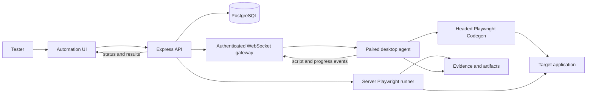
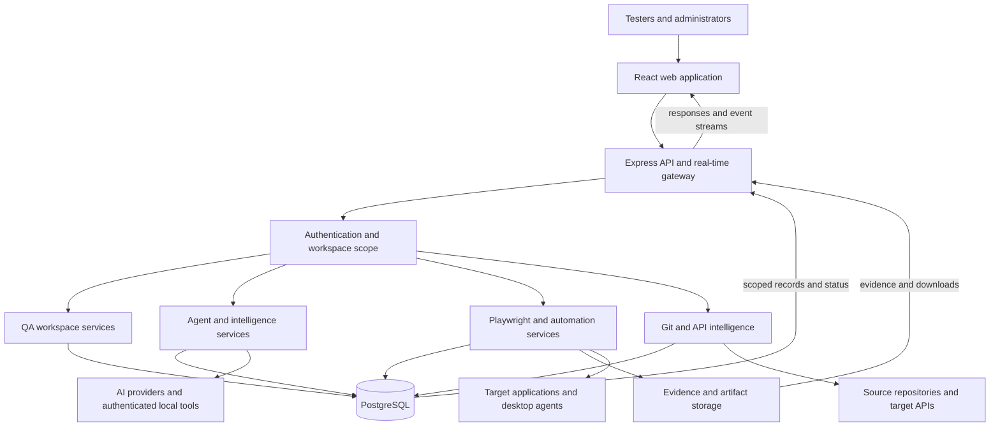

# Test Flow AI

Test Flow AI is a quality-engineering workspace for designing test coverage, executing browser tests, collecting evidence, and keeping requirements, defects, reports, and automation assets connected inside one scoped workspace.

This guide describes the application that end users operate. It intentionally excludes internal development notes, historical diagnostics, and unrelated platform material.

## Start here

1. Sign in with your assigned account.
2. Select a **project** and **application** from the top bar.
3. Add or confirm the target application URL, credentials, and source repository in **Settings**.
4. Create requirements, plans, suites, and test cases manually, or ask the **Agent Console** to draft them.
5. Review generated work before saving or executing it.
6. Run the selected tests and inspect evidence, reports, and defects.

The selected project and application determine which workspace data is read or changed. Check the top-bar scope before creating, editing, running, or deleting anything.

## Application map

| Area | What it is used for |
| --- | --- |
| Agent Console | Ask questions about real workspace data, create QA artifacts, author scripts, and continue agent-assisted work in a conversation. |
| Dashboard | Review test-management totals and recent quality activity for the selected workspace. |
| File System | Organize repository folders and browse plans, suites, cases, runs, reports, scripts, and evidence as one hierarchy. |
| Test Plans | Define strategy, objectives, scope, environments, risks, owners, and release coverage. |
| Test Suites | Group related cases by folder, feature, plan, and parent suite. |
| Test Cases | Maintain preconditions, ordered steps, expected results, tags, revisions, links, and automation settings. |
| Test Runs | Execute selected cases, track outcomes, and inspect run progress and evidence. |
| Requirements | Create, discover, review, and approve product requirements. |
| Traceability | Link requirements to cases and identify covered, partial, and missing coverage. |
| Reports | Review execution summaries, step outcomes, evidence, and exportable results. |
| Defects | Track failures with severity, status, reproduction detail, linked runs/cases, and captured evidence. |
| Automation | Record browser flows, manage desktop agents, schedules, jobs, executions, and uploaded artifacts. |
| Git Agent | Inspect the configured source repository and generate code-grounded coverage. |
| Settings | Configure projects, applications, AI providers, credentials, prompts, limits, automation, deployment, profile, and appearance. |

## Workspace structure and scope

Workspace data follows this hierarchy:

```text
Signed-in user
└── Project
    └── Application
        ├── Repository folders
        ├── Requirements
        ├── Test plans
        ├── Test suites
        ├── Test cases
        ├── Test runs and evidence
        ├── Reports and defects
        └── Automation assets
```

The web client sends the selected project and application with scoped requests. The API also applies the authenticated owner. This prevents one signed-in user, project, or application from silently reading another scope.

Use repository folders as the stable organizing structure. Plans, suites, cases, runs, scripts, and reports should be created in the folder that represents the feature or application area they belong to.

## Agent Console

The Agent Console is the conversational entry point for workspace questions and QA work.

It can:

- answer questions using persisted workspace records;
- locate existing cases, suites, plans, runs, scripts, requirements, reports, and defects;
- draft requirements, plans, suites, and cases;
- start reviewed agent runs;
- author Playwright scripts against a selected live application;
- execute approved work and collect evidence;
- continue a conversation using saved conversation history and workspace scope.

For reliable results:

- select the correct application before asking;
- name the feature, object, or workflow when it matters;
- include the expected outcome for execution requests;
- review the agent's interpretation before approving generated work;
- use Script Author mode for a browser workflow, not for a general workspace question.

Short instructions are resolved against the selected application and live interface. If the target application is not selected and no saved application name or URL is present, the console asks for a target instead of guessing.

## Test design workflow

### Requirements

Requirements describe the behavior that needs coverage. They can be entered manually or discovered with the requirement agent. Review AI-drafted requirements before confirming them.

### Test plans

Plans define the testing strategy and release boundary. Use them for objectives, in-scope and out-of-scope behavior, environments, roles, risks, entry/exit criteria, schedule, and deliverables.

### Test suites

Suites group related cases. A suite can belong to one or more plans and can be nested under parent suites. Folder and parent-suite selections determine which related cases are offered during manual suite creation.

### Test cases

Each case should include:

- a clear user-facing title;
- a short description;
- concrete preconditions;
- ordered actions and expected results;
- priority, status, testing type, and tags;
- plan, suite, and folder relationships;
- whether manual execution should capture evidence.

Case revisions preserve historical content. Plan pins can keep a release on a specific case revision while the current case continues to evolve.

## Runs, evidence, reports, and defects

### Test runs

A run records the selected cases, assignment, state, tags, target URL, duration, progress, and execution outcome. Agent-created and manual runs are stored in the same workspace model.

### Evidence

Evidence can include screenshots, per-step screenshots, traces, videos, console/network output, and uploaded execution artifacts. Evidence is useful only when the browser or automation runner actually captured it. A report displays **Not captured** when no evidence was stored; it does not invent proof.

### Reports

Reports summarize the run and its step outcomes. Stored report-level evidence is matched back to report steps when a direct step screenshot is absent.

Report exports include:

- PDF through the browser print dialog;
- Excel-compatible CSV;
- Markdown;
- JSON;
- HTML.

### Defects

Defects can be logged manually or created from failed automation. A defect may carry reproduction steps, expected and actual behavior, environment details, severity, status, linked cases/runs, tags, and evidence.

## Requirements and traceability

Traceability connects product intent to executable coverage.

1. Create or discover a requirement.
2. Review and approve its wording.
3. Link one or more test cases.
4. Inspect coverage state in Traceability.
5. Add or revise cases for uncovered behavior.
6. Re-run affected coverage after the product changes.

Traceability should be treated as a relationship view, not as a replacement for requirement or case content.

## Record and Play

Record & Play uses a paired desktop agent because recording requires a visible browser on the user's machine. The desktop agent creates an outbound authenticated WebSocket connection to the server; it does not require an inbound desktop port.



### One-time setup

1. Enable Record & Play in Settings.
2. Generate a pairing code.
3. Start the desktop agent and complete pairing.
4. Confirm that the agent shows as online.

### Record a flow

1. Choose the target URL, browser, environment, and online desktop agent.
2. Start recording.
3. The server creates a recording and sends `record.start` to the paired agent.
4. The agent opens headed Playwright Codegen.
5. Perform the real browser workflow.
6. The agent streams the growing script and action count.
7. Stop the recording.
8. The final script is stored, grouped into readable steps, and linked to an automated case.

### Play a recording

1. Start the saved recording manually, from a test run, on a schedule, or through a webhook.
2. The server creates a job and records its state.
3. Manual runs are sent to the paired desktop agent for visible execution.
4. Scheduled and webhook runs execute headlessly on the server.
5. Playwright returns results and artifacts.
6. Execution status is synchronized with the linked run.

Typical job states are `queued`, `running`, `uploading`, `passed`, and `failed`.

## Git and source intelligence

Projects can point to a source checkout. Git Agent and source-grounded agents use that repository to:

- browse the repository tree and files;
- search code and selectors;
- inspect commits and changes;
- understand application structure;
- ground requirements, cases, and scripts in implemented behavior;
- identify coverage affected by a change.

The configured repository path must exist on the server running the API. Application subpaths should be configured when multiple applications share one repository.

## High-level architecture



### Web application

The React client provides the Agent Console, test-management pages, execution views, reports, automation, Git Agent, settings, and workspace selection.

### API and real-time gateway

The Express service authenticates sessions, applies owner/project/application scope, validates requests, exposes feature APIs, streams agent events, and manages desktop-agent WebSockets.

### Domain and execution services

Feature services manage QA resources, requirements, traceability, conversations, agent workflows, browser inspection, script generation, Playwright execution, automation, repository analysis, and API intelligence.

### Persistence and connected systems

PostgreSQL stores application records, workspace scope, settings, agent checkpoints, and automation state. The server filesystem stores evidence and execution artifacts. Connected systems include AI providers, source repositories, target applications/APIs, and paired desktop agents.

## Agent runtime flow

```text
User request
  → classify intent
  → assemble conversation and workspace context
  → resolve selected application
  → inspect source, metadata, or live DOM when required
  → plan or answer
  → validate generated work
  → request approval when required
  → save or execute
  → persist results, evidence, and conversation memory
```

The runtime uses the selected workspace, canonical conversation history, requirements, application knowledge, repository evidence, credentials, metadata, and observed browser evidence. Generated cases and scripts pass validation gates before they are persisted or executed.

Long-running work exposes status and event endpoints so the UI can resume and inspect an active run.

## Data and storage

PostgreSQL is the normal source of truth for:

- users and workspace ownership;
- projects and applications;
- folders and QA resources;
- requirements and traceability links;
- conversations and messages;
- agent runs and checkpoints;
- automation agents, recordings, jobs, schedules, and executions;
- settings and usage information.

Evidence files, traces, videos, reports, and uploaded artifacts are stored outside database rows and referenced by persisted records.

The JSON store is available only when `DISABLE_POSTGRES=true` explicitly enables a disposable sandbox. It is not a production database fallback.

## API overview

Application APIs use JSON over HTTP unless an endpoint explicitly streams events or serves an artifact.

| Area | Route family | Purpose |
| --- | --- | --- |
| Authentication | `/api/auth/*`, `/api/users` | Login, session, logout, and profile administration. |
| Projects and applications | `/api/projects/*`, `/api/apps/*` | Workspace hierarchy, repository metadata, files, commits, compare, and search. |
| QA resources | `/api/plans`, `/api/suites`, `/api/cases`, `/api/runs`, `/api/defects`, `/api/reports`, `/api/folders` | Scoped CRUD, bulk actions, revisions, pins, and run creation. |
| Requirements | `/api/requirements/*` | Draft, discover, confirm, update, delete, and link requirements. |
| Agent execution | `/api/agent/*`, `/api/agent-runs/*` | Start, continue, cancel, retry, inspect, and save agent work. |
| Command routing | `/api/controller/*`, `/api/ai/search` | Classify requests, navigate, supervise actions, and search workspace data. |
| Conversations | `/api/chat/*` | Persist conversations, turns, and canonical messages. |
| Browser execution | `/api/playwright/*` | Run scripts and manage browser code-generation sessions. |
| Automation | `/api/automation/*` | Pair agents and manage recordings, jobs, schedules, events, runs, and artifacts. |
| AI configuration | `/api/ai/*`, `/api/settings/*` | Providers, prompts, health, usage, cost controls, autonomy, and deployment settings. |
| Credentials | `/api/credentials/*` | Manage target applications and role-based users for execution. |
| Source intelligence | `/api/git-agent/*`, `/api/api-intelligence/*`, `/api/knowledge/*` | Analyze repositories/APIs and maintain application knowledge. |

Protected requests require an authenticated session. Scoped requests also use the selected project and application.

```http
Authorization: Bearer <session-token>
X-Project-Id: <project-id>
X-App-Id: <application-id>
Content-Type: application/json
```

## Security model

- **Authentication:** Login creates a random bearer session token. Sessions are held by the API process, so an API restart requires users to sign in again.
- **User passwords:** Application-user passwords are salted and hashed with scrypt and checked with a timing-safe comparison.
- **Target credentials:** Target-application passwords are encrypted at rest with AES-256-GCM. Production must provide a stable `CRED_ENC_KEY`.
- **Isolation:** Protected handlers combine the signed-in owner with project and application scope.
- **Machine access:** Desktop agents and schedule webhooks use pairing, refresh, agent, or webhook tokens rather than user passwords.
- **Public endpoints:** Health, app configuration, login, agent bootstrap, webhook, and screenshot-loading paths are intentionally allowlisted.
- **Evidence:** Evidence is served from protected deployment storage. Production ingress and filesystem permissions must restrict access appropriately.
- **Secrets:** Provider keys, database credentials, encryption keys, tokens, and target passwords must remain in environment or deployment secret stores.

## Settings

Settings controls the behavior of the current installation.

| Setting area | What to configure |
| --- | --- |
| Profile | Signed-in account details and access to this documentation. |
| Projects and applications | Workspace names, application URLs, repository paths, and application subpaths. |
| AI providers | Provider selection, models, API credentials, authenticated local tools, prompts, limits, and health. |
| Credentials | Website/application users and roles used by browser execution. |
| Automation | Record & Play enablement, pairing, agents, schedules, and execution options. |
| Deployment | Public URLs, storage paths, environment behavior, and runtime flags. |
| Appearance | Theme and interface preferences. |

Only administrators should change shared provider, deployment, security, or automation configuration.

## Deployment and operation

### Local development

- Run the Vite web client on port `3000`.
- Run the Express API on port `3001`.
- Configure PostgreSQL and local provider credentials in ignored environment files.
- Configure a valid source checkout for repository-grounded features.

### Production

- Build the web client and server bundle.
- Run the API against a dedicated PostgreSQL database.
- Terminate TLS at the deployment edge.
- Keep provider keys, database credentials, tokens, and encryption keys in the deployment secret store.
- Retain a stable credential-encryption key.
- Protect evidence and uploaded artifact storage.
- Monitor database availability, API health, automation workers, and storage growth.

Optional runtime flags enable features such as the desktop automation agent, investigation stages, visual regression, and evidence-oracle behavior. The active deployment mode and feature flags are available from `GET /api/app-config`.

## Troubleshooting

| Symptom | What to check |
| --- | --- |
| Workspace data appears missing | Confirm the signed-in user, selected project, and selected application. |
| Agent asks which application to use | Select an application in the top bar or mention a saved application name/URL. |
| Script Author cannot proceed | Confirm the target URL, login credentials, and that the requested control is reachable in the live application. |
| No evidence is shown | Confirm the run actually executed and evidence capture was enabled; a saved URL is not the same as captured evidence. |
| Record & Play agent is offline | Confirm pairing, the agent process, outbound WebSocket access, and the configured server URL. |
| Scheduled execution does not start | Check schedule status, worker health, target credentials, and job events. |
| Git-grounded features return little context | Confirm the project repository path and application subpath exist on the API server. |
| Users must sign in after restart | Expected: bearer sessions are stored in the API process. |

## Glossary

| Term | Meaning |
| --- | --- |
| Project | Top-level workspace boundary. |
| Application | Product or deployable surface within a project. |
| Repository folder | User-facing organization for QA artifacts. |
| Test plan | Strategy and release coverage definition. |
| Test suite | Functional grouping of related cases. |
| Test case | Preconditions, actions, and expected results for one scenario. |
| Test run | Execution record for selected cases. |
| Evidence | Captured proof such as screenshots, traces, logs, videos, or reports. |
| Agent run | Long-running AI-assisted workflow with review and execution stages. |
| Desktop agent | Paired local process used for visible recording and manual playback. |
| Scope | Signed-in owner plus selected project and application. |
