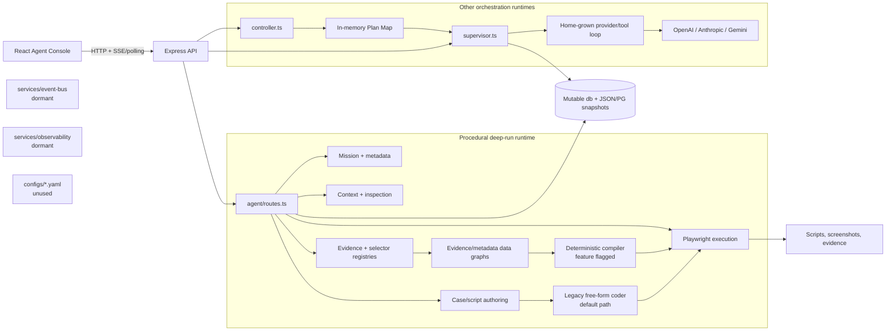
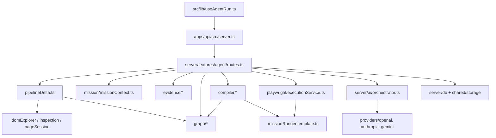
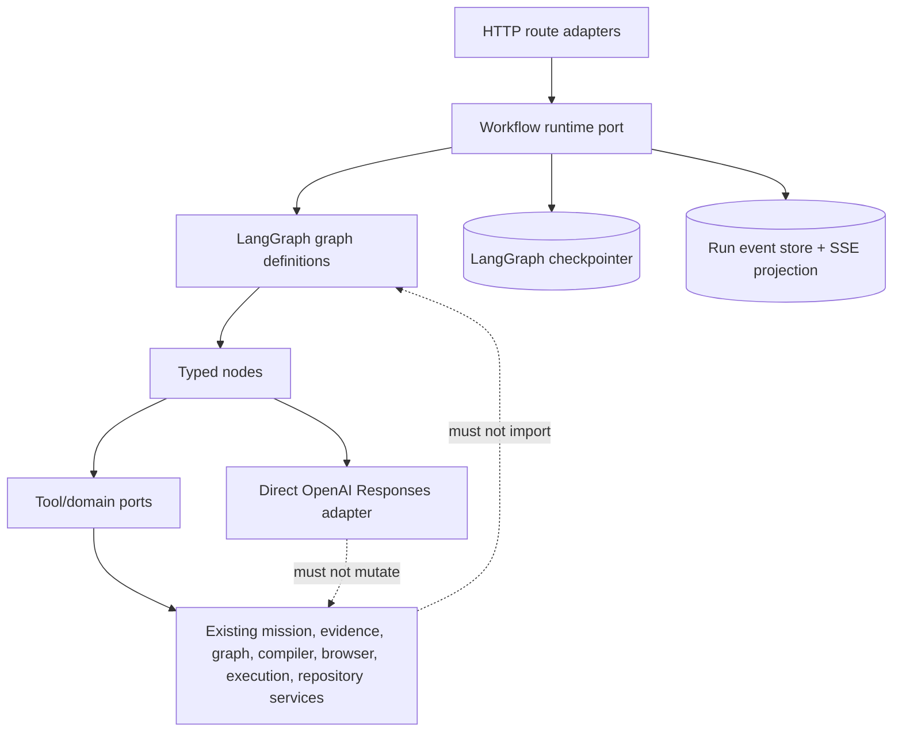
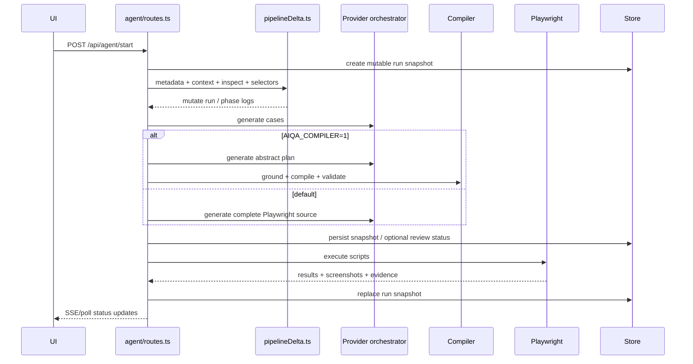
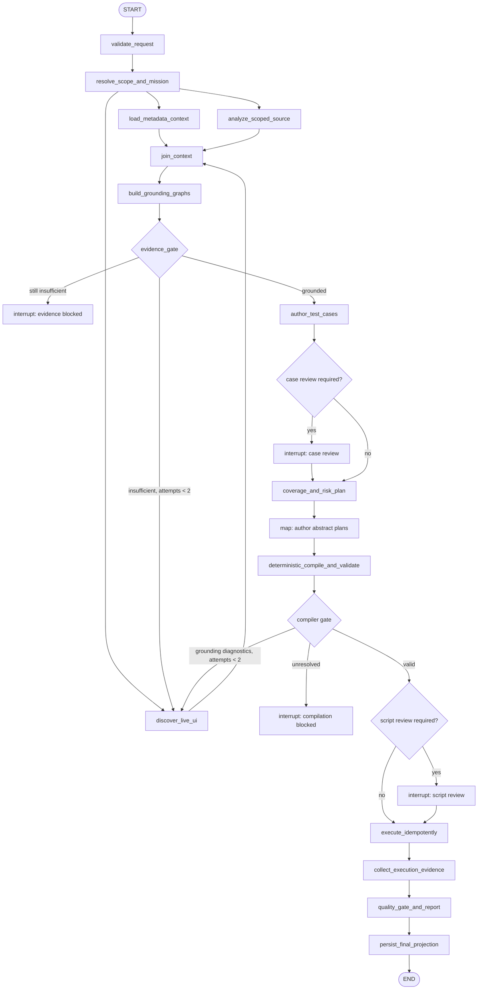
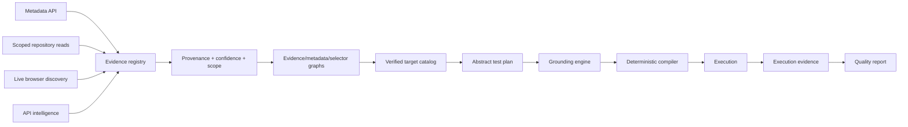
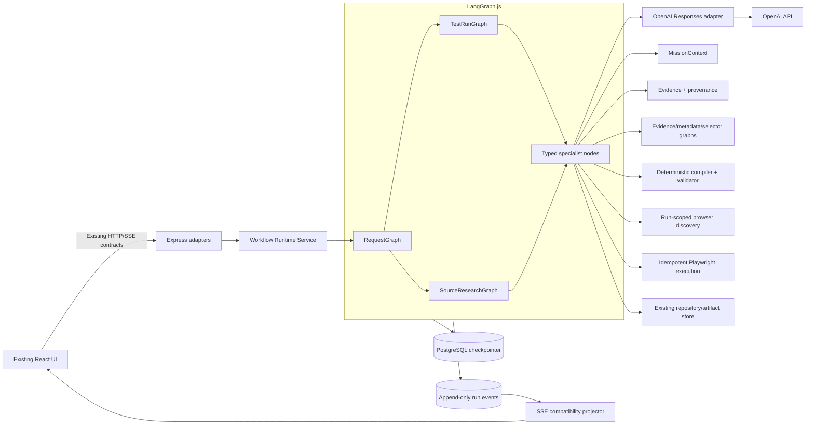
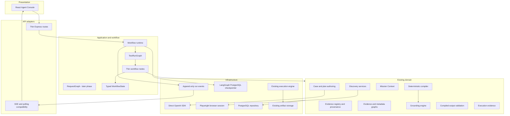
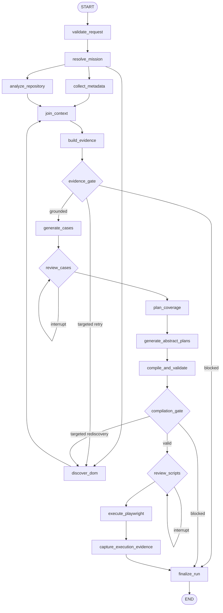

# OpenAI SDK + LangGraph.js Master Architecture and Implementation Blueprint

**Date:** 2026-07-13  
**Status:** Approved in principle; architecture and planning only; no implementation is authorized  
**Scope:** AI test-automation orchestration, agent communication, context/evidence flow, test authoring, deterministic compilation, review, execution, persistence, and observability  
**Decision requested:** Approve, reject, or amend the phased plan. Approval must occur in a later turn before any implementation begins.

**Amendment (2026-07-13, prior to any Phase 1 approval):** The original draft scoped the new workflow runtime to OpenAI only, with Anthropic and Gemini remaining on the legacy path indefinitely. That scoping is rejected. Hard requirement: the graph path must be provider-neutral. Every node that calls a model resolves its provider through the existing `resolveProviderForAgent()` / `resolveModelForAgent()` boundary in `server/ai/orchestrator.ts` — the same function every other part of the application already uses to honor the single provider selection in Settings (`db.settings.defaultProvider`). Whichever of OpenAI, Anthropic, or Gemini the user has selected receives identical LangGraph reliability guarantees (checkpointing, crash recovery, one retry owner, durable interrupts). Section 7.2, and the provider-related rows in Sections 10.8, 12, 15, A.1, and A.12, are corrected below to reflect this. Wherever the remainder of this document says "Responses API" as a node dependency, read it as "the OpenAI Responses API when the resolved provider is OpenAI; the existing native Anthropic/Gemini adapters otherwise" — the mechanism being named, not a fixed vendor.

## 1. Executive Summary

The platform already contains the hard domain assets needed for a reliable AI test-automation system: an immutable mission context, typed evidence and provenance, live-selector verification, a deterministic test-plan compiler, static output validation, real Playwright execution, API intelligence, review gates, and persistent run snapshots. The central architectural problem is not a lack of agents. It is that those capabilities are coordinated by several overlapping orchestration mechanisms with different state and failure models.

The production deep-run path is primarily a 5,800-line procedural route module that mutates a large run object and periodically persists snapshots. Chat and research use a separate home-grown provider/tool loop. Controller planning uses another in-memory plan map. The recently added “graphs” are valuable evidence and metadata data structures, but they are not executable workflow graphs. Dormant event-bus, observability, YAML-agent-roster, and orchestration-service packages add architectural vocabulary without participating in the current runtime.

The proposed design introduces one explicit workflow runtime, LangGraph.js, while retaining the existing deterministic domain services. Graph nodes call whichever provider the existing Settings-driven resolver selects — OpenAI through the Responses API with strict structured outputs, Anthropic and Gemini through their existing native adapters — so reliability guarantees never depend on which provider the user picked; LangChain model wrappers and an LLM “swarm” are intentionally not added. Nodes communicate only through a compact, typed, checkpointed state. Large evidence, screenshots, HTML, codebase extracts, and credentials stay outside graph checkpoints. Human review becomes a native interrupt/resume operation. Browser discovery and execution are isolated as side-effecting nodes with idempotency keys. Durable PostgreSQL checkpoints and an append-only run-event stream make crash recovery and observability first-class.

The migration is incremental and dark-launched behind `AGENT_GRAPH_V2=1`. Existing HTTP routes, SSE payloads, run records, UI flows, non-OpenAI providers, and the legacy execution path remain available during rollout. The current deterministic compiler remains the only intended code-generation backend in the new graph. No broad rewrite of the React UI, persistence layer, Playwright runtime, or evidence model is proposed.

The recommended sequence is seven bounded phases over approximately 28–41 engineer-days, followed by canary soak time. Each phase changes at most one architectural subsystem and no more than 10–15 files. Destructive cleanup is deferred until the graph path satisfies measurable durability, grounding, compatibility, execution, and observability gates.

## 2. Existing Architecture

### 2.1 Deployable shape and packages

The active product is a monolithic TypeScript application with a Vite/React frontend and Express API. `apps/api/src/server.ts` composes feature routes, loads the JSON or PostgreSQL-backed repository, and exposes the API. The `services/*` packages are mostly boundary re-exports around implementations in `server/features/*`; they are not independently deployed services. The imported reference architecture under `architecture-import/agentic-test-platform` is excluded from the active build and must not be treated as runtime code.

The important active packages and modules are:

| Area | Current responsibility | Architectural status |
|---|---|---|
| `server/features/agent/routes.ts` | Starts, continues, retries, reviews, and reports deep agent runs; coordinates nearly every phase | Active orchestration center and primary bottleneck |
| `server/features/agent/pipelineDelta.ts` | Metadata, role/context, DOM inspection, selector-registry, and evidence-graph phase integration | Active transitional pipeline |
| `server/features/agent/mission/missionContext.ts` | Immutable run mission and URL/app invariants | Strong domain primitive; retain |
| `server/features/agent/evidence/*` | Typed evidence, provenance, budgets, run snapshots | Strong domain primitive; retain |
| `server/features/agent/graph/*` | Evidence, metadata, selector, page, and object-repository data graphs | Active data model; not a workflow engine |
| `server/features/agent/compiler/*` | Coverage classification, abstract test plan, deterministic Playwright compilation, validation | Implemented dark path; retain and harden |
| `server/features/agent/pageSession.ts` | In-memory authenticated Playwright page sessions | Useful ephemeral browser resource |
| `server/features/playwright/executionService.ts` | Script execution and evidence capture | Active side-effect boundary |
| `server/ai/orchestrator.ts` | Provider selection, generation calls, retries, and a custom tool loop | Separate active orchestration runtime |
| `server/ai/providers/openai.ts` | OpenAI Chat Completions adapter and manual structured-output repair | Active provider adapter; not Responses API |
| `server/ai/supervisor.ts` | Chat/research tool construction and tool-loop supervision | Active second agent runtime |
| `server/ai/controller.ts` | Intent classification and sequential plan execution | Active third state/orchestration mechanism |
| `server/shared/storage.ts` and `server/db/*` | Mutable in-memory/JSON state plus PostgreSQL snapshots | Active persistence boundary |
| `src/pages/AgentConsole.tsx`, `src/lib/useAgentRun.ts` | Run UX, review actions, SSE with polling fallback | Active client; preserve contracts |
| `services/event-bus/*` | In-process agent bus | Tested but dormant |
| `services/observability/*` | Lightweight tracer | Tested but dormant |
| `services/orchestration/index.ts` | Placeholder export | Dormant boundary suitable for the new runtime |
| `configs/agents.yaml`, `configs/models.yaml` | Declarative-looking agent/model configuration | No active reader found |

The root package already depends on `openai`, currently version `^6.42.0`. LangGraph is not installed. The project also supports Gemini and Anthropic through the current provider abstraction. All three providers are first-class in the graph path, resolved per node through the same `resolveProviderForAgent()` boundary the rest of the application already uses; none is a prerequisite the others must wait on.

### 2.2 Agent structure

The product presents several named agents in prompts and UI, but runtime behavior falls into three concrete structures:

1. **Fixed deep-run specialists.** Metadata discovery, context construction, inspection, selector registration, test-case authoring, live script authoring or compilation, execution, and proof collection are invoked in a fixed procedural sequence from `server/features/agent/routes.ts`. These are function/service boundaries rather than independently scheduled agents.
2. **Supervisor tool loop.** Chat and research requests enter `server/ai/supervisor.ts`, which assembles tools and delegates to the append-only loop in `server/ai/orchestrator.ts`. The model chooses tools until it stops or the step limit is reached.
3. **Controller plan execution.** `server/ai/controller.ts` classifies intent, creates a plan held in an in-memory `Map`, and executes plan steps sequentially. Its memory is a global bounded array rather than run-scoped durable state.

The canonical-agent names and aliases in `server/ai/systemPrompts.ts` are therefore mainly prompt-level personas. They do not correspond to isolated durable workers with explicit message contracts.

### 2.3 Agent communication

Communication is currently implicit and heterogeneous:

- Deep-run phases share and mutate the same `run` object, pass large strings and arrays directly, and persist full snapshots between selected phases.
- The supervisor communicates with model-selected tools through Chat Completions messages. Tool outputs are serialized into the message history and silently capped by the loop.
- The controller communicates through in-memory plan objects and shared controller memory.
- The data graphs communicate grounded evidence to the compiler through normal function calls, not event messages or graph transitions.
- The dormant `AgentBus` is not imported by the active runtime, so there is no production agent-message bus despite the package name.

This architecture has no single definition of a run state transition, attempt, retry, interrupt, or resumable checkpoint.

### 2.4 Current component diagram



### 2.5 Strengths

- **Evidence correctness is now represented explicitly.** Provenance distinguishes live DOM evidence from metadata, source, static, and inferred sources. Selector promotion requires live, unique evidence in the current delta pipeline.
- **Mission invariants are centralized.** `MissionContext` freezes the target application, URL, credentials reference, scope, and verification rules instead of leaving every prompt to reconstruct them.
- **A deterministic compiler exists.** The compiler translates a typed abstract test plan into the existing `MissionRunner` API, rejects unresolved or ambiguous targets, and validates generated output for prohibited navigation, login, locator, and application-ID patterns.
- **The platform gathers real evidence.** It can use application metadata, source inspection, live browser discovery, API intelligence, test execution, screenshots, and verification artifacts.
- **Backward-compatible persistence and UI contracts exist.** Agent runs are available through JSON fallback or PostgreSQL, and the UI already supports streaming, polling fallback, continue/review/cancel, and persisted run recovery.
- **Provider access is abstracted.** The existing provider layer makes an incremental OpenAI graph path possible without immediately breaking Anthropic or Gemini consumers.
- **The new compiler path is dark-launched.** `AIQA_COMPILER=1` already makes it possible to compare deterministic generation with the legacy author without changing the default production behavior.

### 2.6 Bottlenecks and constraints

- **Orchestration is concentrated in one route file.** `server/features/agent/routes.ts` mixes HTTP concerns, workflow decisions, prompt assembly, retries, review, persistence, compiler selection, execution, and recovery. This makes state transitions difficult to test independently.
- **There are three orchestration/state models.** The procedural run, provider tool loop, and controller plan map have different retry, persistence, cancellation, and observability semantics.
- **Workflow state is a mutable blob.** Full `agentRuns` objects are mutated in place and periodically copied into storage. The PostgreSQL record stores many JSONB collections plus another broad `raw` object, increasing duplication and making partial updates and replay opaque.
- **The current graphs do not orchestrate.** Evidence and metadata graphs improve grounding, but they provide no scheduling, checkpointing, branching, interrupts, or fault recovery.
- **The safer compiler is not the default.** The legacy path can still ask an LLM to emit complete Playwright source. Execution repair also remains a free-form regeneration path.
- **Structured output is repaired rather than guaranteed.** The OpenAI provider uses Chat Completions JSON mode, manual JSON extraction/coercion, and Zod parsing. The abstract test-plan normalizer currently drops invalid steps, which can silently reduce coverage.
- **Prompts and tool histories are oversized.** Context is flattened into large template strings. Several `.slice()` caps and an 8,000-character tool-result cap discard evidence without a preflight budget or explicit loss record.
- **Retries can multiply.** The OpenAI client configures SDK retries while the custom orchestration loop also retries calls, making worst-case latency and duplicate side effects hard to reason about.
- **Browser work is repeated and fragile.** Separate discovery attempts can reopen or reauthenticate browsers, contributing to long runs and authentication rate limits. Browser objects cannot be durable workflow state.
- **Observability is incomplete.** The active tracer is fire-and-forget and the incident run produced no expected trace file. The more structured observability package is dormant.
- **Global state leaks scope.** Blackboard entries and controller memory are not consistently keyed to a run/thread. Browser sessions are in-memory only and cannot survive process restarts.
- **Dead architectural surfaces increase cognitive load.** Unused YAML rosters, event bus, observability wrapper, and placeholder orchestration package imply capabilities that the runtime does not use.

### 2.7 Current-code evidence anchors

These anchors identify the inspected implementation behind the architectural claims; line numbers refer to the 2026-07-13 working tree and may move during later phases.

| Finding | Current-code anchor |
|---|---|
| Deep-run route entry and procedural coordinator | `server/features/agent/routes.ts:4215`, `server/features/agent/routes.ts:4723` |
| Case, post-case, and execution phase functions in the route module | `server/features/agent/routes.ts:1992`, `server/features/agent/routes.ts:2442`, `server/features/agent/routes.ts:3708` |
| Deterministic compiler is flag-gated and legacy remains default | `server/features/agent/routes.ts:63`, `server/features/agent/routes.ts:2538`, `server/features/agent/compiler/compiledGeneration.ts:100` |
| Zero-DOM is now failed and MCP DOM facts are disabled by default | `server/features/agent/pipelineDelta.ts:263`, `server/features/agent/pipelineDelta.ts:293` |
| Static selectors cannot become verified-live | `server/features/agent/pipelineDelta.ts:450`, `server/features/agent/pipelineDelta.ts:467` |
| Tolerant plan normalization can drop invalid/unrecognized steps | `server/features/agent/compiler/testPlan.ts:58`, `server/features/agent/compiler/testPlan.ts:72`, `server/features/agent/compiler/testPlan.ts:80` |
| OpenAI adapter uses Chat Completions and SDK `maxRetries: 8` | `server/ai/providers/openai.ts:63`, `server/ai/providers/openai.ts:100`, `server/ai/providers/openai.ts:245` |
| Custom orchestration adds four-attempt retry and capped tool serialization | `server/ai/orchestrator.ts:575`, `server/ai/orchestrator.ts:594` |
| Controller plan and conversation memory are process-global/in-memory | `server/ai/controller.ts:40`, `server/ai/controller.ts:41` |
| Supervisor tool loops permit 60 and 200 steps | `server/ai/supervisor.ts:311`, `server/ai/supervisor.ts:388`, `server/ai/supervisor.ts:516` |
| Shared JSON/in-memory store owns agent runs and blackboard | `server/shared/storage.ts:44`, `server/shared/storage.ts:52`, `server/shared/storage.ts:81` |
| PostgreSQL persistence upserts broad run snapshots | `server/db/schema.sql:195`, `server/db/schema.sql:435`, `server/db/repository.ts:412` |
| Browser page sessions are an in-memory map with a ten-minute TTL | `server/features/agent/pageSession.ts:43`, `server/features/agent/pageSession.ts:44` |
| Blackboard is globally bounded rather than thread-scoped | `server/features/agent/blackboard.ts:15`, `server/features/agent/blackboard.ts:29`, `server/features/agent/blackboard.ts:39` |

The live failure evidence and the earlier layer-by-layer trace are preserved in `docs/diagnostics/agent-run-incident-report-2026-07-10.md` and `docs/diagnostics/pipeline-runtime-forensics-2026-07-10.md`. The current evidence-pipeline proposal and P0–P3 classification were also reviewed before this consolidation.

## 3. Dependency Graph

### 3.1 Current dependency direction



The high fan-in and fan-out at `routes.ts` is the key issue: domain modules depend on relatively few components, but the route layer knows and orders all of them. The proposed graph runtime should invert that relationship. HTTP routes will issue commands to a workflow service; nodes will call narrow domain ports; domain modules will not import LangGraph.

### 3.2 Proposed dependency rules



Rules:

1. LangGraph imports are confined to `workflow/*` and the orchestration service boundary.
2. Mission, evidence, grounding, compiler, and execution modules remain framework-neutral.
3. Nodes accept typed state and dependencies and return state deltas; they do not receive Express request/response objects.
4. Provider calls occur behind a small Responses adapter. Domain code does not import the OpenAI SDK.
5. HTTP/SSE compatibility is maintained by adapters around graph commands and event streams.
6. No event bus is placed between graph nodes. The checkpointed state and graph transitions are the communication mechanism.

## 4. Runtime Flow

### 4.1 Current deep-run flow

The current `/api/agent/start` handler creates and mutates a run, resolves metadata and context, invokes inspection, promotes selectors, authors cases, selects the legacy or deterministic generation path, may pause for review, executes scripts, collects evidence, and persists output. Continue and retry endpoints infer where to resume from a combination of run status and the presence of output fields.



The flow works when every phase succeeds in one process, but the unit of recovery is a broad run snapshot rather than a committed node transition. A process failure can leave browser resources, model calls, file writes, and snapshot status out of sync.

### 4.2 Proposed top-level runtime

The new `RequestGraph` is a thin router, not a general autonomous planner. It directs requests to a bounded subgraph with an explicit state schema:

- `TestRunGraph` for generation, review, execution, and evidence.
- `SourceResearchGraph` for code-grounded questions currently handled by supervisor tools.
- Existing deterministic workspace-action services for non-agent CRUD or configuration operations.

The initial production migration should start with `TestRunGraph`; routing chat/controller traffic comes later. LangGraph can be used independently of LangChain model wrappers, which supports this direct SDK design. The official LangGraph overview documents this standalone use: [LangGraph overview](https://docs.langchain.com/oss/javascript/langgraph/overview).

### 4.3 Proposed test-run workflow



Execution characteristics:

- Context branches may run concurrently, but live discovery is bounded to one authenticated page session per attempt.
- Per-case plan authoring may fan out with bounded concurrency. Deterministic compilation remains local and cheap.
- Every node returns a typed delta; reducers merge events, errors, and per-case results deterministically.
- LangGraph checkpoints after each superstep. A stable `thread_id` equal to the agent `runId` gives the workflow durable identity. Checkpoints support fault recovery, human-in-the-loop, and state history: [LangGraph persistence](https://docs.langchain.com/oss/javascript/langgraph/persistence).
- Review pauses use `interrupt()` and resume with `Command`, not inferred output-field checks: [LangGraph interrupts](https://docs.langchain.com/oss/javascript/langgraph/interrupts).
- The existing SSE endpoint projects graph `updates` and custom progress events into the existing client payload rather than forcing an immediate UI rewrite. LangGraph provides update, value, message, custom, tool, and debug stream modes: [LangGraph streaming](https://docs.langchain.com/oss/javascript/langgraph/streaming).

## 5. Evidence Flow

### 5.1 Current evidence flow

Evidence enters through application metadata, source inspection, browser/DOM inspection, MCP-assisted inspection, selector extraction, API intelligence, and execution artifacts. `pipelineDelta.ts` now records source provenance and only promotes selectors as verified when live evidence and uniqueness are available. The data-graph adapter projects evidence into selector, page, metadata, evidence, and object-repository graphs. The deterministic compiler consumes only grounded targets, but the default legacy author can still receive broader textual context and produce direct locators.

The July 10 incident showed the original failure chain: DOM discovery returned zero results but the phase was reported complete; an MCP parsing failure lost browser evidence; static selectors were promoted as verified; repeated recovery attempts reopened/login-tested the application; and no test reached execution. The current working tree has already improved zero-DOM failure status, provenance handling, live-selector promotion, and the default handling of MCP DOM facts. Those fixes should be preserved.

### 5.2 Proposed evidence contract

The new graph does not replace the current evidence types. It makes their use mandatory at state transitions.



Enforced gates:

1. An executable target must have a deterministic graph identity and live, unique, visible evidence when it represents a UI interaction.
2. Metadata or source evidence can inform naming, expected behavior, coverage, and rediscovery, but cannot be silently relabelled as a verified live locator.
3. Unresolved or ambiguous plan targets produce diagnostics and a bounded targeted-rediscovery transition. They never cause the model to invent a locator.
4. Evidence loss is explicit. If a budget excludes an artifact, state records the artifact reference, token estimate, exclusion reason, and summary rather than silently slicing a string.
5. Execution evidence is linked to the exact script digest, test-plan digest, evidence snapshot, and attempt.

Large evidence artifacts must not be copied into every checkpoint. Raw DOM, HTML, screenshots, source extracts, and logs remain in the existing artifact/run store. Graph state keeps stable references, digests, provenance summaries, and the minimal verified catalog needed by subsequent nodes.

## 6. Context Flow

### 6.1 Current context flow

Context is assembled from project/application configuration, role data, metadata, inspection results, selectors, source snippets, prior run output, and prompt-specific instructions. Much of it becomes flat prompt text. The forensic report identified multiple independent truncation points in context construction, provider messages, and tool output. Because truncation is local and silent, a later phase cannot tell whether evidence never existed or was dropped for length.

### 6.2 Proposed shared state

Use a Zod-defined LangGraph state schema with small, serializable fields. A representative logical schema is below; it is a design contract, not implementation code.

| State group | Required content | Persistence rule |
|---|---|---|
| Identity | `runId`, `threadId`, project/application IDs, request type, created time | Checkpointed |
| Mission | Frozen mission snapshot, allowed origins, target route/module, role/credential reference | Checkpointed; never credential secret |
| Workflow | Current status, node history, cancellation flag, review policy, resume payload | Checkpointed |
| Context | Metadata summary/ref, source-analysis summary/ref, role/test-data refs, context budget record | Checkpointed summaries and refs only |
| Evidence | Evidence-snapshot ref/digest, verified target catalog, counts by provenance, missing-evidence requirements | Checkpointed compact catalog |
| Authoring | Cases, coverage classifications, risk priorities, abstract plans, model response IDs/usage | Checkpointed |
| Compilation | Script refs/digests, compiler diagnostics, validator results | Checkpointed refs and results |
| Execution | Execution attempt IDs, status, result/evidence refs, aggregate counts | Checkpointed |
| Control | Retry counters by node/error class, rediscovery count, idempotency keys | Checkpointed |
| Diagnostics | Typed errors, warnings, redacted event metadata | Append/reducer fields |

Never checkpoint:

- passwords, access tokens, API keys, cookies, or resolved credentials;
- Playwright `Browser`, `Context`, or `Page` objects;
- full DOM/HTML documents, screenshots, videos, or binary attachments;
- complete repository contents or unconstrained source dumps;
- full repeated prompt strings when a prompt template version, input digest, usage, and redacted diagnostic are sufficient.

Credential secrets are resolved inside the browser/execution node immediately before use. A `pageSession` is an ephemeral node resource. Within a discovery attempt, the node should reuse one authenticated session for navigation and observation and close it in `finally`; the serializable results are returned to state. This avoids trying to checkpoint an impossible browser object while reducing repeated login churn.

Reducers should be used only where merging is semantically necessary:

- append-only, bounded run events;
- typed errors and warnings;
- per-case plan/compile results keyed by case ID;
- execution results keyed by script digest and attempt.

All other state fields should have a single owning node to avoid last-write ambiguity.

## 7. Prompt Flow

### 7.1 Current prompt flow

The current system builds broad, free-form prompts for case generation, complete Playwright source generation, source research, repair, and tool supervision. Prompt personas carry some architectural policy, while code later applies additional post-processing and validation. The OpenAI adapter asks Chat Completions for JSON and then extracts, coerces, or repairs the response. The tool loop serializes capped tool outputs back into an append-only conversation.

### 7.2 Proposed model interaction model (provider-neutral, Settings-driven)

Every graph node that calls a model resolves its provider and model exactly the way the rest of the application already does: through `resolveProviderForAgent(agent)` and `resolveModelForAgent(agent, provider)` in `server/ai/orchestrator.ts`, which read `db.settings.defaultProvider` (the Settings/top-bar selection) with an optional per-agent override. A node never hardcodes a provider. This is a hard requirement, not an optimization: the reliability properties LangGraph provides (checkpointing, one retry owner, durable interrupts) belong to the workflow layer, not to any one provider, so they must not be rationed to OpenAI users only.

Structured, schema-validated output is required from every authoring node regardless of provider:

- When the resolved provider is **OpenAI**, use the official `openai` package and migrate the call to the Responses API. OpenAI recommends Responses for new projects and supports incremental migration while Chat Completions remains available: [Migrate to the Responses API](https://developers.openai.com/api/docs/guides/migrate-to-responses). Use `responses.parse()` with the OpenAI Zod helper, reading `output_parsed` instead of extracting JSON with regular expressions: [Structured Outputs](https://developers.openai.com/api/docs/guides/structured-outputs). Schemas use strict mode, all properties required, `additionalProperties: false`, matching OpenAI's function-calling guidance: [Function calling](https://developers.openai.com/api/docs/guides/function-calling). Set `parallel_tool_calls: false` where deterministic tool order matters. Set request storage to `store: false` unless a separately approved retention policy says otherwise; do not use `previous_response_id` as durable state, only as a trace correlation.
- When the resolved provider is **Anthropic or Gemini**, use the existing native adapters (`server/ai/providers/anthropic.ts`, `server/ai/providers/gemini.ts`) already built and verified for schema-driven tool-calling in the tool-loop substrate work. Neither has an API-enforced strict-schema guarantee equivalent to OpenAI's constrained decoding, so the one-repair-call pattern below is their primary safety net, not just a fallback.
- In all three cases, a schema-invalid response gets exactly one repair call containing the validation errors and the original bounded input, per the retry policy in Section 10.5. There is no silent coercion for any provider.

Node-specific calls (dependency is "resolved provider," never a fixed vendor):

| Node | Model responsibility | Input boundary | Output boundary |
|---|---|---|---|
| `author_test_cases` | Turn mission, context summaries, and evidence capabilities into test cases | No raw credentials, unrestricted repo, or full DOM | Strict case schema |
| `author_abstract_plans` | Select actions and semantic target IDs from the verified catalog | Catalog IDs and allowed action vocabulary only | Strict `TestPlan` schema |
| `analyze_scoped_source` | Summarize explicitly scoped repository evidence | Read-only tools limited to project/app roots | Typed findings with file/ref provenance |
| Optional repair call | Correct one schema-invalid response | Validation errors plus original bounded input | One strict retry only |

Prompt assembly becomes versioned and loss-aware, independent of which provider answers:

1. Each node has one narrow system contract and a strict output schema.
2. The node reads compact state and artifact summaries, not the entire run.
3. A context-budget builder ranks mandatory mission rules, verified evidence, user scope, metadata, and optional source detail.
4. Excluded material is recorded with an artifact reference and reason.
5. Prompt template version, input digest, output schema version, resolved provider, response/call ID, token usage, latency, and refusal/validation status are emitted as redacted events.
6. Deterministic compiler and validator rules remain code, not prose duplicated across prompts.

No LangChain model abstraction is required for any provider. Adding `@langchain/openai` (or an equivalent wrapper for the others) would duplicate the existing provider boundary without improving graph state or reliability.

## 8. Current Problems

| Problem | User/system impact | Evidence in current design | Priority |
|---|---|---|---|
| Procedural orchestration mixed with routes | Changes are high-risk; resume logic is implicit | `server/features/agent/routes.ts` coordinates start through execution | P0 |
| Static/source evidence can influence a legacy executable prompt | Hallucinated or wrong-surface locators remain possible | Deterministic compiler is feature-flagged; legacy author is default | P0 |
| No durable transition checkpoints | Restart can repeat expensive or side-effecting work | Run snapshots are not node commits | P0 |
| Invalid test-plan steps can be dropped | Silent coverage loss | Tolerant normalization in `compiler/testPlan.ts` | P0 |
| Execution repair bypasses deterministic compilation | A failed run can reintroduce free-form source | Legacy coder repair remains active | P0 |
| Multiple retry layers | Long tail latency and duplicate operations | SDK retries plus orchestration retries | P1 |
| Browser/auth lifecycle crosses loosely coordinated phases | Authentication rate limits and repeated discovery | Incident trace and in-memory session model | P1 |
| Silent context/tool truncation | Model decisions lose evidence without an audit trail | Multiple `.slice()` caps; tool result cap | P1 |
| Review/resume inferred from mutable fields | Incorrect continuation after partial failure | Continue/retry routes inspect run state/output | P1 |
| Observability is not tied to state transitions | Root-cause analysis requires manual forensics | Active tracer gaps; dormant observability package | P1 |
| Global/unscoped memories | Cross-run contamination and non-durable plans | Blackboard and controller memory | P2 |
| Dormant architectural packages/config | Maintenance overhead and misleading boundaries | No active imports/readers found | P3 |

## 9. Root Cause Analysis

The failures are symptoms of four root causes.

### 9.1 The run has no authoritative state machine

Statuses, output-field presence, phase logs, prompt messages, and storage snapshots all partially describe progress. None is the authoritative transition log. Consequently, cancellation, retries, review, crash recovery, and idempotency are implemented independently by each path.

### 9.2 Evidence policy is not enforced at every executable boundary

Typed provenance and deterministic compilation were added after the original free-form generation path. They improve the new branch but coexist with prompts and repair logic that can bypass them. Reliability requires one invariant: executable actions are produced only by a deterministic compiler from grounded plan targets.

### 9.3 Orchestration, intelligence, and side effects are mixed

Routes decide workflow; prompts carry policy; provider loops decide tools; browser and filesystem operations can occur inside broad phases; persistence is both a domain operation and a recovery mechanism. Without narrow node/tool boundaries, a retry cannot distinguish a safe pure computation from a side effect.

### 9.4 Incremental architecture additions were not followed by consolidation

The repository contains useful new evidence graphs, compiler modules, service boundaries, event-bus and observability experiments, plus older procedural systems. Dark launch was the correct risk-control step, but the next step must be consolidation around the validated path. Adding another autonomous agent layer or message bus would make this root cause worse.

## 10. Proposed Architecture

### 10.1 Architectural principles

1. **One workflow runtime:** LangGraph owns scheduling, branching, checkpointing, interrupts, retry policy, and state history.
2. **One durable workflow identity:** `thread_id === runId`; the existing `AgentRuns` record is a compatibility/read projection, not the checkpoint mechanism.
3. **Typed state, not agent chat, is the communication contract.** Specialists are nodes or bounded subgraphs.
4. **LLMs decide intent and abstract plans; deterministic code decides executable syntax.** No LLM-generated Playwright source in the target path.
5. **Evidence gates precede authoring and compilation.** No verified target means rediscover or stop.
6. **Large artifacts live outside checkpoints.** State holds references, digests, summaries, and verified catalogs.
7. **Retries occur at one layer.** LangGraph owns transient node retry; model and side-effect behavior is explicitly classified.
8. **Every side effect is idempotent or non-retriable.** Browser discovery is read-mostly and resource-scoped; execution and persistence use idempotency keys.
9. **Backward compatibility is an adapter concern.** Existing API, SSE, and UI contracts remain stable during migration.
10. **Observability follows transitions.** Every node attempt produces structured events and correlations.

### 10.2 Target components



### 10.3 Node and subgraph boundaries

| Node/subgraph | Type | Reads | Writes | Side effects |
|---|---|---|---|---|
| `validate_request` | Deterministic | request | validation/status | None |
| `resolve_scope_and_mission` | Deterministic/domain | request, app/project refs | frozen mission | Repository reads |
| `load_metadata_context` | Deterministic I/O | mission | metadata refs/summary | Metadata/API reads |
| `analyze_scoped_source` | LLM + read tools | mission, scoped roots | source findings/ref | Read-only repository tools, OpenAI |
| `discover_live_ui` | Browser I/O | mission, rediscovery target | live evidence/ref | Authenticated browser session |
| `build_grounding_graphs` | Deterministic | evidence refs | verified catalog/graph refs | Repository upsert |
| `evidence_gate` | Deterministic router | catalog, requirements | decision/diagnostics | None |
| `author_test_cases` | LLM structured | mission, summaries, catalog capabilities | cases | OpenAI |
| `coverage_and_risk_plan` | Deterministic | cases, metadata | coverage/risk | None |
| `author_abstract_plans` | LLM structured map | cases, verified catalog | strict plans | OpenAI; bounded concurrency |
| `deterministic_compile_and_validate` | Deterministic | plans, graphs | scripts/diagnostics/digests | Artifact write |
| Review nodes | Interrupt | cases/scripts/review policy | resume decision | Human input only |
| `execute_idempotently` | Playwright I/O | validated script ref/digest | attempt/result refs | Test execution |
| `collect_execution_evidence` | Deterministic I/O | attempt refs | evidence summary/ref | Artifact reads/upsert |
| `quality_gate_and_report` | Deterministic | all summaries | final outcome | None |
| `persist_final_projection` | Deterministic I/O | final state | legacy run projection | Idempotent repository upsert |

Use per-invocation subgraphs for one-off specialist work such as a case-plan authoring branch. Per-thread subgraphs are unnecessary unless a specialist must retain independent memory across calls; LangGraph recommends per-invocation mode for most one-off multi-agent work: [LangGraph subgraphs](https://docs.langchain.com/oss/javascript/langgraph/use-subgraphs).

### 10.4 Tool boundaries

Tools are capability ports, not generic access to the whole application:

| Tool/port | Allowed | Forbidden |
|---|---|---|
| Credential resolver | Resolve a named role inside browser/execution node | Return a secret into graph state, prompt, event, or log |
| Metadata reader | Read scoped application metadata | Mutate application/project configuration |
| Repository evidence reader | Search/read allowlisted project/app roots with result limits and provenance | Shell execution, arbitrary filesystem traversal, writes |
| Browser discovery | Navigate only within mission-approved origins; inspect/observe; capture artifacts | Arbitrary external URLs, persistent credentials, executable selector invention |
| OpenAI Responses | Strict node-specific prompts, schemas, and tools | General-purpose code execution or unrestricted tools |
| Grounding/compiler | Resolve graph target IDs and compile deterministic runner calls | Fuzzy locator fallback or LLM source generation |
| Execution | Execute a validated script digest under mission invariants | Run unvalidated or digest-mismatched source |
| Persistence/event writer | Idempotent upsert/append scoped to `runId` | Replace unrelated run state or store secrets |

### 10.5 Error handling and retry policy

LangGraph nodes support retry policies, so retry behavior should be declared per node rather than nested in SDK, provider, and route loops: [LangGraph Graph API](https://docs.langchain.com/oss/javascript/langgraph/use-graph-api).

| Error class | Policy | Max attempts | Result after exhaustion |
|---|---|---:|---|
| Network timeout, connection reset, 429, retryable 5xx | Exponential backoff with jitter in graph retry policy | 3 total | Typed transient failure |
| OpenAI refusal | Do not retry unchanged request | 1 | Review/blocked with refusal metadata |
| Schema-invalid model output | One repair call containing validation errors | 2 total | Typed authoring failure; never drop invalid steps |
| Insufficient live evidence | Targeted rediscovery transition | 2 rediscovery attempts | Evidence-blocked interrupt/failure |
| Ambiguous/unresolved compiler target | Targeted rediscovery using diagnostics | 2 rediscovery attempts | Compilation-blocked interrupt/failure |
| Browser authentication failure | One fresh-session attempt when classified transient | 2 total | Auth-blocked with redacted evidence |
| Execution infrastructure failure | Retry once with same script digest/idempotency key | 2 total | Infrastructure failure |
| Test assertion/product failure | No automatic execution retry | 1 | Valid test result, not orchestration failure |
| Persistence conflict | Idempotent retry | 3 total | Workflow persistence failure |
| Programmer/schema invariant violation | No retry | 1 | Fail fast and alert |

Configure the OpenAI SDK with zero or one transport retry in the graph path so it cannot multiply the graph policy. Tool calls that mutate state are not automatically retried. Each side-effect node uses an idempotency key derived from `(runId, nodeName, artifactDigest, logicalAttempt)` and checks existing results before acting. Because interrupt resume restarts the containing node, any operation before an interrupt must be idempotent, consistent with LangGraph's interrupt rules.

Cancellation propagates through an `AbortController`, a checkpointed cancellation request, and explicit cancellation checks before model, browser, compiler artifact, and execution boundaries. A cancelled run cannot transition back to running without a distinct resume command.

### 10.6 Persistence and state management

- Production uses `@langchain/langgraph-checkpoint-postgres` and a dedicated PostgreSQL checkpointer. Local development and isolated unit tests may use the in-memory saver.
- Existing `agent_runs` remains the query/read model consumed by current routes and UI. A projection is updated from graph state/events.
- Add `agent_run_events` as an append-only, ordered, run-scoped audit stream. It is not a second event bus; it is a durable observable record.
- Do not migrate historical runs into graph checkpoints. A run records which engine created it. Legacy runs continue through legacy retry/continue behavior; graph runs resume only through the graph runtime.
- The JSON-storage fallback can run the graph only in non-durable development mode. Production graph enablement requires PostgreSQL and must fail closed if no durable checkpointer is configured.

### 10.7 Observability

Every node attempt emits a start and terminal event containing:

- `runId`, `threadId`, `traceId`, graph version, node, logical attempt, checkpoint ID;
- status, start/end timestamps, latency, retry classification, interrupt/resume reason;
- OpenAI request/response ID, model, token usage, refusal and schema-validation status;
- evidence counts by provenance, verified-target counts, artifact digests/refs;
- compiler diagnostic counts, validation outcome, execution attempt/result ref;
- sanitized error code and stack fingerprint.

Prompts, raw tool results, credentials, cookies, and unrestricted DOM/source are redacted by default. Debug-level storage of sensitive artifacts requires a separate explicit policy.

LangGraph state history supplies checkpoint-level time travel and fault analysis. Existing SSE consumers receive compatible phase/status messages derived from graph update/custom streams. LangSmith tracing may be enabled by environment configuration for teams that want hosted graph traces, but it is optional; the platform remains operable and auditable with PostgreSQL events alone.

### 10.8 Side-by-side comparison

| Dimension | Current architecture | Proposed architecture | Migration impact |
|---|---|---|---|
| Maintainability | Workflow rules spread across a large route, prompts, tool loop, and retry helpers | Explicit graph topology, typed nodes/state, framework-neutral domain services | Medium initial refactor; materially smaller change surface afterward |
| Agent communication | Mutable run blobs, chat messages, in-memory plans | Typed state deltas and bounded subgraph outputs | Requires schemas/adapters; removes implicit coupling |
| Scalability | One process coordinates broad sequential phases; in-memory sessions/memory | Checkpointed threads, resumable workers, bounded fan-out | PostgreSQL checkpointer and worker discipline required |
| Performance | Repeated browser/auth work, giant prompts, multiplied retries | Concurrent context branches, compact prompts, one retry owner, session reuse within discovery | Expected lower tail latency; must benchmark model/browser portions |
| Reliability | Snapshot recovery and inferred resume; legacy free-form code default | Node checkpoints, interrupts, idempotent side effects, deterministic compiler only | High-value change; rollout must remain feature-flagged |
| Evidence safety | Strong new evidence model coexists with bypass paths | Evidence and compiler gates are mandatory | Some formerly “best effort” runs will stop as blocked, by design |
| Structured output | JSON mode plus extraction/coercion; invalid steps may disappear | Responses structured parsing; strict schemas; explicit repair/failure | Prompt/schema fixtures must be updated |
| Observability | Partial phase logs and fire-and-forget traces | Node-attempt events, state history, response/usage/artifact correlation | Additive DB/event projection work |
| Human review | Status plus route-specific continue logic | Durable interrupts and explicit resume commands | Preserve endpoints through an adapter |
| Provider flexibility | OpenAI, Anthropic, Gemini behind common interface | New graph resolves the provider per node through the existing Settings-driven resolver; all three providers get identical checkpointing/reliability guarantees | No product tradeoff — parity with today's provider choice is preserved, not narrowed |
| Operational risk | Familiar but difficult to recover/debug | New framework/checkpoint tables and idempotency requirements | Highest during dual-run/cutover; reduced by dark launch and canaries |
| Data footprint | Repeated broad JSON snapshots and prompt/tool text | Compact checkpoints plus referenced artifacts and append-only events | Additive schema; later snapshot compaction is optional |

## 11. Complete Refactoring Strategy

### Phase 1 — Durable workflow foundation

Create the state, error, checkpointer, and event contracts without changing production routing. Add additive PostgreSQL persistence and make `services/orchestration` the real workflow boundary. Validate serialization, reducers, event ordering, and production checkpointer configuration.

### Phase 2 — OpenAI Responses boundary

Introduce a direct OpenAI Responses adapter for graph nodes. Implement strict Zod structured parsing, refusal handling, usage/response-ID capture, request storage policy, cancellation, and the single retry-owner rule. Leave legacy provider calls untouched.

### Phase 3 — Context, discovery, and grounding subgraph

Extract a graph-driven discovery flow using the existing mission, metadata, evidence, page-session, DOM inspection, selector-registry, and data-graph capabilities. Reuse one authenticated browser session per discovery attempt, return only serializable evidence, and implement the evidence gate and targeted rediscovery.

### Phase 4 — Authoring and deterministic compilation subgraph

Move case and abstract-plan authoring to strict Responses schemas. Make invalid plans fail rather than silently drop steps. Connect coverage/risk, grounding, deterministic compilation, validation, and bounded rediscovery. No execution yet.

### Phase 5 — Review, execution, and full `TestRunGraph`

Add interrupts for existing review modes, idempotent execution, evidence collection, quality gate, event streaming, and legacy run projection. Route only new flagged runs through the graph. Preserve every existing HTTP/SSE contract and the legacy path.

### Phase 6 — Source research and controller consolidation

Replace the generic supervisor tool loop for scoped source research with a bounded graph and narrow read tools. Adapt controller/chat routes to the request graph while preserving deterministic workspace actions and provider compatibility outside the new graph path.

### Phase 7 — Cutover and cleanup

After the canary and rollback window, make the graph the default for new deep runs, retain an emergency legacy flag for one release, then delete bypass and dormant surfaces. Do not delete non-OpenAI provider adapters unless a separate product decision removes them.

The strategy intentionally does not introduce distributed agent workers, a message broker, a vector database, a new artifact platform, or a React rewrite. None is necessary to solve the diagnosed reliability problems.

## 12. Every File That Must Change

The tables list the complete planned migration scope. Exact line-level edits require phase approval and a fresh pre-implementation status check because the current worktree is uncommitted and actively evolving.

### 12.1 Keep unchanged as domain foundations

| File or directory | Disposition | Reason |
|---|---|---|
| `server/features/agent/mission/missionContext.ts` | Keep | Immutable mission and runtime invariants are the correct graph input boundary |
| `server/features/agent/evidence/registry.ts` | Keep | Typed evidence contract, collection, and snapshot logic |
| `server/features/agent/evidence/provenance.ts` | Keep | Source/provenance classification |
| `server/features/agent/graph/evidenceGraph.ts` | Keep | Verified evidence data projection |
| `server/features/agent/graph/metadataGraph.ts` | Keep | Metadata domain graph |
| `server/features/agent/graph/knowledgeGraph.ts` | Keep | Deterministic semantic knowledge relationships |
| `server/features/agent/graph/versioning.ts` | Keep | Graph version/diff primitives |
| `server/features/agent/graph/objectRepository.ts` | Keep | Persistent semantic object mapping |
| `server/features/agent/graph/groundingEngine.ts` | Keep | Exact target resolution and ambiguity handling |
| `server/features/agent/graph/discoveryAdapter.ts` | Keep | Existing discovery-to-graph and repository projection |
| `server/features/agent/graph/apiEvidenceAdapter.ts` | Keep | Existing API-evidence projection |
| `server/features/agent/compiler/renderCatalogForPrompt.ts` | Keep | Verified catalog projection for authoring |
| `server/features/agent/compiler/Compiler.ts` | Keep | Backend interface and diagnostic contract |
| `server/features/agent/compiler/coveragePlan.ts` | Keep | Deterministic coverage classifier |
| `server/features/agent/graph/riskAnalysis.ts` | Keep | Deterministic prioritization |
| `server/features/agent/compiler/playwrightCompiler.ts` | Keep | Deterministic `MissionRunner` source compiler |
| `server/features/agent/compiler/validateCompiledOutput.ts` | Keep | Static prohibited-pattern gate |
| `server/features/agent/compiler/missionRunner.template.ts` | Keep | Runtime abstraction template emitted with compiled tests |
| `server/features/api-intelligence/**` | Keep | Existing API evidence capability, consumed through a node port |
| `server/ai/providers/anthropic.ts` | Keep | Backward compatibility outside graph path |
| `server/ai/providers/gemini.ts` | Keep | Backward compatibility outside graph path |
| `server/ai/providers/types.ts` | Keep initially | Existing provider contracts remain for legacy paths |
| `src/pages/AgentConsole.tsx` | Keep initially | Existing UI can consume compatibility projection |

### 12.2 Modify

| File | Phase | Required change | Risk |
|---|---:|---|---|
| `package.json` | 1–6 | Add LangGraph/checkpointer dependencies and bounded workflow test scripts | Low |
| `package-lock.json` | 1 | Lock new dependencies | Low |
| `.env.example` | 1–2 | Document graph flag, checkpointer, OpenAI storage/retry, optional tracing settings | Low |
| `server/db/schema.sql` | 1 | Add append-only run events and required workflow indexes; install checkpointer tables through supported setup | Medium |
| `server/db/repository.ts` | 1, 5 | Add idempotent event append/read and graph-to-legacy run projection operations | Medium |
| `apps/api/src/server.ts` | 1, 5 | Initialize/close workflow runtime and checkpointer; fail closed for flagged production runs without durable storage | Medium |
| `services/orchestration/index.ts` | 1, 5 | Replace placeholder with public workflow runtime exports | Low |
| `server/features/agent/pageSession.ts` | 3 | Expose a safe run-scoped discovery lifecycle and guaranteed cleanup without serializing browser objects | Medium |
| `server/features/agent/domExplorer.ts` | 3 | Accept the scoped session/page capability and return typed evidence without owning workflow retries | Medium |
| `server/features/agent/inspectionService.ts` | 3, 7 | Become a narrow evidence adapter; remove legacy MCP/tool-loop fallback at cutover | Medium |
| `server/features/agent/pipelineDelta.ts` | 3, 7 | Extract reusable phase operations and leave a legacy compatibility wrapper; remove duplicate orchestration after cutover | High |
| `server/features/agent/blackboard.ts` | 3 | Scope entries by run/thread or replace active use with state/artifact refs | Medium |
| `server/features/agent/compiler/testPlan.ts` | 4 | Enforce strict schema; reject invalid steps instead of dropping them; version the schema | High |
| `server/features/agent/compiler/compiledGeneration.ts` | 4 | Separate pure compile pipeline from feature-flag routing and expose typed graph-node input/output | Medium |
| `server/features/playwright/executionService.ts` | 5 | Require validated script digest, add idempotency lookup, classify infrastructure vs assertion failures, support cancellation | High |
| `server/features/agent/routes.ts` | 5, 7 | Adapt start/continue/review/retry/cancel/status to workflow commands; retain legacy branch during rollout; remove procedural bypass after gates | High |
| `src/lib/useAgentRun.ts` | 5 only if needed | Accept new nonterminal blocked/interrupt event metadata while preserving current statuses/poll fallback | Low |
| `server/ai/controller.ts` | 6 | Delegate agentic research/test-run work to `RequestGraph`; retain deterministic workspace actions | Medium |
| `server/ai/supervisor.ts` | 6–7 | Reduce to compatibility adapter, extract reusable output sanitization, then remove after route cutover | High |
| `server/ai/orchestrator.ts` | 2, 6–7 | Expose `resolveProviderForAgent`/`resolveModelForAgent` as the provider-resolution boundary graph nodes call directly (already used by every other part of the app); remove custom tool-loop use after consumers migrate | High |
| `server/ai/providers/openai.ts` | 7 | Keep legacy behavior during rollout; after migration either become a thin Responses compatibility adapter or remain only for legacy calls | Medium |
| `server/features/chat/routes.ts` | 6 | Route scoped research through the request graph while preserving response contracts | Medium |
| `server/features/controller/routes.ts` | 6 | Translate controller operations to request-graph commands | Medium |
| `server/agent-runtime/routes.ts` | 6 | Remove direct supervisor/tool-loop dependence where present | Medium |
| `services/README.md` | 7 | Replace dormant event-bus/observability descriptions with the active orchestration and event/checkpoint boundaries | Low |

### 12.3 Create

| File | Phase | Purpose | Risk |
|---|---:|---|---|
| `server/features/agent/workflow/state.ts` | 1 | Versioned LangGraph shared-state schema and reducers | High |
| `server/features/agent/workflow/errors.ts` | 1 | Typed error taxonomy and retry classification | Medium |
| `server/features/agent/workflow/checkpointer.ts` | 1 | PostgreSQL/in-memory checkpointer factory and production guard | High |
| `server/features/agent/workflow/events.ts` | 1 | Redacted node-attempt event contract and projection helpers | Medium |
| `scripts/test-agent-workflow-state.ts` | 1 | State serialization, reducer, event, and checkpointer contract tests | Low |
| `server/ai/openai/responsesClient.ts` | 2 | OpenAI-specific half of the provider-neutral structured-call boundary: Responses API calls, structured parsing, usage/refusal/cancellation policy, used only when `resolveProviderForAgent` resolves to OpenAI. The existing `providers/anthropic.ts`/`providers/gemini.ts` adapters serve the equivalent role for their providers — no new files needed for those two | High |
| `server/ai/openai/promptBudget.ts` | 2 | Versioned, loss-aware compact context assembly | Medium |
| `scripts/test-openai-responses.ts` | 2 | Mock/fixture tests for schemas, refusals, retry ownership, and redaction | Low |
| `server/features/agent/workflow/nodes/context.ts` | 3 | Metadata/source context nodes and artifact summaries | Medium |
| `server/features/agent/workflow/nodes/discovery.ts` | 3 | Run-scoped browser discovery and targeted rediscovery | High |
| `server/features/agent/workflow/nodes/grounding.ts` | 3 | Build graphs/catalog and enforce evidence gate | High |
| `server/features/agent/workflow/graphs/discoveryGraph.ts` | 3 | Context/discovery fan-out, join, evidence routing | High |
| `scripts/test-agent-discovery-graph.ts` | 3 | Live-fixture and deterministic evidence/rediscovery tests | Medium |
| `server/features/agent/workflow/nodes/authoring.ts` | 4 | Strict case and abstract-plan authoring | High |
| `server/features/agent/workflow/nodes/compilation.ts` | 4 | Coverage, grounding, compile, validation, diagnostic routing | High |
| `server/features/agent/workflow/graphs/testAuthoringGraph.ts` | 4 | Bounded case-plan subgraphs and compilation gate | High |
| `scripts/test-agent-authoring-graph.ts` | 4 | Structured authoring, grounding, validation, and coverage tests | Medium |
| `server/features/agent/workflow/nodes/review.ts` | 5 | Case/script interrupt and resume mapping | Medium |
| `server/features/agent/workflow/nodes/execution.ts` | 5 | Idempotent execution and evidence/quality nodes | High |
| `server/features/agent/workflow/testRunGraph.ts` | 5 | Complete deep-run graph composition | High |
| `server/features/agent/workflow/runtime.ts` | 5 | Invoke/stream/resume/cancel/status service and legacy projection | High |
| `scripts/test-agent-workflow-resume.ts` | 5 | Interrupt, crash, restart, retry, cancellation, and idempotency integration tests | High |
| `scripts/test-agent-workflow-e2e.ts` | 5 | Flagged end-to-end List View and compatibility acceptance test | High |
| `server/features/agent/workflow/requestGraph.ts` | 6 | Bounded request routing | Medium |
| `server/features/agent/workflow/sourceResearchGraph.ts` | 6 | Scoped read-only source research replacement | High |
| `server/ai/outputSanitizer.ts` | 6 | Reusable deterministic output/location sanitization extracted from supervisor | Low |
| `scripts/test-agent-request-graph.ts` | 6 | Route, scope, tool-boundary, and compatibility tests | Medium |

### 12.4 Remove only after cutover gates

| File or directory | Phase | Why removal is safe only then | Risk |
|---|---:|---|---|
| `server/features/agent/mcpInspector.ts` | 7 | MCP DOM facts are not a trusted executable evidence source; graph browser discovery replaces the fallback | Medium |
| `server/features/agent/toolLoopInspector.ts` | 7 | Generic tool-loop inspection is replaced by bounded discovery/source nodes | Medium |
| `server/ai/supervisor.ts` | 7 | Remove only after every chat/research consumer uses bounded graph/services | High |
| `server/ai/tracer.ts` | 7 | Replaced by checkpoint-correlated run events and optional LangGraph tracing | Medium |
| `server/ai/recovery.ts` | 7 | Retry/recovery policy moves to graph nodes; verify no non-graph consumer first | Medium |
| `services/event-bus/**` | 7 | Dormant in-process bus (`services/event-bus/src/bus.ts`, types, exports, and test) is unnecessary when graph state is the workflow communication layer | Low |
| `services/observability/**` | 7 | Dormant wrapper and trace test are superseded by the active event/trace path | Low |
| `configs/agents.yaml` | 7 | No active reader; graph topology and prompt contracts are versioned code | Low |
| `configs/models.yaml` | 7 | No active reader; model selection remains in the existing settings boundary | Low |

Before removal, run repository-wide import/config-reader searches. If a file has gained an active consumer by that phase, move it to the modify/retain list rather than deleting it.

## 13. Why Each File Must Change

The per-file reasons are included in Section 12. The cross-cutting rationale is:

- **Composition files** (`package*`, environment, schema, API server, orchestration service) provide the new runtime and durable infrastructure without contaminating domain code.
- **Workflow files** are new so that graph state, nodes, and topology do not add more responsibilities to `routes.ts` or `pipelineDelta.ts`.
- **Discovery files** change only where browser ownership and evidence return values must become retry-safe and serializable.
- **Compiler files** change only to make current deterministic assets strict and callable as pure node services.
- **Execution changes** are required because checkpoint replay is unsafe until side effects are idempotent and failure classes are explicit.
- **Route/controller/supervisor changes** are adapters that preserve external contracts while removing overlapping orchestrators.
- **Cleanup targets** have no place in the final dependency graph and are deleted only after active-use verification and rollout gates.

No change is planned for core evidence provenance, graph identity, mission invariants, deterministic compiler backend, API intelligence, or the initial React screen because those components already align with the target architecture.

## 14. Risk Level Per File

Risk is listed in Section 12. Aggregate risk categories are:

| Risk level | Files/areas | Main mitigation |
|---|---|---|
| High | Shared state/checkpointer, discovery graph, strict plan schema, compiler graph, execution idempotency, runtime, `routes.ts`, supervisor removal | Feature flags, additive schema, fixture tests, crash/restart tests, live canaries, one subsystem per phase |
| Medium | Repository events, browser/session adapters, pipeline compatibility, authoring nodes, controller/chat adapters, OpenAI provider cutover | Contract tests, dual-run comparison, compatibility wrappers |
| Low | Dependency manifests, environment docs, service export, output sanitizer, dormant cleanup | Build/typecheck/import scans |

The highest semantic risk is not LangGraph itself; it is changing when a run stops rather than guessing. Evidence- or schema-insufficient runs will become explicitly blocked. This may initially reduce apparent completion rate while improving correctness. Product reporting must distinguish “blocked safely” from “framework failure.”

## 15. Backward Compatibility Concerns

1. **HTTP and SSE:** Keep existing endpoints, payload fields, terminal statuses, phase messages, and polling fallback. New event fields are additive. If a new `blocked` reason cannot fit an existing status, expose it as metadata until the client is updated.
2. **Run records:** Keep `agent_runs` readable in its current shape. Store `engineVersion` and `threadId` additively. Project graph state into legacy fields used by the UI.
3. **Historical runs:** Never attempt to resume a legacy run with the graph or a graph run with legacy output-field inference.
4. **Reviews:** Existing continue/review endpoints translate to LangGraph `Command` resume payloads. Duplicate review submissions must be idempotent.
5. **Compiler flag:** During migration, `AGENT_GRAPH_V2` selects the new runtime. `AIQA_COMPILER` continues to govern legacy behavior. The graph path always uses deterministic compilation.
6. **Providers:** Graph runs require whichever provider the run's resolved agent/Settings selection points to — OpenAI, Anthropic, and Gemini all work identically inside the graph path. There is no OpenAI-only requirement and no separate "legacy provider" tier for graph runs.
7. **Storage modes:** PostgreSQL is required for durable production graph runs. JSON mode remains a documented non-durable development fallback.
8. **Prompt/model changes:** Structured Responses outputs may not exactly match legacy wording/order. Compatibility is defined by valid test-case/script contracts and behavior, not byte-for-byte model text.
9. **Test-plan schema:** Strict rejection can surface previously hidden invalid data. Version plans and retain readers for persisted version-1 plans during the rollout window.
10. **Cleanup:** Do not remove legacy orchestration in the same release that makes the graph default. Maintain one-release emergency rollback capability.

## 16. Migration Strategy

### 16.1 Dark launch and comparison

1. Add graph infrastructure with no routed traffic.
2. Run fixture tests and local PostgreSQL crash/resume tests.
3. Add `AGENT_GRAPH_V2=1` for explicitly selected internal runs.
4. Shadow only pure authoring/compilation decisions when safe; do not duplicate browser or execution side effects.
5. Compare evidence counts, case coverage, compiler diagnostics, prompt tokens, latency, retry counts, and script validation against legacy runs.
6. Canary graph execution on a controlled application/role cohort.
7. Expand by project/application after success criteria hold.
8. Make the graph default for new runs, with an emergency legacy flag for one release.
9. Remove bypass/dormant code only after soak and an import/config audit.

### 16.2 Database migration

- Apply additive tables/indexes first.
- Let the supported LangGraph PostgreSQL saver create or migrate its own checkpoint schema through an explicit deployment step.
- Add `engine_version`, `thread_id`, and projection metadata to run storage only if not already representable in `raw`; prefer first-class indexed columns for operations.
- Do not rewrite historical run JSON.
- Establish retention for checkpoints and events after operational measurements; do not prematurely delete diagnostic history.

### 16.3 State/schema versioning

Persist `graphVersion`, `stateSchemaVersion`, `promptVersion`, `testPlanSchemaVersion`, and compiler version. A deployed runtime may resume only versions it explicitly supports. State migrations must be pure, fixture-tested functions. If an incompatible graph change is unavoidable, finish or cancel old threads before deployment rather than mutating them in place.

## 17. Testing Strategy

### 17.1 Unit tests

- State schema serialization, reducers, ownership, and secret/raw-artifact rejection.
- Typed error classification and retry routing.
- Prompt budgets and explicit exclusion records.
- OpenAI structured parsing, refusal, cancellation, usage capture, and one-repair limit using mocked responses.
- Strict test-plan rejection; prove invalid steps cannot disappear.
- Evidence gate and exact grounding decisions.
- Compiler and validator invariants, including every action type.
- Idempotency-key calculation and existing-result lookup.
- Event redaction and ordering.

### 17.2 Graph tests

- Every conditional edge and terminal state.
- Bounded context fan-out and per-case plan fan-out.
- Evidence rediscovery stops after the configured limit.
- Compiler diagnostics route only to targeted rediscovery.
- Review interrupt, process restart, duplicate resume, and successful continuation.
- Cancellation before and during model/browser/execution nodes.
- Transient node retry versus non-retryable assertion and invariant failures.
- State replay from every checkpoint without duplicate artifacts or execution.

### 17.3 Integration tests

- Real PostgreSQL saver initialization, checkpoint persistence, process termination, and resume.
- Existing repository projection and all agent API/SSE contracts.
- Browser-session cleanup on success, failure, cancellation, and timeout.
- Credential redaction from checkpoints, events, logs, and OpenAI inputs where not required.
- OpenAI sandbox/smoke call for strict test-case and abstract-plan schemas.
- Execution service with the same script digest across retries.

### 17.4 End-to-end and regression tests

- Reproduce “Generate 2 test cases for the List View” against the real application and configured role.
- Verify live DOM discovery, verified-target catalog, strict plan, deterministic compilation, review, execution, screenshots/evidence, and final status.
- Test zero-DOM, wrong route, expired credentials, rate limit, OpenAI refusal, malformed plan, ambiguous target, process restart, database reconnect, user cancel, and duplicate continue.
- Run the repository's existing compiler, graph, evidence, API, build, typecheck, and UI test suites after every phase.
- Verify no new circular imports and no domain module imports LangGraph.

### 17.5 Performance and quality evaluation

Record legacy and graph baselines for:

- time to first progress event and time per node;
- browser launches and authentication attempts per run;
- OpenAI request count, input/output tokens, retry count, and cost proxy;
- verified-target and unresolved-target counts;
- generated cases, plans, compiled scripts, skipped scripts, and reasons;
- execution reached, infrastructure failure, assertion failure, and safe-block rates;
- checkpoint/event storage growth.

## 18. Rollback Strategy

Before default cutover, rollback is configuration-only:

1. Disable `AGENT_GRAPH_V2` for new runs.
2. Allow already-started graph runs to finish or explicitly cancel them; never hand them to legacy resume code.
3. Continue serving existing run projections and SSE events.
4. Leave additive event/checkpoint tables in place; they do not alter legacy semantics.
5. Diagnose using the checkpoint and event history, fix forward, and re-enable only after acceptance tests.

After the graph becomes default, retain the legacy path and emergency flag for one release. After Phase 7 deletion, rollback requires deploying the previous application version, but the additive database schema remains compatible. No rollback step may delete checkpoints, events, evidence, run history, or user artifacts.

Phase-specific rollback:

- Phases 1–4 have no production route impact and roll back by reverting that phase's files/dependencies.
- Phase 5 rolls back via feature flag.
- Phase 6 rolls back individual chat/controller route adapters independently.
- Phase 7 must be a separate release or commit series so deleted files can be restored cleanly without reverting validated graph/domain changes.

## 19. Estimated Implementation Effort

Estimate for one senior engineer familiar with the repository, excluding external security review and extended production soak:

| Phase | Scope | Estimate |
|---|---|---:|
| 1 | State, events, checkpointer, additive persistence | 2–3 days |
| 2 | Direct OpenAI Responses boundary and prompt budgets | 2–3 days |
| 3 | Context/discovery/grounding graph | 5–7 days |
| 4 | Strict authoring and deterministic compilation graph | 4–6 days |
| 5 | Review, execution, runtime, API/SSE integration, crash tests | 7–10 days |
| 6 | Source research/controller consolidation | 5–7 days |
| 7 | Default cutover, soak fixes, and cleanup | 3–5 days |
| **Total** | Implementation and validation | **28–41 engineer-days (approximately 6–8 weeks)** |

Add at least one to two weeks of staged canary/soak observation before destructive cleanup. Parallel work may shorten elapsed time, but Phases 3–5 have ordering dependencies and should not be split across uncoordinated implementations.

## 20. Recommended Implementation Order and Success Criteria

### Phase checklist

- [ ] **Phase 1 — Durable workflow foundation**  
  Files: `package.json`, `package-lock.json`, `.env.example`, `server/db/schema.sql`, `server/db/repository.ts`, `apps/api/src/server.ts`, `services/orchestration/index.ts`, and four new workflow/test files.  
  Risk: **High** for state/checkpointer; medium overall.  
  Exit gate: state round-trips without secret/raw-artifact leakage; PostgreSQL checkpoint survives restart; event append is ordered/idempotent; no route behavior changes.

- [ ] **Phase 2 — OpenAI Responses boundary**  
  Files: `server/ai/orchestrator.ts`, two new OpenAI boundary files, one test file, package/environment updates already counted as continuing composition files.  
  Risk: **High** for structured model boundary.  
  Exit gate: strict parsed outputs, refusals and invalid schemas are typed, token/response correlation is emitted, no nested retry multiplication, legacy providers/tests remain green.

- [ ] **Phase 3 — Context/discovery/grounding subgraph**  
  Files: `pageSession.ts`, `domExplorer.ts`, `inspectionService.ts`, `pipelineDelta.ts`, `blackboard.ts`, three new nodes, one graph, one test.  
  Risk: **High**.  
  Exit gate: one scoped authenticated browser lifecycle per attempt; zero DOM fails explicitly; only verified-live unique targets enter the catalog; crash/cancel closes resources; rediscovery is bounded.

- [ ] **Phase 4 — Authoring/compiler subgraph**  
  Files: `compiler/testPlan.ts`, `compiler/compiledGeneration.ts`, two new nodes, one graph, one test, composition script updates.  
  Risk: **High**.  
  Exit gate: invalid plan steps cannot be dropped; every executable action resolves through the grounding engine; all compiled output passes validators; unresolved targets block or rediscover rather than generate code.

- [ ] **Phase 5 — Full TestRunGraph and flagged integration**  
  Files: `executionService.ts`, `routes.ts`, optionally `useAgentRun.ts`, four new runtime/node/graph files, two new integration/E2E tests, API/repository composition files.  
  Risk: **High**.  
  Exit gate: API/SSE contracts pass; review/resume and cancel are durable; restart causes no duplicate model artifact or execution; the List View run reaches real execution with verified evidence.

- [ ] **Phase 6 — Request/source-research consolidation**  
  Files: `controller.ts`, `supervisor.ts`, three route files, three new graph/sanitizer files, one test.  
  Risk: **High**.  
  Exit gate: all current chat/controller behaviors have contract coverage; source tools are read-only and scoped; no migrated consumer invokes the generic tool loop.

- [ ] **Phase 7 — Cutover and cleanup**  
  Files: `routes.ts`, `pipelineDelta.ts`, `inspectionService.ts`, `orchestrator.ts`, `providers/openai.ts`, plus removal candidates listed in Section 12.4. This phase must be split if the pre-phase audit exceeds 15 files or reveals another subsystem.  
  Risk: **High**.  
  Exit gate: canary and rollback windows complete; graph is default; emergency legacy release remains deployable; import/config audit proves every deletion is unused.

### Production success criteria

All of the following must be true before Phase 7 cleanup:

1. **Correctness:** 100% of emitted UI actions come from a versioned abstract plan and resolve to a verified target through the deterministic grounding/compiler path. No raw LLM-authored Playwright, selector, login, URL, or application-ID source reaches execution.
2. **No silent loss:** Invalid plan steps, excluded context, unresolved evidence, and truncated artifacts are recorded explicitly. Tests prove no invalid step is silently removed.
3. **Durability:** A forced process termination at every node boundary can resume the same graph thread from PostgreSQL without losing approved work or repeating a committed side effect.
4. **Idempotency:** Duplicate start, review-resume, persistence, and execution commands do not create duplicate scripts, artifacts, events, or Playwright attempts for the same idempotency key.
5. **Evidence:** Executable UI targets are live, unique, visible, and provenance-linked. Static/source evidence can enrich planning but cannot become executable verification by relabelling.
6. **Compatibility:** Existing API, SSE, polling, review, cancel, retry, run-history, and UI contract tests pass. Historical legacy runs remain readable and resumable by their original engine.
7. **Security:** No credentials, cookies, API keys, raw unrestricted DOM, or repository dumps appear in checkpoints, events, logs, or OpenAI inputs outside an explicitly approved minimum.
8. **Observability:** Every graph node attempt is correlated by run/thread/trace, records duration and retry class, and records OpenAI usage/response IDs or deterministic artifact digests as applicable.
9. **Retry discipline:** Automated tests prove the configured maximum attempts for every error class and prove assertion/product failures are not retried as infrastructure failures.
10. **Resource behavior:** A discovery attempt uses at most one active authenticated page session at a time and closes it on success, failure, timeout, or cancellation.
11. **Canary quality:** Across 20 consecutive controlled graph canary runs, there are zero wrong-surface executions, zero hallucinated selectors, zero duplicate side effects, and at least 90% reach real Playwright execution; application assertion failures are reported separately from framework failures.
12. **Regression:** Build, typecheck, existing test suites, compiler/graph tests, API tests, and UI tests pass with no broken imports or new circular dependencies.
13. **Performance:** Graph orchestration overhead excluding model, browser, and test execution is below one second at p95; browser launches, authentication attempts, model calls, tokens, and total p95 runtime do not regress from the measured legacy baseline without an explicitly accepted correctness tradeoff.
14. **Operations:** Production graph enablement fails closed without PostgreSQL checkpointing; checkpoint/event retention, database growth, alerts, and rollback procedures are documented and rehearsed.

---

## Appendix A — Detailed Implementation Blueprint

This appendix consolidates the implementation-level design review requested after the architecture was approved in principle. Sections 1–20 remain normative. Where the appendix gives a more granular phase sequence, the appendix supersedes the coarser phase grouping without changing its architecture or scope.

No section of this document authorizes implementation.

### A.1 Final production decisions

1. LangGraph.js owns node sequencing, conditional routing, checkpointing, interrupts, retry declarations, resume, cancellation, and progress streaming only.
2. Existing domain services own mission rules, evidence policy, selector verification, grounding, compilation, validation, execution, and evidence interpretation.
3. Models are called through the existing provider-resolution boundary (`resolveProviderForAgent`/`resolveModelForAgent`), the same one the rest of the application uses — OpenAI via direct SDK/Responses API, Anthropic and Gemini via their existing native adapters. No LangChain model wrapper or additional agent framework is introduced for any provider.
4. The graph path accepts only structured cases and abstract semantic plans from OpenAI. It never accepts LLM-authored Playwright source.
5. The existing deterministic compiler is the only executable source-generation path in `graph-v2`.
6. `AGENT_GRAPH_V2` controls routing. A run is permanently associated with the engine that created it.
7. PostgreSQL is mandatory for durable production graph execution. JSON storage remains a non-durable local-development fallback.
8. Existing HTTP, SSE, review, cancellation, retry, history, and React contracts remain compatible.
9. Large artifacts remain outside checkpoints. State carries references, digests, compact summaries, and verified catalogs.
10. A separate message bus is not introduced. Nodes communicate through checkpointed state deltas.

#### A.1.1 Layered component view



#### A.1.2 Dependency rules

- React depends on API contracts, not workflow internals.
- Express routes authenticate, validate, and translate commands; they do not run the workflow.
- Workflow nodes depend on domain services.
- Domain services never import LangGraph or Express.
- Provider modules never persist workflow state directly.
- The compiler never calls OpenAI.
- The execution engine receives only a validated script digest and immutable mission.
- Credentials, cookies, browser objects, process handles, and database clients never enter WorkflowState.
- Existing Evidence Graph modules remain under `server/features/agent/graph`; executable LangGraph definitions remain under `server/features/agent/workflow` to prevent naming ambiguity.

### A.2 Repository structure after migration

No broad repository move is recommended. Stable module locations are retained to avoid import churn.

```text
D:\core-platform-automation
├── apps/
│   └── api/
│       └── src/
│           └── server.ts
├── server/
│   ├── ai/
│   │   ├── openai/
│   │   │   ├── responsesClient.ts
│   │   │   └── promptBudget.ts
│   │   ├── providers/
│   │   │   ├── openai.ts
│   │   │   ├── anthropic.ts
│   │   │   ├── gemini.ts
│   │   │   ├── cli.ts
│   │   │   └── types.ts
│   │   ├── research/
│   │   │   └── deepResearch.ts
│   │   ├── controller.ts
│   │   ├── orchestrator.ts
│   │   ├── guardrails.ts
│   │   ├── outputSanitizer.ts
│   │   └── systemPrompts.ts
│   ├── features/
│   │   ├── agent/
│   │   │   ├── routes.ts
│   │   │   ├── pipelineDelta.ts
│   │   │   ├── applicationContext.ts
│   │   │   ├── appTargeting.ts
│   │   │   ├── authoringService.ts
│   │   │   ├── pageSession.ts
│   │   │   ├── domExplorer.ts
│   │   │   ├── inspectionService.ts
│   │   │   ├── selectorMap.ts
│   │   │   ├── mission/
│   │   │   │   └── missionContext.ts
│   │   │   ├── evidence/
│   │   │   │   ├── registry.ts
│   │   │   │   ├── provenance.ts
│   │   │   │   └── executionEvidence.ts
│   │   │   ├── graph/
│   │   │   │   ├── metadataGraph.ts
│   │   │   │   ├── evidenceGraph.ts
│   │   │   │   ├── groundingEngine.ts
│   │   │   │   ├── discoveryAdapter.ts
│   │   │   │   ├── apiEvidenceAdapter.ts
│   │   │   │   ├── objectRepository.ts
│   │   │   │   ├── knowledgeGraph.ts
│   │   │   │   ├── riskAnalysis.ts
│   │   │   │   └── versioning.ts
│   │   │   ├── compiler/
│   │   │   │   ├── Compiler.ts
│   │   │   │   ├── testPlan.ts
│   │   │   │   ├── coveragePlan.ts
│   │   │   │   ├── semanticPlanner.ts
│   │   │   │   ├── compiledGeneration.ts
│   │   │   │   ├── playwrightCompiler.ts
│   │   │   │   ├── renderCatalogForPrompt.ts
│   │   │   │   ├── validateCompiledOutput.ts
│   │   │   │   └── missionRunner.template.ts
│   │   │   └── workflow/
│   │   │       ├── testRunGraph.ts
│   │   │       ├── requestGraph.ts
│   │   │       ├── sourceResearchGraph.ts
│   │   │       ├── state.ts
│   │   │       ├── errors.ts
│   │   │       ├── events.ts
│   │   │       ├── runtime.ts
│   │   │       ├── toolBindings.ts
│   │   │       └── nodes/
│   │   │           ├── discovery.ts
│   │   │           ├── authoring.ts
│   │   │           ├── compilation.ts
│   │   │           └── execution.ts
│   │   ├── playwright/
│   │   │   ├── executionService.ts
│   │   │   └── routes.ts
│   │   └── api-intelligence/
│   ├── db/
│   │   ├── pool.ts
│   │   ├── repository.ts
│   │   └── schema.sql
│   └── shared/
│       ├── schemas.ts
│       ├── storage.ts
│       └── browser.ts
├── services/
│   ├── agents/
│   ├── execution/
│   └── orchestration/
│       └── index.ts
├── src/
│   ├── lib/
│   │   └── useAgentRun.ts
│   └── pages/
│       └── AgentConsole.tsx
├── scripts/
│   ├── existing domain checks
│   ├── test-agent-workflow-state.ts
│   ├── test-openai-responses.ts
│   ├── test-agent-discovery-graph.ts
│   ├── test-agent-authoring-graph.ts
│   ├── test-agent-workflow-resume.ts
│   └── test-agent-workflow-e2e.ts
└── docs/
    └── diagnostics/
```

#### A.2.1 Folder ownership and exclusions

| Folder | Purpose and owner | Allowed dependencies | Belongs here | Must never belong here |
|---|---|---|---|---|
| `apps/api` | Process composition; API team | Service exports and persistence startup | Express lifecycle | Agent prompts or workflow logic |
| `agent/workflow` | Workflow topology; agent-platform team | LangGraph, state, domain functions | Graphs, edges, interrupts, runtime | Selector or compiler business rules |
| `workflow/nodes` | Thin state-to-domain adapters | State and tool bindings | Read state, call one domain operation, return delta | Long algorithms, SQL, generic agents |
| `workflow/state.ts` | Versioned workflow contract | Zod and domain data types | Schema, reducers, versions | Express types, secrets, browser objects |
| `workflow/toolBindings.ts` | Explicit capability map | Existing domain services | Function bindings and scope enforcement | One class/interface per tool |
| `mission` | Target invariants | Minimal domain types | Platform/application/module rules | Persistence or workflow status |
| `evidence` | Evidence provenance and metadata | Mission/domain types | Registry, confidence, execution evidence | Retry routing or credentials |
| `graph` | Existing domain data graphs | Evidence and mission | Evidence/metadata relations and grounding | LangGraph workflow definitions |
| `compiler` | Deterministic generation | Mission and Evidence Graph | Plan schema, compiler, validator | OpenAI calls or browser access |
| `playwright` | Browser process execution | Playwright and runner template | Execution, cancellation, results | Test planning or evidence trust policy |
| `ai/openai` | Direct OpenAI boundary | Official SDK and Zod | Responses calls, parsing, usage/refusal metadata | Workflow state or database writes |
| `ai/providers` | Anthropic/Gemini native adapters — called directly by graph nodes via the resolver, not just by legacy consumers | Provider SDKs | Current provider compatibility; also the graph's Anthropic/Gemini model boundary | New graph orchestration topology |
| `server/db` | Persistence | PostgreSQL | Repositories, events, schema | Workflow routing |
| `server/shared` | Low-level shared utilities | Minimal dependencies | Browser constants and shared persisted schemas | Agent-specific orchestration |
| `services/orchestration` | Public workflow service boundary | Workflow runtime | Invoke, resume, cancel, stream | A second orchestrator |
| `src` | Presentation | API/SSE contracts | UI state and user commands | Retry and recovery decisions |
| `scripts` | Runnable verification | Production exports | Focused checks and E2E harnesses | Duplicate production logic |

A dedicated wrapper class or file for every tool is intentionally excluded. The logical Tool Layer is one binding module plus existing domain services.

### A.3 Detailed workflow specification

#### A.3.1 Final TestRunGraph



#### A.3.2 Node contracts

| Node | Purpose | Input and reads | Output and writes | Dependencies | Human approval |
|---|---|---|---|---|---|
| `validate_request` | Validate trust-boundary input and supported policy | Start command and authenticated scope | Normalized request/status or typed failure | Zod request schema | None |
| `resolve_mission` | Create authoritative immutable execution scope | Request and scoped app/project records | Mission and identity metadata | Mission Context and app targeting | Block if runtime application is unresolved |
| `collect_metadata` | Collect scoped application/object metadata | Mission | Metadata summary and artifact ref | Existing metadata/API intelligence | None |
| `analyze_repository` | Produce scoped source findings | Mission and allowlisted repository scope | Findings, provenance, revision, artifact ref | Existing research logic, read tools, direct OpenAI | None |
| `discover_dom` | Observe the real target surface | Mission, credential ref, rediscovery intent | Live DOM evidence and session artifacts | Page session, DOM explorer, inspection | User can correct scope/credentials only |
| `join_context` | Normalize context-branch availability | Metadata, repository, discovery results | Context readiness summary | No external dependency | None |
| `build_evidence` | Build registry, graphs, and catalog | Mission and context results | Registry/graph refs, digests, verified catalog | Evidence Registry and graph adapters | None |
| `evidence_gate` | Decide whether execution can be grounded | Catalog, evidence requirements, counters | Continue, targeted rediscovery, or block | Deterministic policy | Safety gate cannot be waived |
| `generate_cases` | Generate strict test cases | Mission, summaries, evidence capability | Cases and model metadata | Authoring service and Responses API | Optional review follows |
| `review_cases` | Pause for case approval/editing | Cases and review policy | Approved/revised cases and review audit | LangGraph interrupt | Yes |
| `plan_coverage` | Classify coverage and risk | Approved cases and metadata | Coverage plan and risk ordering | Existing deterministic modules | Existing coverage decision may interrupt |
| `generate_abstract_plans` | Generate semantic plans using catalog IDs | Cases, mission, verified catalog | Plan per case and model metadata | Authoring service and Responses API | None |
| `compile_and_validate` | Ground and compile deterministic scripts | Plans, mission, Evidence Graph | Script refs/digests and diagnostics | Grounding, compiler, validator | None |
| `compilation_gate` | Route compiled output or rediscovery | Diagnostics, scripts, counters | Continue, targeted rediscovery, or block | Deterministic policy | Safety gate cannot be waived |
| `review_scripts` | Pause for validated script approval | Script summaries, refs, digests | Approved script set and audit | LangGraph interrupt | Yes |
| `execute_playwright` | Execute exactly the approved digest | Mission, approved scripts, execution policy | Attempt/result refs | Existing execution engine | None after approval |
| `capture_execution_evidence` | Link results to exact artifacts and evidence | Execution result and compiler digests | Evidence refs and quality summary | Evidence/artifact services | None |
| `finalize_run` | Persist terminal state and compatibility projection | Compact WorkflowState | Terminal result, report ref, event cursor | Repository and event writer | None |

#### A.3.3 Node operations

| Node | Failures | Retry strategy | Checkpoint and idempotency | Timeout | Expected time | Required telemetry |
|---|---|---|---|---:|---:|---|
| `validate_request` | Invalid schema or authorization | Never retry | Pure; commit normalized request or failure | 2s | <50ms | Validation code and authenticated scope IDs |
| `resolve_mission` | Missing app, invalid URL, scope mismatch | Invariants never retry; DB transient max 3 | Pure for same input; commit before fan-out | 5s | <250ms | Platform, application/module IDs, no secrets |
| `collect_metadata` | Timeout or unavailable metadata | Transient max 3; degrade only by policy | Mission-digest keyed | 30s | 1–10s | Counts, source, latency, exclusion reason |
| `analyze_repository` | Missing repo, refusal, timeout, injection attempt | Transport max 3; one schema repair; no unchanged refusal retry | Mission+revision+prompt version key | 120s | 10–60s | Files searched, tokens, response ID, refusal |
| `discover_dom` | Auth, navigation, zero DOM, wrong surface | One fresh session for transient browser/auth; rediscovery max 2 | Discovery-intent+attempt key; always close session | 120s | 10–60s | Browser/login counts, URL verification, element counts |
| `join_context` | Missing required branch | No retry; deterministic routing | Pure | 2s | <50ms | Available/degraded/missing branch count |
| `build_evidence` | Provenance/graph invariant or storage failure | Invariants fail fast; storage max 3 | Evidence-snapshot digest key | 15s | <2s | Counts by source/confidence and catalog size |
| `evidence_gate` | Insufficient/contradictory evidence | No node retry; graph rediscovery max 2 | Pure; commit decision before edge | 2s | <50ms | Missing requirement and rediscovery count |
| `generate_cases` | Timeout, refusal, invalid schema, empty result | Transport max 3; one schema repair | Mission+context+prompt/schema key | 90s | 5–30s | Model, tokens, response ID, case count |
| `review_cases` | Stale, duplicate, malformed decision | Reject; do not retry | Checkpoint before interrupt and after resume; correlation ID | 7-day TTL | Human | Actor, age, revision digest |
| `plan_coverage` | Invalid cases | No retry | Pure | 5s | <500ms | Coverage classes and risk distribution |
| `generate_abstract_plans` | Refusal, invalid target, empty plan | Per-case transport max 3; one repair; bounded concurrency | Case+catalog+schema key; reducer by case ID | 90s/case | 5–30s/case | Per-case usage, result, concurrency |
| `compile_and_validate` | Ambiguous/unresolved targets or prohibited output | No blind retry; diagnostics route graph | Pure by plan+evidence+compiler version | 30s | <5s | Resolution and violation counts |
| `compilation_gate` | No valid scripts or unresolved diagnostics | No node retry; rediscovery max 2 | Pure; commit diagnostic correlation | 2s | <50ms | Diagnostic classes and target |
| `review_scripts` | Stale decision or edited digest mismatch | Reject mismatch | Checkpoint before/after interrupt; correlation+digest | 7-day TTL | Human | Actor, digest, age |
| `execute_playwright` | Infrastructure, timeout, assertion failure | Infrastructure once; assertion never | `(runId, scriptSetDigest, logicalAttempt)`; look up before spawn | Default 15m | 30s–10m | PID, digest, counts, duration, failure class |
| `capture_execution_evidence` | Missing/corrupt artifact or storage failure | Storage max 3; missing artifact becomes explicit degradation | Execution-attempt key | 60s | 1–20s | Artifact counts, missing refs, digest |
| `finalize_run` | Projection/event conflict | Idempotent max 3 | Run+terminal-version key; final checkpoint after durable projection | 15s | <2s | Outcome, total duration, engine version |

### A.4 One strongly typed WorkflowState

The state is a serializable workflow envelope. Large payloads live in artifact/run storage and are referenced by digest.

| Property | Why it exists | Mutability | Persisted/checkpointed |
|---|---|---|---|
| `schemaVersion` | State migration and safe resume | Immutable | Yes |
| `graphVersion` | Pin thread to compatible topology | Immutable | Yes |
| `engine` | Prevent cross-engine continuation | Immutable | Yes |
| `runId` | Public run identity | Immutable | Yes |
| `threadId` | LangGraph identity; equals run ID | Immutable | Yes |
| `requestId` | Duplicate-start protection | Immutable | Yes |
| `tenantId` | Enterprise isolation | Immutable | Yes |
| `workspaceId` | Settings/repository scope | Immutable | Yes |
| `projectId` | Source/persistence scope | Immutable | Yes |
| `applicationId` | Selected application | Immutable after validation | Yes |
| `requestedBy` | Authorization/audit actor | Immutable | Yes |
| `createdAt` | Retention and audit | Immutable | Yes |
| `request` | Normalized goal, count, review/execution policy | Immutable after validation | Yes |
| `credentialRef` | Runtime secret lookup without secret storage | Immutable unless approved correction | Yes; reference only |
| `mission` | Single execution-scope authority | Immutable after resolution | Yes |
| `status` | Existing external run status | Mutable | Yes |
| `stage` | Detailed internal progress | Mutable | Yes |
| `cancelRequested` | Durable cancellation | Mutable | Yes |
| `startedAt`, `updatedAt`, `completedAt` | Timing and terminal audit | Controlled mutation | Yes |
| `retryCounters` | Enforce retry maximums | Mutable | Yes |
| `rediscoveryAttempts` | Prevent discovery loops | Mutable | Yes |
| `context.metadata` | Metadata summary/ref/digest | Single writer | Yes |
| `context.repository` | Source summary/ref/revision | Single writer | Yes |
| `context.roles` | Sanitized role/test-data references | Single writer | Yes |
| `context.budget` | Explicit include/exclude ledger | Mutable during assembly | Yes |
| `evidence.registry` | Provenance/trust snapshot or ref | Replace per evidence build | Yes |
| `evidence.metadataGraphRef` | Metadata graph identity | Replace per evidence build | Yes |
| `evidence.evidenceGraphRef` | Exact compiler evidence identity | Replace per evidence build | Yes |
| `evidence.targetCatalog` | Only executable target vocabulary | Replace on rediscovery | Yes |
| `evidence.gate` | Safe-block/continue reasons | Gate-owned | Yes |
| `cases` | Strict case output | Replace only through approved review | Yes |
| `coveragePlan` | Traceable coverage classification | Replace when cases change | Yes |
| `riskScores` | Deterministic priority | Replace when coverage changes | Yes |
| `plansByCase` | Parallel semantic-plan results | Reducer keyed by case ID | Yes |
| `compilation.scripts` | Artifact refs/digests, not repeated source | Replace per compilation | Yes |
| `compilation.diagnostics` | Grounding/validation failures | Replace per compilation | Yes |
| `compilation.compilerVersion` | Reproducibility | Set per compilation | Yes |
| `review.pending` | Durable interrupt correlation | Mutable | Yes |
| `review.resolution` | Decision and actor audit | Mutable | Yes |
| `execution.attempts` | Replay-safe attempts | Append/reducer | Yes |
| `execution.aggregate` | Final execution summary | Replace per completed attempt | Yes |
| `execution.evidenceRefs` | Screenshot/trace/report refs | Append/reducer | Yes |
| `errors` | Bounded typed errors and warnings | Append/reducer | Yes |
| `usage` | Model and node cost/performance | Append/reducer | Yes |
| `eventCursor` | SSE/event ordering | Mutable | Yes |
| `output` | Final summary/report/reason | Finalizer-owned | Yes |

Transient resources are intentionally outside WorkflowState: OpenAI clients, PostgreSQL clients, browser/context/page objects, child processes, resolved credentials, cookies, abort signals, and open streams.

### A.5 Production Tool Layer

| Tool | Purpose | Input | Output | Dependencies | Failure modes | Idempotency |
|---|---|---|---|---|---|---|
| `resolveMission` | Build execution scope | Valid request and scoped app data | Mission Context | Mission/app targeting | Invalid app/surface/URL | Pure |
| `resolveCredentials` | Resolve runtime-only secret | Tenant/workspace and credential ref | Runtime credentials | Credential repository | Missing, unauthorized, expired | Read-only; never state-cached |
| `collectMetadata` | Gather scoped metadata | Mission | Summary/ref | Pipeline/API intelligence | Timeout/unavailable | Mission-digest key |
| `analyzeRepository` | Produce scoped source findings | Mission, root, revision | Findings/ref | Research service, read tools, OpenAI | Missing repo, injection, refusal | Mission+revision+prompt key |
| `discoverDOM` | Observe actual UI | Mission and credential | Live DOM evidence | Page session/DOM inspection | Auth, navigation, zero DOM | Discovery-attempt key |
| `captureEvidence` | Register evidence metadata | Payload ref and provenance | Evidence record/snapshot | Evidence Registry | Invalid provenance/storage | Evidence-ID upsert |
| `verifySelectors` | Promote only live unique visible controls | DOM observations and mission | Verified registry/catalog | Selector/provenance logic | Ambiguous/hidden/stale | Deterministic |
| `buildEvidenceGraph` | Build domain graph views | Registry/metadata/selectors | Graph refs/digests | Existing graph adapters | Invariant failure | Snapshot-digest key |
| `generateCases` | Generate strict cases | Mission/summaries/capabilities | Cases | Direct Responses adapter | Refusal/schema/empty | Input+prompt+schema key |
| `generatePlans` | Generate semantic plans | Cases and verified catalog | Plan per case | Direct Responses adapter | Invalid action/target/refusal | Case+catalog key |
| `planCoverage` | Classify coverage/risk | Cases and metadata | Coverage/risk | Existing deterministic modules | Invalid input | Pure |
| `compilePlan` | Produce deterministic source | Plan/mission/Evidence Graph | Script or diagnostics | Grounding/compiler | Ambiguous/unresolved target | Pure |
| `validateCompiledOutput` | Enforce executable gates | Compiled source | Gate result | Existing validator | Prohibited code/syntax | Pure |
| `storeArtifact` | Persist large payload | Scope/digest/content | Stable ref | Artifact storage | Storage failure | Content-digest key |
| `loadArtifact` | Read scoped payload | Scope/ref | Content | Artifact storage | Missing/unauthorized/corrupt | Read-only |
| `executePlaywright` | Execute approved digest | Mission/scripts/policy | Result/artifact refs | Existing execution engine | Infrastructure/timeout/assertion | Run+digest+attempt key |
| `killExecution` | Cancel running process | Run/attempt | Kill status | Execution process registry | Already exited | Repeat-safe |
| `storeRun` | Maintain UI read projection | Compact graph result | `agent_runs` row | Repository | Conflict/outage | Run+projection version |
| `appendRunEvent` | Append transition audit | Run/sequence/event | Event sequence | PostgreSQL | Conflict/duplicate | Run+event ID unique |
| `streamProgress` | Project events to SSE | Durable events | Existing SSE messages | Route/event layer | Client disconnect | Reconnectable/read-only |

Security requirements:

- Repository tools are read-only and root-allowlisted.
- Browser tools are origin-allowlisted by Mission Context.
- Credentials never appear in tool output.
- DOM and repository content are untrusted input.
- OpenAI receives no unrestricted shell capability.
- Only the deterministic compiler may write executable source.
- Execution rejects artifact/compiler digest mismatches.
- Every tool validates tenant/workspace/run scope.

### A.6 Supplemental file migration matrix

Section 12 is the authoritative keep/modify/create/remove inventory. These additional important files complete the detailed blueprint.

| File | Current responsibility | Final responsibility | Disposition | Complexity | Risk | Test effort |
|---|---|---|---|---:|---:|---:|
| `server/features/agent/applicationContext.ts` | Application context | Same, called through discovery binding | Keep | S | Low | S |
| `server/features/agent/appTargeting.ts` | Target/surface resolution | Same under Mission Context | Keep | S | Medium | M |
| `server/features/agent/authoringService.ts` | New | Extract case/plan authoring business logic from routes | Create | L | High | L |
| `server/features/agent/flowInspector.ts` | Flow inspection endpoints | Keep outside core graph unless explicitly invoked | Keep | M | Medium | M |
| `server/features/agent/mcpDomFacts.ts` | Optional MCP DOM facts | Diagnostic evidence only; never executable target source | Modify policy, keep temporarily | S | Medium | M |
| `server/features/agent/liveAuthor.ts` | Free-form/live script authoring | No final executable role | Delete after canary | L | High | L |
| `server/features/agent/synthesizeScript.ts` | Free-form synthesis | No final executable role | Delete after canary | M | High | L |
| `server/features/agent/selectorMap.ts` | Selector mapping | Verified discovery support only | Refactor/keep | M | High | L |
| `server/features/agent/knowledge/index.ts` | Knowledge retrieval | Scoped context source | Keep | M | Medium | M |
| `server/features/agent/compiler/semanticPlanner.ts` | Deterministic plan fallback | Explicit deterministic fallback only | Keep/clarify | S | Medium | M |
| `server/ai/providers/structuredOutput.ts` | Coercion/repair | Legacy-only; graph path does not use it | Keep, then delete if unused | M | Medium | M |
| `server/ai/research/deepResearch.ts` | Source research | Bounded read-only domain service | Refactor | L | High | L |
| `server/ai/guardrails.ts` | Safety policy | Retain deterministic guardrails | Keep | S | High | M |
| `server/ai/tools/*` | Generic tools and registry | Retain only non-graph consumers; graph binds explicit capabilities | Refactor selectively | L | High | L |
| `server/features/playwright/routes.ts` | Direct execution endpoints | Preserve contracts; enforce digest where applicable | Modify narrowly | M | High | L |
| `server/shared/browser.ts` | Browser constants | Same | Keep | S | Low | Existing |

No file moves are required.

### A.7 Fine-grained independently deployable phases

#### Phase 1 — Contracts and dark flag

- Objective: define `AGENT_GRAPH_V2`, freeze API/SSE/status contracts, add engine/version fields.
- Files: `.env.example`, `package.json`, `server/shared/schemas.ts`, contract checks.
- Duration: 1–2 days.
- Dependencies: none.
- Rollback: leave flag unset and revert unused additive fields.
- Validation: legacy serialization/API/UI unchanged; flag defaults off.
- Success: zero runtime behavior change.
- Risk: accidental response-shape change.

#### Phase 2 — State, events, and checkpoints

- Objective: state schema, error taxonomy, events, PostgreSQL checkpointer, restart proof.
- Files: `state.ts`, `errors.ts`, `events.ts`, `runtime.ts`, DB schema/repository, API startup, one test.
- Duration: 3–4 days.
- Dependencies: Phase 1.
- Rollback: disable runtime initialization; retain additive tables.
- Validation: serialization, secret rejection, restart, duplicate-event rejection, production PostgreSQL guard.
- Success: a synthetic thread resumes after process restart.
- Risk: checkpointer permissions and state-version errors.

#### Phase 3 — Direct OpenAI Responses boundary

- Objective: strict Responses parsing, refusal/usage/cancellation, one retry owner.
- Files: `responsesClient.ts`, `promptBudget.ts`, narrow orchestrator settings export, one test.
- Duration: 2–3 days.
- Dependencies: Phase 1.
- Rollback: no routed consumer; remove adapter.
- Validation: strict fixtures, refusal, one repair, no retry multiplication, redaction.
- Success: cases/plans parse without JSON regex repair.
- Risk: model/schema compatibility.

#### Phase 4 — Discovery and Evidence Graph

- Objective: graph-drive mission, context, DOM discovery, evidence build/gate.
- Files: discovery node, bindings, graph skeleton, pipeline/session/DOM/inspection/adapter/blackboard, one test.
- Duration: 5–7 days.
- Dependencies: Phases 2–3.
- Rollback: no routed traffic; use procedural discovery.
- Validation: one browser session, zero DOM/wrong surface failure, verified-live catalog, bounded rediscovery, cleanup on cancel.
- Success: real List View reaches evidence gate.
- Risk: hidden coupling in `pipelineDelta.ts` and authentication lifecycle.

#### Phase 5 — Strict authoring

- Objective: extract authoring, strict cases/plans, deterministic coverage/risk.
- Files: authoring service/node, `testPlan.ts`, catalog rendering, coverage/risk adapters if needed, one test.
- Duration: 4–5 days.
- Dependencies: Phases 3–4.
- Rollback: keep legacy authoring; graph unrouted.
- Validation: no dropped steps, catalog-only targets, versioned schemas.
- Success: every accepted plan is strict.
- Risk: increased safe-block rate.

#### Phase 6 — Compiler completion

- Objective: make deterministic compiler the only graph source generator and complete assertion semantics.
- Files: compilation node, compiled generation, compiler, MissionRunner template, validator, semantic planner, checks.
- Duration: 5–7 days.
- Dependencies: Phase 5.
- Rollback: graph unrouted.
- Validation: every action/assertion, no raw URL/login/locator/app ID, diagnostics, reproducibility.
- Success: plans compile or fail explicitly.
- Risk: current compiler semantic gaps.

#### Phase 7 — Durable review and cancellation

- Objective: map cases, coverage, and script reviews to interrupt/resume; handle stale/duplicate decisions.
- Files: runtime, graph, authoring/compilation nodes, route adapters, resume/cancel test.
- Duration: 3–4 days.
- Dependencies: Phases 2, 5, 6.
- Rollback: flag off; legacy reviews remain.
- Validation: restart in review, duplicate/stale decision, cancel, downstream invalidation after edits.
- Success: review survives restart without double resume.
- Risk: route/edit compatibility.

#### Phase 8 — Idempotent execution and finalization

- Objective: digest-based execution, evidence capture, final projection.
- Files: execution node, execution evidence, execution service, repository, events, integration checks.
- Duration: 5–7 days.
- Dependencies: Phases 2 and 6.
- Rollback: graph unrouted; legacy execution unchanged.
- Validation: duplicate command, crash before/after execution, assertion no-retry, infrastructure single retry, cancellation, digest correlation.
- Success: recovery causes no duplicate execution.
- Risk: filesystem and PostgreSQL are not one transaction.

#### Phase 9 — Flagged API canary

- Objective: route selected new runs through graph while preserving contracts.
- Files: agent routes, orchestration export, API startup, optional UI compatibility changes, E2E check.
- Duration: 4–6 days plus soak.
- Dependencies: Phases 1–8.
- Rollback: set `AGENT_GRAPH_V2=0`; do not transfer graph threads to legacy.
- Validation: all agent endpoints/SSE, List View, review/cancel/retry/history, 20-run canary.
- Success: zero wrong-surface actions, hallucinated selectors, or duplicate effects; at least 90% reach real execution.
- Risk: dual-engine projection drift.

#### Phase 10 — Research/controller consolidation

- Objective: replace generic supervisor/tool-loop consumers with bounded domain/workflow paths.
- Files: request/source graphs, research/controller/supervisor/orchestrator, route adapters, sanitizer, checks.
- Duration: 5–7 days.
- Dependencies: stable Phase 9.
- Rollback: route-specific flag/previous adapter.
- Validation: existing contracts, read-only scope, no migrated `runToolLoop` consumer.
- Success: one workflow runtime for agentic requests.
- Risk: unrelated reusable behavior hidden in supervisor.

#### Phase 11 — Default cutover

- Objective: graph default for new deep runs; emergency legacy flag for one release.
- Files: routes, configuration, operational documentation.
- Duration: 2–3 days plus soak.
- Dependencies: Phase 9 gates and Phase 10 where applicable.
- Rollback: `AGENT_GRAPH_V2=0`.
- Validation: production metrics, storage growth, failure rates, rollback rehearsal.
- Success: default graph without correctness/SLO regression.
- Risk: production load differs from canary.

#### Phase 12 — Cleanup

- Objective: remove bypass and dormant surfaces; split if over 15 files.
- Candidates: MCP/tool-loop inspectors, live/free-form authors, supervisor, recovery, tracer, unused repair, event bus, dormant observability, YAML configs.
- Duration: 3–5 days.
- Dependencies: one-release rollback window complete.
- Rollback: deploy previous release; additive DB schema remains.
- Validation: import/config-reader audit, build, typecheck, all tests, no free-form executable path.
- Success: no dead second orchestrator.
- Risk: dynamic imports.

### A.8 Testing blueprint

| Test level | Required coverage |
|---|---|
| Unit | State/version parsing, reducers, immutability, secret rejection, retry classes, redaction, budgets, strict cases/plans, gates, idempotency keys, status mapping |
| Integration | Repository events/projection, PostgreSQL saver, mocked Responses, metadata/source adapters, browser lifecycle, Evidence Graph/compiler, execution/artifact correlation, API/SSE contracts |
| Workflow | Every conditional edge and terminal outcome, fan-out joins, interrupts, rediscovery limits, cancellation, final projection |
| Checkpoint | Forced termination after every important node boundary, before/after review, before/after execution, during finalization |
| Retry | 429/5xx limits, one schema repair, no unchanged refusal retry, bounded rediscovery, assertion no-retry, infrastructure single retry, no SDK multiplication |
| Playwright | Auth session reuse, storage/session state, wrong-origin prevention, mission verification, every action/assertion, evidence, cancellation, digest rejection |
| Failure recovery | DB disconnect, OpenAI timeout/refusal, browser crash, expired credentials, rate limit, corrupt/missing artifact, zero DOM, duplicate/stale review, worker death, disk failure |
| Regression | All existing mission/evidence/selector/graph/compiler/runner/API/build/typecheck/UI checks |
| Load | Workflow-only concurrency, model concurrency/rate limits, browser host capacity, SSE reconnect/backlog |
| Performance | Per-node p50/p95/p99, total time, browser logins, tokens/calls, checkpoint size/time, storage growth, process startup, retry amplification |
| Observability | Start/terminal events, attempt correlation, response IDs/usage, secret redaction, checkpoint/event cursor, actor audit, client reconnect, bounded metric cardinality |

Performance acceptance targets:

- orchestration overhead below one second at p95 excluding model/browser/execution;
- checkpoint state normally below 256 KB, warning at 512 KB;
- initial plan-generation concurrency of three;
- no more than one live browser session per discovery attempt;
- SSE first-progress event below one second after accepted start;
- zero duplicate model or execution side effects after resume.

### A.9 Performance comparison

| Dimension | Current architecture | Final graph architecture | Expected result |
|---|---|---|---|
| Latency | Broad sequential phases, repeated auth, large prompts, multiplied retries | Parallel context, bounded prompts, one retry owner | Lower tail latency if concurrency is capped |
| Workflow overhead | Direct calls | Checkpoint/event writes | Small increase for durability |
| Memory | Large mutable run and provider histories | Compact state plus artifact refs | Lower only if raw content stays out of state |
| Tokens | Repeated flat context | Node-specific summaries/catalogs | Expected reduction; fan-out increases call count |
| Retries | SDK/orchestrator/recovery overlap | Declared node policy | Predictable maximum |
| Concurrency | Broad per-run procedure | Context and case-plan fan-out | Better utilization with caps |
| Browser use | Repeated sessions possible | One session per discovery attempt | Fewer logins/processes |
| Scalability | In-memory recovery limits | PostgreSQL checkpointed threads | Horizontal workflow recovery possible |
| Fault recovery | Status/output inference | Last committed checkpoint | Deterministic resume |
| Cost | Hidden retry/prompt amplification | Per-node usage and limits | Measurable; likely lower, not guaranteed |
| Maintainability | Routes/prompts/tool loops | Explicit topology/contracts | Smaller reasoning surface |
| Developer experience | Mutable-blob forensics | Node/state/event history | Better diagnostics with framework learning cost |
| Database load | Broad snapshots | Checkpoints, events, projection | Higher write volume; retention required |
| Artifact load | Local artifacts | Same initially | Requires separate scaling decision |

### A.10 Risk register

#### Critical

| Risk | Mitigation |
|---|---|
| Graph replay duplicates execution | Durable idempotency lookup before process spawn |
| Legacy/graph engines resume the same run | Immutable engine/version and command rejection |
| Secrets enter checkpoints/events | Schema rejection, runtime-only resolution, redaction checks |
| Cross-tenant artifact/checkpoint access | Tenant/workspace/run scope on every tool/repository operation |
| Model source bypasses compiler | Abstract-plan-only output and execution digest gate |
| Evidence confidence is promoted incorrectly | Existing provenance policy remains authoritative; no waiver |
| Incompatible graph resumes old state | Graph/state version pinning and compatible deployment policy |
| Execution finishes but persistence fails | Independent execution idempotency/artifact record |
| Compiler assertion semantics remain incomplete | Complete/test every assertion before canary |

#### High

| Risk | Mitigation |
|---|---|
| Prompt injection from source/DOM | Untrusted-content handling, strict schema, read-only tools, deterministic compiler |
| PostgreSQL/checkpointer outage | Fail closed, health checks, alerts, retry budget |
| WorkflowState becomes another god object | Single field ownership, artifact refs, size limits |
| Retry storms | One retry owner, jitter, caps, runtime circuit breaker |
| Strict validation raises blocked runs | Measure safe-block separately; improve evidence, never weaken gate |
| API/SSE projection drift | Contract tests and durable event cursor |
| Cancellation/execution race | Attempt state machine and compare-and-set terminal transition |
| Local artifacts block horizontal resume | Worker affinity initially or shared storage before scaling |
| Authentication rate limits | One session, classified auth errors, no blind retries |
| OpenAI availability | Explicit queued/failed state; no silent provider semantic switch |
| Source tools exceed scope | Root allowlists, limits, provenance and audit |
| Human edits invalidate digests | Re-run schema/compiler/validation gates |

#### Medium and low

- checkpoint/event growth: retention and measured partitioning;
- LangGraph upgrades: pinned versions and resume fixtures;
- plan fan-out token growth: case/count/concurrency limits;
- telemetry cardinality: IDs in events, not metric labels;
- JSON fallback confusion: disable durable graph production without PostgreSQL;
- abandoned reviews: TTL and explicit expiry;
- dependency learning: small graph and runbook;
- Evidence Graph/LangGraph naming: separate folders;
- dormant config cleanup: post-cutover only.

### A.11 Rollback matrix

Global rules:

- `AGENT_GRAPH_V2=0` routes new runs to legacy.
- A run never changes engine.
- Graph runs are never resumed by legacy code and vice versa.
- Disabling new graph starts does not delete checkpoints.
- Schema changes remain additive throughout migration.
- User cases, scripts, artifacts, evidence, and history are never removed by rollback.

| Phase | Disable/rollback | Checkpoint handling | User-data handling |
|---|---|---|---|
| 1 | Leave flag unset; revert unused fields | None | Existing runs unchanged |
| 2 | Disable runtime initialization; retain tables | Checkpoints remain readable | Events/checkpoints retained |
| 3 | Remove unused adapter | None | No user impact |
| 4 | Use procedural discovery | Synthetic checkpoints retained | Evidence retained |
| 5 | Use legacy authoring outside graph | Test checkpoints retained | Fixtures retained |
| 6 | Keep graph unrouted | Compiler checkpoints retained | Scripts/artifacts retained |
| 7 | Flag off; legacy review routes | Paused graph review remains resumable after compatible redeploy | Decisions retained |
| 8 | Flag off; legacy execution | Idempotency records remain | Evidence retained |
| 9 | Set flag off; deploy previous adapter if necessary | Existing graph threads finish/pause under compatible runtime | Projection remains readable |
| 10 | Route-specific disable | Source threads retained | Chat/run data retained |
| 11 | Set flag off; previous release deployable | Do not convert graph threads | History retained |
| 12 | Deploy previous release | Checkpoint schema unchanged | No destructive DB rollback |

Checkpoint recovery:

1. Identify run, engine, graph version, last checkpoint, and event cursor.
2. Confirm the deployed runtime supports that version.
3. Inspect active execution and idempotency records.
4. Resume using the original thread ID.
5. If unsupported, redeploy the compatible runtime.
6. If unsafe to resume, preserve state/artifacts and terminate with a typed recovery reason.
7. Never edit checkpoint JSON manually in production.

### A.12 Final Staff Engineer readiness review

#### Strengths

- One durable workflow state machine replaces implicit resume inference.
- Existing mission, evidence, graph, compiler, and execution assets are preserved.
- The executable boundary is deterministic and evidence-gated.
- Rollout is dark, additive, and reversible.
- OpenAI and LangGraph responsibilities are deliberately narrow.

#### Weaknesses

1. LangGraph does not repair incomplete compiler semantics.
2. PostgreSQL checkpoints and local execution artifacts have different durability.
3. A single state can still become bloated without enforced limits.
4. Graph runs are intentionally OpenAI-dependent.
5. Dual-engine rollout temporarily increases complexity.
6. Correct safe-block behavior may look like reduced completion rate.
7. Browser/filesystem side effects cannot share a transaction with checkpoints.
8. Existing UI statuses may be too coarse for operational detail.

#### Explicitly unnecessary

- LangChain model wrappers;
- another agent framework;
- event/message broker before measured need;
- one class per tool;
- generic agent registry;
- custom workflow DSL;
- vector database for state;
- one service per node;
- distributed workers before load results;
- mandatory LangSmith;
- historical-run checkpoint migration;
- new artifact platform in the first migration;
- a provider-neutral graph abstraction for hypothetical *future* providers beyond OpenAI/Anthropic/Gemini (the three already integrated are required, not hypothetical, and use the existing resolver — see the 2026-07-13 amendment);
- fuzzy grounding or safety-gate override.

#### Decisions required before implementation

- PostgreSQL/checkpointer availability topology;
- shared artifact storage versus worker affinity;
- approved model/data-residency policy for whichever provider is resolved (OpenAI, Anthropic, or Gemini);
- checkpoint and event retention;
- model/browser/execution concurrency limits;
- prompt and state size limits;
- review TTL and permissions;
- external status mapping for safe-block reasons;
- supported graph/state version window;
- execution idempotency transaction design;
- canary cohort and measurable baselines;
- acceptable safe-block/framework-failure targets;
- source/DOM prompt-injection security review;
- ~~confirmation that non-OpenAI graph support is out of scope~~ — resolved 2026-07-13: non-OpenAI graph support is in scope and required; all three providers get equal treatment (see amendment at the top of this document).

#### Implementation entry criteria

- This master document is approved explicitly for a named phase.
- Outstanding decisions have owners.
- Existing uncommitted compiler/graph changes are baselined.
- The dirty worktree is classified.
- API/SSE compatibility fixtures exist.
- Production PostgreSQL is confirmed.
- Artifact durability strategy is selected.
- Compiler assertion semantics are accepted.
- Rollout and rollback owners are named.

Recommended authorization sequence: approve Phases 1–3 only, validate their assumptions, and conduct a fresh design checkpoint before authorizing the discovery graph.

---

This Markdown file is the single master reference for the current architecture analysis, proposed OpenAI SDK + LangGraph.js architecture, workflow/state/tool design, file migration plan, deployable phases, testing, performance, risks, rollback, and readiness review. No implementation, dependency installation, source modification, commit, or pull request is authorized.
