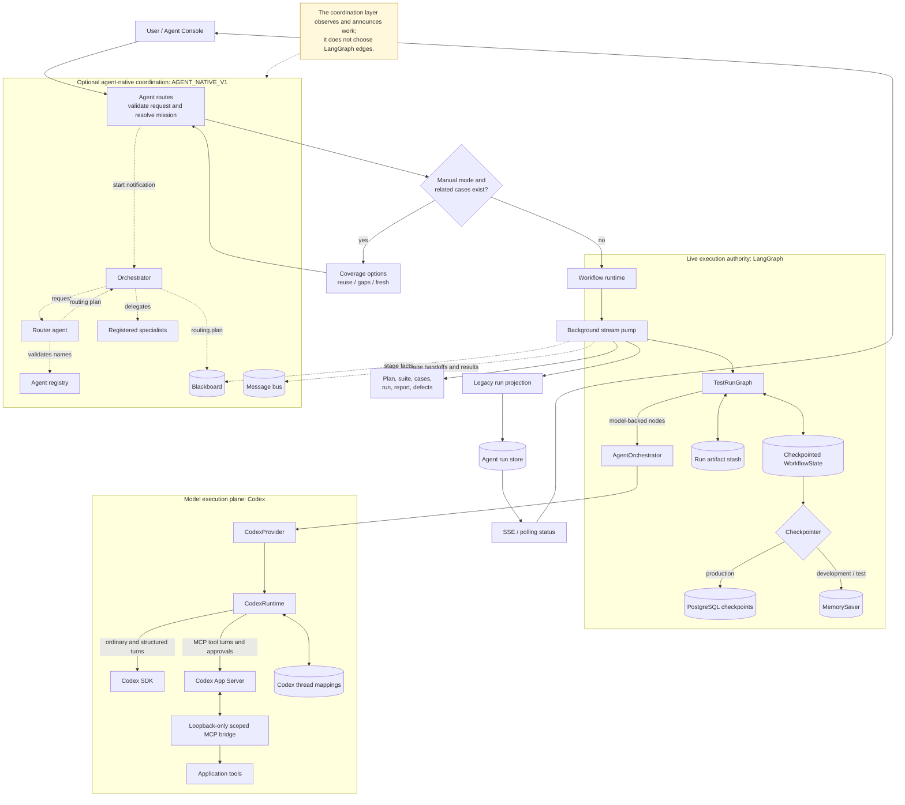
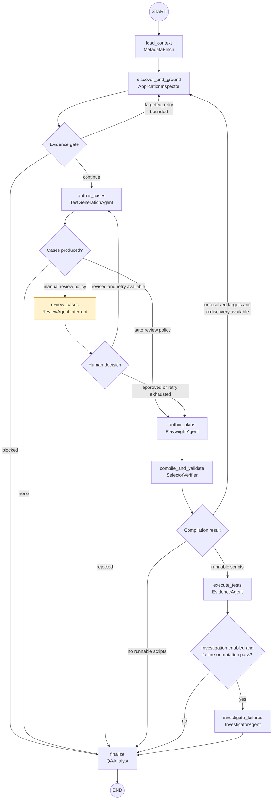
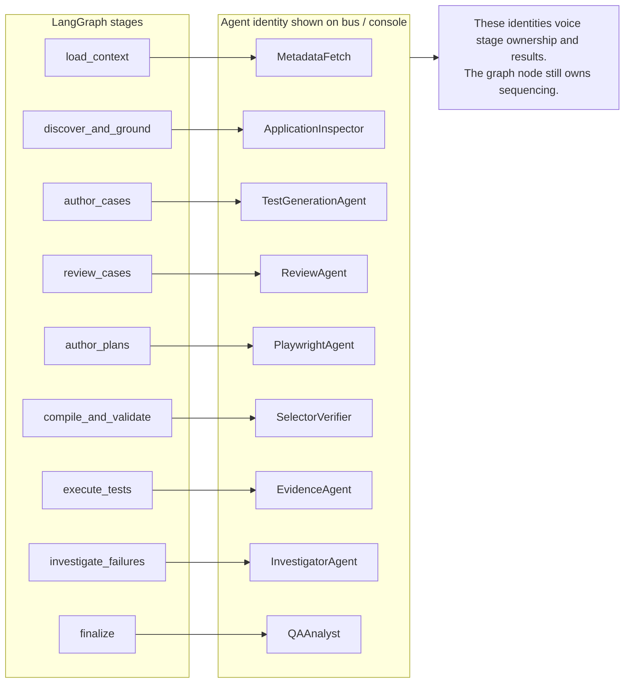
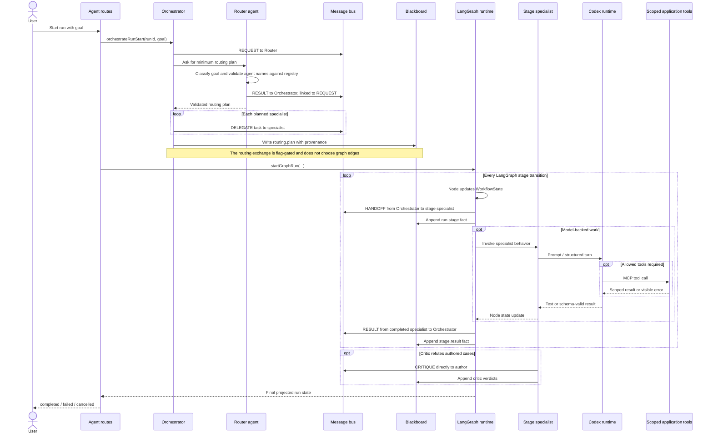
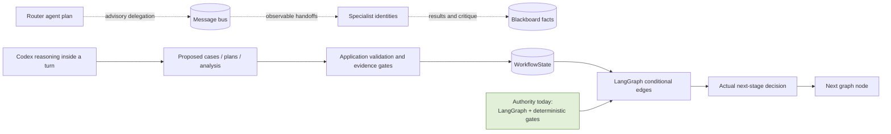
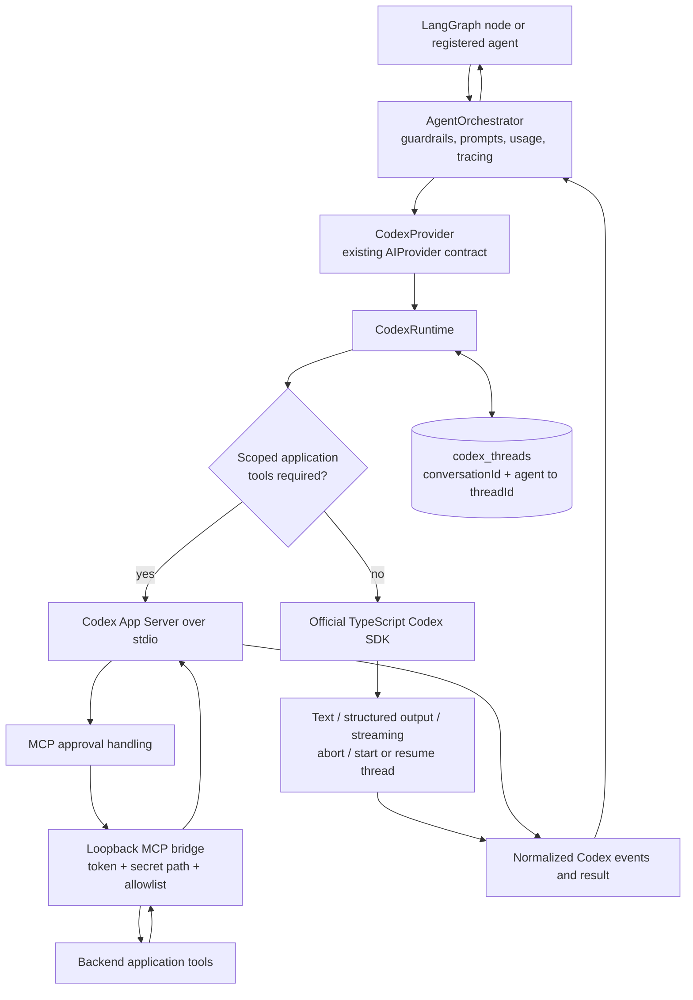
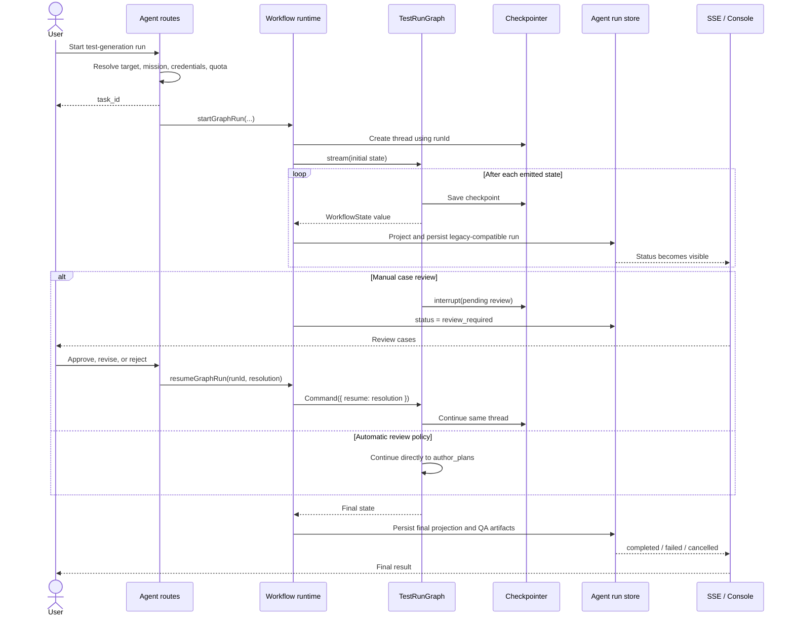
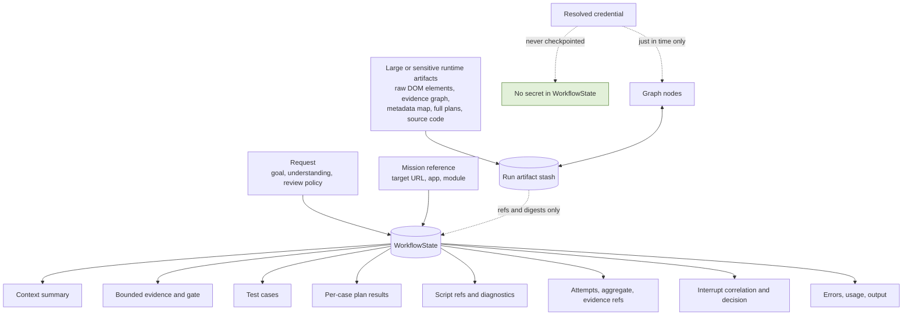

# Multi-Agent and LangGraph Orchestration

This document describes the current implementation as of 2026-08-13.

## The short version

LangGraph is the live default workflow engine. It deterministically moves one shared `WorkflowState` through context loading, application discovery, evidence grounding, case authoring, compilation, execution, investigation, and finalization.

The agent-native router, message bus, and blackboard are a separate, `AGENT_NATIVE_V1`-gated coordination layer. They publish routing plans, handoffs, results, and shared facts, but the LangGraph graph remains the authority that decides which stage executes next. In other words: the application has specialist-agent behavior and agent-to-agent telemetry, but it is not yet a free-form swarm.

Codex is the single model-execution runtime behind model-backed agents and graph nodes. Ordinary text, structured-output, streaming, cancellation, and resumable turns use the official TypeScript Codex SDK. Turns that need application tools use Codex App Server because the current SDK path cannot answer MCP approval requests. This application does **not** use the OpenAI Agents SDK as a second orchestrator; LangGraph remains the orchestrator.

## 1. Whole-system view

## 2. The live `TestRunGraph`

Important details:

- Rediscovery is bounded by `MAX_REDISCOVERY_ATTEMPTS`; the graph cannot loop forever.
- Per-case plans are authored with bounded concurrency, then merged into state by case ID.
- Compilation is deterministic and only emits runnable scripts when selectors pass validation.
- Script review is not a node in the compiled graph. The current source header still mentions `review_scripts`, but the actual `StateGraph` does not register it.
- Failure investigation is conditional on its feature flag and the execution outcome.

## 3. Agent ownership versus actual execution

The registry also contains callable roles such as `caseWriter`, `testPlanner`, `chatAssistant`, `CriticAgent`, and `playwrightCoder`. `runRegisteredAgent()` can execute a registered role through the existing model tool loop, but that seam is currently described and wired as shadow-mode coordination rather than the authority for the live deep-run graph.

## 4. How the orchestrator and agents communicate

There are three different communication paths. They should not be treated as one mechanism:

1. **Control path:** LangGraph passes checkpointed `WorkflowState` between nodes and evaluates conditional edges. This is what actually advances or stops a run.
2. **Coordination path:** the message bus records addressed agent messages; the blackboard stores shared, append-only facts. This path is active only when `AGENT_NATIVE_V1` is enabled and is currently mostly delegation and observability.
3. **Execution path:** a model-backed specialist calls Codex. If tools are required, Codex calls only the allowed backend tools through the scoped MCP bridge.

### Message contract

| Message | Meaning | Current use |
|---|---|---|
| `REQUEST` | Ask another agent for a decision or result | Orchestrator asks Router for a routing plan |
| `RESULT` | Return a result, normally linked by `causationId` | Router, stage specialists, critic, grounding, and deterministic capabilities report outcomes |
| `DELEGATE` | Ask a specialist or deterministic capability for a bounded sub-result | Orchestrator announces planned specialists and delegates compile/execute capabilities |
| `HANDOFF` | Transfer ownership of the current unit of work | Orchestrator hands each graph stage to its displayed specialist; `runRegisteredAgent()` also uses it |
| `CRITIQUE` | Refute or request correction of another agent's draft | `CriticAgent` sends case feedback directly to the author |
| `QUESTION` / `ANSWER` | Contract for clarification exchanges | Defined and persisted by the bus, but no current production publisher uses them |

Every bus message contains `runId`, per-run `seq`, `from`, `to`, `type`, `payload`, timestamp, and optional `causationId`. `to: null` is a broadcast. The bus enforces a per-run message budget and maximum causation depth to prevent runaway agent chatter.

The blackboard is not another chat channel. It is the shared fact store: agents append facts such as `routing.plan`, `run.stage`, `stage.result.*`, grounding evidence, critic verdicts, and capability results. Each fact records who wrote it, when, and which message caused it. PostgreSQL backs both channels when configured; development and tests use in-memory implementations.

### Current authority boundary

This means a bus `DELEGATE` or `HANDOFF` does not itself execute or advance the workflow. The corresponding LangGraph node does. Likewise, a Codex answer is proposed content until the node's schema, evidence, selector, compiler, or execution gate accepts it.

## 5. Codex SDK and App Server execution

The transport selector defaults to `CODEX_TRANSPORT=auto`:

- No MCP servers: use `@openai/codex-sdk`.
- Scoped MCP tools present: use App Server so tool approvals can be answered.
- SDK thread-store conflict before any event is emitted: fall back to App Server.
- `CODEX_TRANSPORT=sdk` or `app-server`: force a transport for testing or rollback.

Codex decides how to reason within an individual model turn and, for MCP turns, which allowed tool to call. It does not own workflow routing, evidence verification, selector acceptance, compilation gates, or final run status; those remain application and LangGraph responsibilities. The official [Codex SDK documentation](https://developers.openai.com/codex/sdk/) describes the SDK as the server-side TypeScript interface for starting, continuing, and resuming coding-focused threads.

## 6. Start, interrupt, and resume sequence

## 7. What travels through the graph

This split is intentional: checkpointed state stays bounded and resumable, while large artifacts remain outside the LangGraph state. The tradeoff is that the in-process stash may need rediscovery after a process restart; the agent-native run-store mirror is the incremental path toward making those shared artifacts durable.

## Source map

- Live graph topology and routers: `server/features/agent/workflow/testRunGraph.ts`
- Workflow state and reducers: `server/features/agent/workflow/state.ts`
- Start/resume/cancel and stream pump: `server/features/agent/workflow/runtime.ts`
- PostgreSQL/MemorySaver selection: `server/features/agent/workflow/checkpointer.ts`
- API cutover and coverage gate: `server/features/agent/routes.ts`
- Router decision and registry validation: `server/agent-core/router/routerAgent.ts`
- Start-of-run delegation: `server/agent-core/router/orchestrateRun.ts`
- Agent registry: `server/agent-core/registry/agents.ts`
- Stage-to-agent projection: `server/agent-core/bus/runInstrumentation.ts`
- Typed agent message contract and persistence: `server/agent-core/bus/messageBus.ts`
- Shared fact/provenance store: `server/agent-core/bus/blackboard.ts`
- Deterministic capability delegation: `server/agent-core/registry/capabilities.ts`
- Critic-to-author communication: `server/agent-core/critic/caseCritic.ts`
- Registered-agent execution seam: `server/agent-core/registry/runViaBus.ts`
- Codex runtime and transport selection: `server/ai/codex/runtime.ts`
- Official Codex SDK adapter: `server/ai/codex/sdkClient.ts`
- Approval-capable App Server client: `server/ai/codex/appServerClient.ts`
- Scoped application-tool bridge: `server/ai/codex/mcpBridge.ts`
- Codex provider adapter: `server/ai/providers/codex.ts`
- Prompt, guardrail, tracing, and tool-loop boundary: `server/ai/orchestrator.ts`
- Runtime operations guide: `docs/CODEX-RUNTIME.md`
