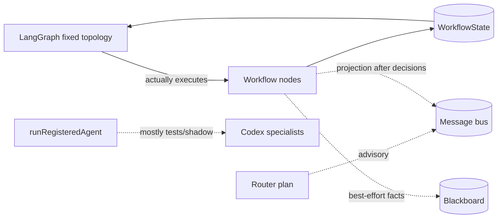
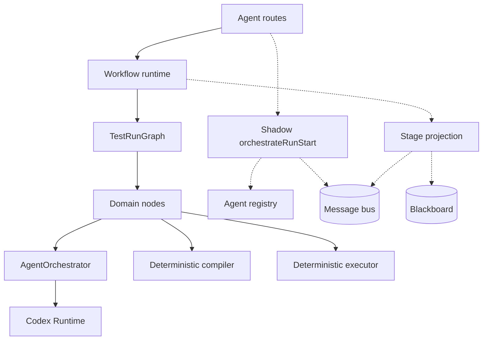
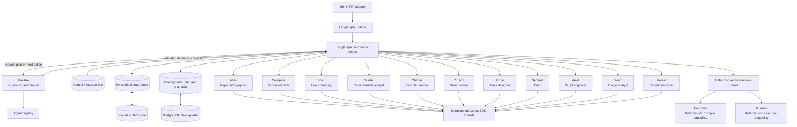
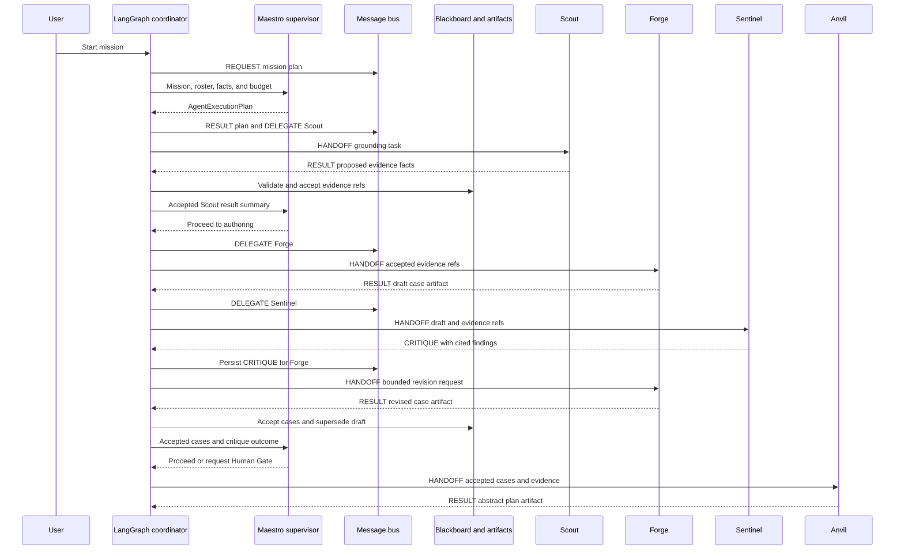
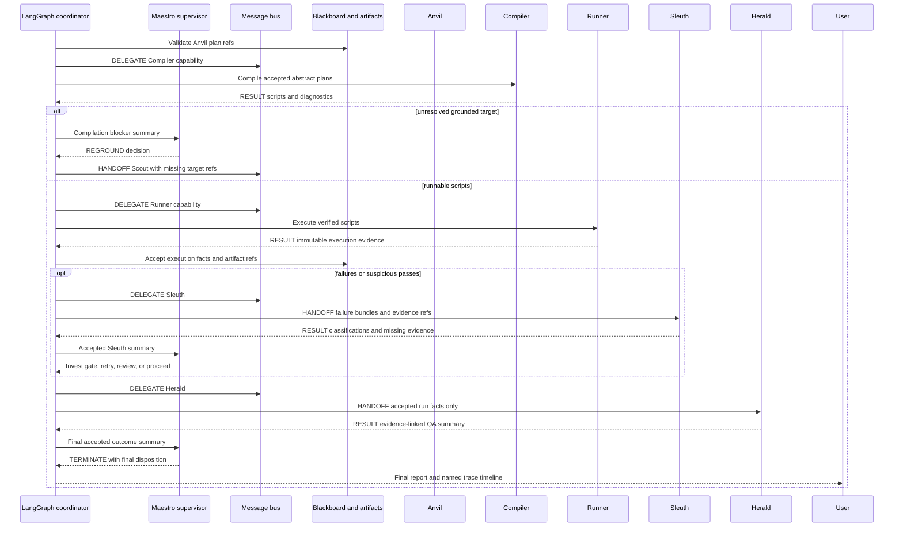
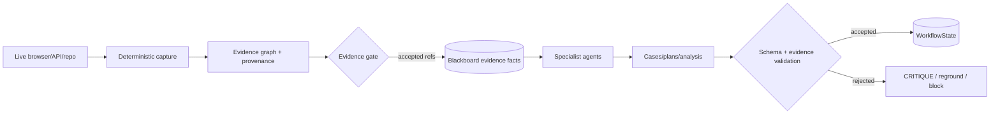
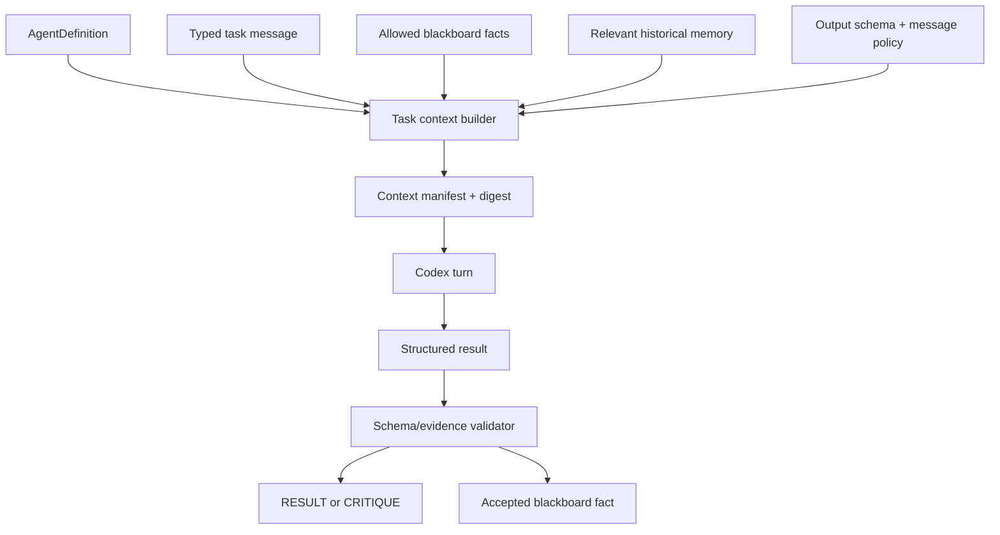
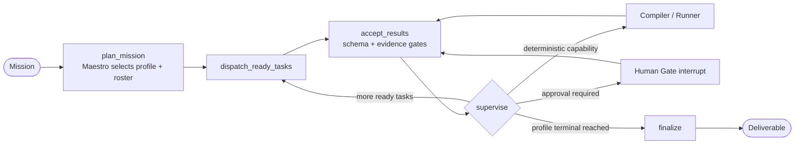

# Full Multi-Agent Orchestration — Phase 0 Implementation Plan

**Date:** 2026-08-13  
**Status:** Analysis only. No runtime implementation is authorized by this document.  
**Approval rule:** implementation may begin only after explicit approval in a later turn, one phase at a time.  
**Recommended target:** bounded hierarchical multi-agent orchestration, not an unconstrained agent swarm.

## 1. Executive Summary

The application already has most of the infrastructure needed for multi-agent work: a durable LangGraph runtime, a typed agent registry, a message bus, an append-only blackboard, a shared artifact store, per-agent Codex threads, a router, critic traffic, and deterministic compiler/executor capabilities.

It is not yet a full multi-agent orchestration system because the agent-native layer is `AGENT_NATIVE_V1`-gated, advisory, and best-effort. `orchestrateRunStart()` publishes a routing conversation but does not execute the plan. `runRegisteredAgent()` is a real execution seam but is used primarily by tests/shadow paths. LangGraph's fixed node topology remains the sole live controller, and most bus `HANDOFF`/`RESULT` traffic is emitted after the graph has already made the decision.

The smallest safe path to a real system is not to replace LangGraph. LangGraph should remain the durable scheduler, checkpoint owner, interrupt/resume engine, and bounded-loop controller. The change is to make its nodes dispatch real registered agents, consume typed agent results, and route from accepted decisions. The bus becomes the causal communication log; the blackboard becomes the shared fact surface; Codex provides independent specialist threads; deterministic evidence, compiler, selector, execution, and safety gates remain non-negotiable authorities.

Target outcome:

- a Supervisor/Router reads the user's actual request, classifies the mission, and creates a validated, persisted execution plan that names only the specialists that mission needs;
- every workspace deliverable the product owns — requirement, test plan, suite, case, automation script, run evidence, report — has a registered owning specialist, so "plan this" wakes the plan agent and ends there, while "test the list view" wakes the full grounding→authoring→scripting→execution chain;
- LangGraph schedules the plan and enforces budgets, retries, interrupts, and terminal rules;
- registered specialists execute independently through Codex with agent-specific tools and threads;
- specialists communicate through typed `REQUEST`, `RESULT`, `HANDOFF`, `DELEGATE`, `CRITIQUE`, `QUESTION`, and `ANSWER` messages;
- accepted results write versioned blackboard facts and update checkpointed workflow state;
- author/critic and investigator/judge become real decision-bearing agent loops;
- compiler and executor remain deterministic delegated capabilities;
- durable artifacts are awaited and rehydrated, making restart/cross-worker resume truthful;
- the console renders the same messages that drive execution.

### 1.1 Research-backed SDK decision

The production agent runtime will use **only `@openai/codex-sdk` for model turns**. It will not add the OpenAI Agents SDK, the Responses multi-agent beta, CrewAI, AutoGen, Swarm, or a LangGraph supervisor package.

This distinction matters:

- OpenAI's Responses multi-agent beta provides hosted `spawn_agent`, `send_message`, `wait_agent`, and related primitives, but those belong to the Responses API beta rather than the Codex SDK.
- The Codex SDK exposes coding-focused `startThread()`, `resumeThread()`, `run()`, `runStreamed()`, `TurnOptions.outputSchema`, and `TurnOptions.signal`. It does not expose the Responses API's hosted subagent coordinator.
- That surface was verified against the pinned dependency `@openai/codex-sdk@0.147.0` in `node_modules`, not against the public SDK page, which documents only thread lifecycle and sandbox presets. The plan therefore depends on a **pinned** SDK version; any upgrade must re-verify `outputSchema` and `signal` before the coordinator relies on them, because structured output and abort are the two primitives the whole design assumes.
- Codex App Server is the richer JSON-RPC surface (approvals, MCP OAuth/tool calls, thread fork/archive/compact/rollback) and OpenAI positions it for interactive client integrations, with the SDK positioned for programmatic automation. Since this runtime is programmatic and already owns its own approval/persistence layer, the SDK is the correct choice and App Server stays a legacy/admin path.
- The Codex SDK itself wraps the Codex CLI and exchanges JSONL events with it. Therefore "Codex SDK only" means that application code integrates through `@openai/codex-sdk`; it does not mean a CLI-free runtime.
- The application must own coordination. Existing LangGraph checkpoints, registry, bus, blackboard, and run store already cover most of that responsibility.

**Correction (supersedes the earlier `ToolRequest`-only stance).** Tool calling stays **native MCP through the existing in-process bridge**, on the SDK path. Verification against the pinned SDK:

- `CodexOptions.config` accepts arbitrary Codex CLI `--config` overrides, flattened to dotted paths. `mcp_servers.<name>.*` can therefore be supplied through the **SDK constructor**, so `mcpBridge.ts` works on a pure `startThread()`/`run()` path with no App Server involved.
- `ThreadOptions` carries `approvalPolicy`, `sandboxMode`, `networkAccessEnabled`, `model`, and `modelReasoningEffort` per thread — enough to give each specialist its own execution policy.
- `McpToolCallItem` is a first-class thread item (`server`, `tool`, `arguments`, `result`, `status`), so every tool call is observable from the SDK event stream for tracing.

The SDK exposes no way to *declare* tools as a parameter; tools reach the model only through CLI config. `mcpBridge.ts` already provides exactly that, with a security model the coordinator would otherwise have to rebuild: loopback bind, per-process bridge token, unguessable per-session URL revoked at close, a pinned user/project/app/conversation scope, an explicit per-session tool allowlist, a session TTL, a max-tool-call backstop, and result bounding to the artifact store.

A model-emitted `ToolRequest` loop would be strictly worse: one tool call per turn with no native parallel calls, an extra SDK turn and prompt cost per step, and — most importantly — it re-introduces the "model describes a tool call as data" failure that `mcpBridge.ts` was written to eliminate.

One real constraint follows: `config` lives on `CodexOptions` (the `Codex` constructor), not on `ThreadOptions`. Per-agent tool allowlists therefore require **one `Codex` client instance per specialist session**, not one shared client. That is desirable anyway — each specialist gets its own client, its own bridge session URL, and its own allowlist.

The authority split is by **effect**, not by mechanism:

| Tool class | Mechanism | Rationale |
|---|---|---|
| Read/inspect — `explore_page`, `verify_selectors`, `list_surfaces`, `list_api_endpoints`, repository search | native MCP bridge, in-turn, per-agent allowlist, read-only sandbox | idempotent and side-effect-free; the model should call these freely and in parallel |
| State-changing — compile, execute, persist cases/plans/suites/requirements, write artifacts | **never on the model's tool belt**; coordinator-initiated deterministic capabilities with idempotency keys | preserves exactly-once semantics across retry and restart, which a model-triggered call cannot guarantee |

App Server remains only a legacy/admin compatibility path and is never selected for a native specialist turn.

Research-derived operating limits:

- default maximum of three simultaneously running specialists per run;
- no recursive agent-created agent trees in the first production version;
- one coordinator and one level of rostered specialists; specialists cannot delegate to another specialist directly;
- parallelize only independent evidence gathering, critique, and investigation tasks;
- keep compilation, execution, human approval, and shared-state mutations ordered;
- one bounded author/critic refinement loop unless policy explicitly allows another;
- every delegation states objective, expected schema, allowed tools/facts, dependencies, and completion criteria.
- snapshot the registry digest and every selected agent-definition version when a run starts;
- enforce one shared run budget, with per-agent usage recorded beneath it.
- keep existing canonical keys for compatibility, while assigning each role a stable display name and each execution a unique instance identity.

## 2. Existing Architecture

### 2.1 Live control plane

`server/features/agent/routes.ts` creates the run and starts `startGraphRun()`. `server/features/agent/workflow/runtime.ts` compiles and streams `TestRunGraph`, checkpoints by `runId`, projects state into the legacy run record, supports review resume and cancellation, and emits status to the UI.

`server/features/agent/workflow/testRunGraph.ts` is a real LangGraph graph:

`load_context → discover_and_ground → author_cases → review_cases? → author_plans → compile_and_validate → execute_tests → investigate_failures? → finalize`.

Conditional edges are deterministic functions over persisted state. This is reliable and should remain the durable orchestration spine.

### 2.2 Agent-native substrate

- `messageBus.ts`: durable/in-memory typed messages with causation chains and loop budgets.
- `blackboard.ts`: durable/in-memory append-only facts with provenance.
- `agents.ts`: registered agent identities, prompts, tools, tags, and cost hints.
- `tools.ts`: executable, session-scoped, and deterministic capability definitions.
- `runViaBus.ts`: real registered-agent execution through Codex's tool loop.
- `routerAgent.ts`: Codex-backed plan classification validated against the registry.
- `orchestrateRun.ts`: publishes router request/result/delegations and `routing.plan`.
- `caseCritic.ts`: deterministic critique plus `CRITIQUE`/`RESULT` traffic.
- `runInstrumentation.ts`: projects graph transitions as agent handoffs/results.
- `runStore.ts`: shared JSON artifact persistence.

### 2.3 Model execution plane

`AgentOrchestrator` is the application model boundary. Today, `CodexRuntime` uses the official Codex SDK for ordinary/structured turns and Codex App Server when scoped MCP approval is needed. `codex_threads` maps `{conversationId, agent}` to distinct persistent threads.

In the target native path, every agent reasoning turn uses the Codex SDK. Application tool calls use the coordinator-mediated `ToolRequest -> ToolResult -> next SDK turn` loop. App Server remains only as a temporary legacy/admin compatibility path during migration and is never selected for a native specialist task.

### 2.4 Current truth

The substrate is real, but control is inverted (state at the time of writing; Phases 1-8 inverted it):



## 3. Dependency Graph

### 3.1 Current



### 3.2 Target



Dependency rules:

1. HTTP imports the orchestration service boundary, never internal graph nodes.
2. LangGraph owns scheduling/checkpoints but not domain reasoning.
3. Coordinator resolves agents and tools only through registries.
4. Agents communicate through messages/facts, not direct mutation of another agent's state.
5. Agents may propose; deterministic gates accept or reject.
6. Domain modules do not import Codex transport details.
7. Bus messages and blackboard facts reference artifact IDs/digests for large data.

## 4. Runtime Flow

### 4.1 Target start-to-finish flow

1. API validates tenant/user/app scope, resolves the immutable mission, creates the run, and returns `task_id`.
2. Runtime initializes `WorkflowState` with an empty orchestration plan/task ledger.
3. `plan_run` dispatches Maestro, the registered Supervisor/Router, through `runRegisteredAgent()`.
4. Maestro reads the goal, registry catalog, mission summary, budgets, relevant memory, and current accepted blackboard facts.
5. Maestro selects the mission profile (§10.1.1) and returns a schema-valid `AgentExecutionPlan` naming only that profile's roster. Registry validation rejects unknown agents/tools; policy validation adds the profile's mandatory gates and caps work. A `requirements`, `test_plan`, or `suite` mission terminates at its own deliverable and never enters compilation or execution.
6. The plan and its digest are checkpointed and written to `routing.plan`; bus messages record `REQUEST → RESULT` and causal `DELEGATE`s.
7. LangGraph schedules ready tasks. Each task has an idempotency key, owner agent, input fact refs, expected result schema, budget, dependencies, status, and attempt count.
8. A specialist receives a `HANDOFF` and runs on its own Codex SDK thread. Read/inspect tools are called natively in-turn through the scoped MCP bridge, which enforces that agent's allowlist, tenant scope, call cap, and result bounding; state-changing capabilities are not on its tool belt and must be requested as a proposed next action for the coordinator to execute. The final typed result is written as a fact and sent as a causally linked `RESULT`.
9. Coordinator validates the result schema and evidence references before marking the task accepted. Invalid results become visible task failures/retries, not silently consumed text.
10. Forge drafts cases; Sentinel independently reviews them; Forge gets one bounded revision turn. Deterministic coverage/evidence validation decides whether the revision can proceed.
11. Anvil authors abstract plans. Compiler compiles deterministically. Unresolved targets cause a bounded regrounding request to Scout.
12. Runner executes verified scripts deterministically. Sleuth receives actual evidence and classifies failures/suspicious passes; Herald receives only accepted run facts for synthesis.
13. Maestro may select only from policy-allowed next actions: proceed, reground, revise, investigate, request human review, or terminate. LangGraph enforces retry and message budgets.
14. Finalizer derives terminal status from accepted state and deterministic execution, persists artifacts, emits final results, and closes outstanding tasks.

### 4.2 Agent communication sequence





### 4.3 Named communication contract

Maestro is the reasoning supervisor; the LangGraph coordinator is the deterministic authority. Maestro proposes a plan or next action, but only the coordinator may create tasks, deliver messages, invoke capabilities, accept facts, change workflow state, retry work, interrupt a run, or terminate it.

| Sender | Receiver | Bus message | Shared payload | Expected response | State authority |
|---|---|---|---|---|---|
| Coordinator | Maestro | `REQUEST` | mission ref, registry snapshot, accepted fact refs, task/budget summary | `RESULT` containing plan or bounded next action | coordinator validates before checkpointing |
| Maestro | Scout | `DELEGATE` then `HANDOFF` | grounding objective, allowed surfaces/tools, evidence gaps, budget | `RESULT` with proposed evidence fact/artifact refs | evidence gate accepts or rejects |
| Maestro | Forge | `DELEGATE` then `HANDOFF` | accepted evidence refs, case schema, coverage goal, prior review labels | `RESULT` with draft/revised case artifact | case/schema/evidence gates accept or reject |
| Maestro | Sentinel | `DELEGATE` then `HANDOFF` | Forge artifact, source evidence refs, deterministic validation findings | `CRITIQUE` with cited objections and disposition | coordinator records critique; it does not mutate cases |
| Sentinel | Forge | `CRITIQUE` delivered by coordinator | bounded findings, evidence refs, requested corrections | revised `RESULT` or explicit disagreement | coordinator permits one bounded revision |
| Maestro | Anvil | `DELEGATE` then `HANDOFF` | accepted cases, accepted selector/DOM/API refs, plan schema | `RESULT` with abstract plans and assumptions | plan/evidence validation accepts or rejects |
| Coordinator | Compiler | `DELEGATE` | accepted abstract plan refs and compiler policy | `RESULT` with script refs and diagnostics | deterministic compiler result is authoritative |
| Coordinator | Runner | `DELEGATE` | verified script refs, environment, execution policy | `RESULT` with immutable attempts/evidence refs | deterministic execution result is authoritative |
| Maestro | Sleuth | `DELEGATE` then `HANDOFF` | normalized failure bundles and accepted execution evidence | `RESULT` with classification, confidence, citations, missing evidence | deterministic verdict remains unchanged; analysis is accepted separately |
| Maestro | Herald | `DELEGATE` then `HANDOFF` | accepted facts from the entire run and historical comparison refs | `RESULT` with final QA summary and risk | finalizer validates every claim/ref |
| Any specialist | Maestro | `QUESTION` | one bounded blocker, candidate options, relevant refs | `ANSWER`, escalation, or Human Gate | coordinator routes and checkpoints the answer |
| Maestro | Any specialist | `ANSWER` or follow-up `HANDOFF` | approved clarification/correction and remaining budget | resumed result on the same agent thread | no direct cross-agent state mutation |

Communication rules:

1. Specialists never call one another's Codex thread and never read another specialist's private transcript.
2. Every message is persisted before delivery and includes run/task/trace/span/agent-instance IDs plus `causationId`.
3. Large content is never copied into messages; messages carry bounded summaries, artifact refs, fact refs, and digests.
4. Maestro sees accepted result summaries and explicit questions, not unbounded specialist transcripts.
5. Sentinel-to-Forge critique is a logical peer exchange but is physically routed, budgeted, and recorded by the coordinator.
6. Compiler and Runner cannot send opinions or choose the next agent; they return deterministic capability results.
7. Blackboard writes start as `proposed`; only coordinator validation can mark them `accepted` or `rejected`.
8. A response must link to the request/handoff it answers. Orphan results are rejected and visible in the trace.

### 4.4 Background questions, follow-ups, and trace visibility

When a named specialist needs clarification, it sends a `QUESTION` to Maestro through the coordinator. Maestro may answer from accepted facts, ask Scout for additional evidence, request the Human Gate, or terminate the blocked branch. Follow-ups resume the same specialist's Codex SDK thread when compatible; retries create a new `agentInstanceId` attempt under the same task and trace.

The run-level stream shows named lifecycle events such as `Scout started`, `Sentinel critique received`, `Forge revision accepted`, and `Sleuth awaiting evidence`. The specialist detail stream shows that instance's bounded model/tool spans. The UI can therefore reconstruct both the orchestration chain and each background agent's behavior without exposing private reasoning.

### 4.5 Human review and cancellation

Human review remains a LangGraph interrupt. Resume writes an `ANSWER` linked to the pending `QUESTION`/review request and continues the same thread. Cancellation aborts active Codex turns and deterministic execution, marks in-flight tasks cancelled, checkpoints the state, and publishes terminal results.

## 5. Evidence Flow

Evidence must remain stronger than agent opinion:



- Raw DOM, screenshots, metadata maps, plans, and sources live in the shared run artifact store.
- Workflow state and messages carry bounded references, digests, provenance, and summaries.
- Grounding Agent may choose what evidence to request, but deterministic capture assigns provenance.
- No agent can relabel static/source evidence as live-verified.
- Compiler consumes only accepted evidence refs.
- Execution evidence is immutable input to Investigator/Analyst agents.
- Every artifact is stamped by the runtime—not the model—with `artifactId`, kind, content digest, producer role/key/version/instance, trace/span, model, prompt hash, attempt, and creation time.
- Artifact lineage uses `derivedFromArtifactIds` and optional `supersededByArtifactId`; human-reviewed artifacts additionally record `humanEdited` and the linked gate decision.
- A visible defect can therefore be traced backward through report, investigation, execution evidence, compiled script, abstract plan, test case, grounding facts, and source/live evidence.

## 6. Context Flow

Each specialist receives the minimum context required for its task:

1. agent identity/system prompt from the registry;
2. current task message and causation chain;
3. explicitly allowed blackboard fact kinds;
4. artifact summaries/refs, fetched through scoped tools when needed;
5. relevant semantic memory, tagged as historical—not current evidence;
6. budget, output contract, and permitted next-message types.

Agents do not receive the entire mutable run object or every prior agent transcript. The coordinator constructs a deterministic `AgentTaskContext` manifest and records its digest. Independent Codex SDK threads preserve agent-local conversation history, while authoritative shared facts remain outside thread memory. A specialist receives another agent's accepted facts or a bounded message summary, never that agent's private transcript by default.

### 6.1 Hybrid memory model

Use the existing stores as a hybrid memory hierarchy; do not add Mem0:

| Tier | Authority and consistency | Scope | Contents |
|---|---|---|---|
| agent working memory | private, non-authoritative | run + agent + thread | Codex SDK conversation history and current task reasoning |
| orchestration state | strongly consistent | tenant + app + run | checkpointed plan, task ledger, budgets, interrupts, accepted fact refs |
| shared facts | append-only with coordinator acceptance | tenant + app + run + fact kind | evidence claims, critiques, plans, results, provenance and supersession |
| artifacts | immutable by digest | tenant + app + run | DOM, screenshots, metadata, source, generated plans and execution evidence |
| semantic memory | historical and eventually refreshed | tenant + app + optional user/agent | prior patterns and preferences, never current-run evidence authority |
| registry snapshot | immutable for the run | app + run | agent definition versions, prompts, tools, permissions and registry digest |

Only the coordinator promotes a proposed fact to `accepted`. Conflicting facts remain visible but cannot both become current: accepted facts carry a version/digest and may identify the fact they supersede. Downstream tasks receive the latest accepted fact reference, not a mutable value or full transcript.

### 6.2 Memory access rules

1. Every read is scoped by tenant, application, run, and permitted fact kinds; agent/user scope is added where applicable.
2. Tool results and evidence are deduplicated by idempotency key or content digest before another external call is allowed.
3. Agent-private thread history is never copied wholesale into another agent's prompt.
4. Semantic memory is labelled historical and cannot satisfy a live evidence gate.
5. Credentials are session-scoped operational inputs resolved just in time; they are never memory, facts, messages, or checkpoints.
6. Registry or prompt changes affect new runs only. Active runs continue with their snapshotted agent definitions.

## 7. Prompt Flow



The existing prompt store and `systemPromptFor()` remain authoritative. Agent definitions add input/output schemas and fact permissions. No prompts move into a second configuration system. Codex SDK structured output is used for routing, cases, critiques, plans, investigation decisions, and supervisor decisions. Native MCP tool loops run inside the turn and are granted only to specialists whose role genuinely needs them.

Prompt assembly keeps stable and variable material separate:

1. versioned system prompt and output contract;
2. stable run-scoped context manifest and accepted fact summaries;
3. at most five relevant historical examples with explicit memory IDs;
4. the single task/artifact input for this turn;
5. retry correction only after a schema or deterministic validation failure.

The runtime records both `agentDefinitionVersion` and `promptHash`. A prompt-text edit changes the hash; the definition version changes when the role contract, schema, permissions, tools, or routing semantics change. This preserves measurable prompt experiments without changing stable graph node or agent role identity for every wording edit.

Structured output is validated once. A schema failure receives at most one correction turn containing the validation errors; a second failure becomes a visible task failure/escalation. Deterministic policy violations are never repaired by parsing prose or trusting a self-claim.

## 8. Current Problems

| ID | Problem | Current evidence | Impact |
|---|---|---|---|
| M1 | Router plan is non-blocking shadow output | `orchestrateRunStart()` is fire-and-forget before `startGraphRun()` | Plan cannot control execution |
| M2 | Registered-agent runner is not the live graph's normal execution path | `runViaBus.ts` states shadow/tests | Agents are addressable but not orchestrating |
| M3 | Bus traffic is primarily projection | `runtime.ts` calls `recordRunStageProgress()` after graph state emission | Console conversation does not drive state |
| M4 | Agent definitions lack task/result contracts | registry has prompt/tools/tags but no schemas/fact permissions | Free-text results cannot safely drive edges |
| M5 | Bus is a causal log, not a task ledger | no task status/idempotency/acceptance record | Cannot distinguish delegated, running, accepted, failed work |
| M6 | Blackboard values are structurally untyped at persistence boundary | generic `unknown` values/kinds | Decision consumers can read incompatible facts |
| M7 | Critic is not an independent Codex specialist | deterministic `critiqueCases()` called inside author node | A2A critique is partly representational |
| M8 | Compiler/executor delegations are emitted after execution and fire-and-forget | `recordCapabilityDelegation()` | Delegation does not initiate the capability |
| M9 | Shared run store is best-effort mirror only | stash remains authority; writes are not awaited | Restart can lose required artifacts |
| M10 | `AGENT_NATIVE_V1` defaults off | agent-native consumption disabled unless configured | Production may still be graph-only |
| M11 | Fixed graph stage names are treated as agent identities | stage-to-agent map in instrumentation | Stage ownership and real agent execution are conflated |
| M12 | `QUESTION`/`ANSWER` have no production publishers | message contract only | Agents cannot request bounded clarification |
| M13 | Routes remain a 7,110-line orchestration/API god file | direct inspection | Cutover and rollback wiring are high risk |
| M14 | The requested Responses hosted subagent primitives are not Codex SDK APIs | official API and Codex SDK documentation | Copying the sample would introduce a second model SDK and violate the constraint |
| M15 | Native tool calls select the App Server path even though the SDK can carry `mcp_servers` via `CodexOptions.config` | `CodexRuntime` provider selection (`codex/runtime.ts:196`) and `docs/CODEX-RUNTIME.md` | Native agent turns are pushed off the SDK path for no functional gain; approvals are denied anyway (`appServerClient.ts:173`), so the bridge's own scoping is what actually enforces safety |
| M23 | One shared Codex client cannot express per-agent tool allowlists | `config` is on `CodexOptions`, not `ThreadOptions` | Every specialist would inherit the same tool surface unless each gets its own client instance |
| M16 | Active runs do not pin an immutable registry/agent-definition snapshot | registry definitions are resolved from current process state | Prompt, tool, or permission changes can alter a resumed run |
| M17 | Shared facts lack an explicit acceptance/supersession consistency contract | blackboard is append-only but structurally generic | Parallel agents can expose conflicting versions of reality downstream |
| M18 | Agent labels, workflow stages, Codex threads, bus messages, and model traces do not share one identity/correlation contract | registry, workflow events, bus, and `server/ai/tracer.ts` use related but different fields | Operators cannot reliably reconstruct one agent's behavior or compare its quality over time |
| M19 | Half the product's deliverables have no owning agent | `agents.ts` registers only `ApplicationInspector`, `TestGenerationAgent`, `PlaywrightAgent`, `CriticAgent`, `QAAnalyst` — no requirement, test-plan, or suite specialist | "Draft the requirements", "plan this", and "build a suite" cannot be delegated; only cases/scripts are agent-owned |
| M20 | Non-test-run missions bypass orchestration entirely | `server/agent-runtime/routes.ts` resolves `answer`, `workspace_action`, and `requirement_draft` by single-shot delegation; only `deep_test_run`/`generate_cases` reach `startGraphRun()` | Requirements, plans, and suites get no plan, no bus/blackboard traffic, no critique, no evidence gate, and no trace |
| M21 | The graph has exactly one topology for every mission | `testRunGraph.ts:749-786` is a fixed `load_context → … → finalize` chain | The supervisor cannot shorten, extend, or re-shape a run; a plan-only request still pays for the full pipeline shape |
| M22 | "Plan" is overloaded across two different artifacts | `RouteKind.workspace_action` covers workspace test plans while `author_plans`/`testPlanner` mean per-case automation plans | Supervisor delegation, prompts, and the console conflate a QA test plan with a Playwright execution plan |

## 9. Root Cause Analysis

The substrate was added as a safe shadow around an already-working deterministic workflow. That was the correct migration strategy, but the migration stopped before control inversion.

The root cause is therefore not missing components; it is missing authority transfer:

- the router announces a plan but does not create executable tasks;
- specialists are named but graph nodes call domain functions directly;
- messages describe transitions but are not consumed to make transitions;
- facts are written for observability but are not required inputs to downstream tasks;
- durable storage mirrors the transient hot path instead of being the source of truth.

Full multi-agent orchestration requires making the existing substrate authoritative while keeping LangGraph and deterministic validation as safety rails.

The SDK-only constraint adds one further cause: the present provider boundary couples application-tool use to App Server approval handling. The root fix is not another agent framework. It is a small application-owned tool protocol around the Codex SDK's structured output, using the handlers, scopes, and persistence the repository already has.

## 10. Proposed Architecture

### 10.1 Bounded hierarchical orchestration

The target is a Supervisor plus specialists, coordinated by LangGraph:

- **Supervisor/Router Agent:** reads the request, classifies the mission, produces plans and bounded next-action decisions.
- **Grounding Agent:** chooses inspection/repository/API evidence requests; cannot certify evidence itself. Repository research is one of its evidence surfaces and runs on a Codex thread.
- **Requirements Agent:** drafts and revises structured requirements from repository evidence.
- **Test Plan Agent:** produces the workspace test plan — scope, strategy, risk, entry/exit criteria, and case selection.
- **Suite Agent:** curates suites from accepted cases and tag queries.
- **Test Author Agent:** produces structured test cases from accepted evidence.
- **Critic Agent:** independently critiques coverage, contradictions, and unsupported claims for any authored artifact.
- **Automation Planner Agent:** produces abstract per-case execution plans, never raw Playwright source.
- **Investigator Agent:** analyzes failed or suspicious executions.
- **QA Analyst Agent:** summarizes validated outcomes and risks.
- **Compiler/Executor:** deterministic capabilities, not agents.

Every deliverable the workspace stores has exactly one owning specialist. That is what makes "wake the right agent" a registry lookup rather than a branch in the graph.

### 10.1.1 Mission profiles: the request selects the roster

Maestro's first decision is which mission is being asked for. The mission profile — not a fixed topology — determines the roster, the mandatory gates, and the terminal stage. Profiles are data in the registry, validated by policy; adding one must not require a new graph.

| Mission | Example request | Roster in order | Terminal deliverable |
|---|---|---|---|
| `requirements` | "draft requirements for the list view" | Atlas → Compass → Forge → Sentinel | accepted requirements |
| `test_plan` | "plan this" | Atlas → Compass → Charter → Sentinel | accepted test plan |
| `suite` | "build a regression suite for this feature" | Curator → Sentinel | accepted suite composition |
| `cases` | "generate test cases for the list view" | Atlas/Scout → Compass → Forge → Compiler → Sentinel → Human Gate | accepted cases (review-first, not executed) |
| `automation` | "script the approved cases" | Anvil → Compiler | verified scripts |
| `deep_test_run` | "test the list view" | Atlas/Scout → Compass → Forge → Compiler → Sentinel → Anvil → Compiler → Runner → Sleuth → Herald | executed evidence, verdicts, report |
| `investigation` | "why did run 42 fail" | Sleuth → Herald | classified failures |
| `answer` | a question about the app | Atlas/Scout (read-only) → Herald | grounded answer, no artifacts written |

Rules:

1. Existing `RouteKind` values remain the compatibility surface; mission profiles are the richer internal contract Maestro plans against, and `requirement_draft`, `workspace_action`, `generate_cases`, `deep_test_run`, `code_analysis`, and `answer` each map onto a profile.
2. A longer mission always contains the shorter one's gates. `deep_test_run` reuses the same Compass/Forge/Compiler contracts it would use standalone; it does not fork a second implementation.
3. Maestro may extend a mission only through a policy-allowed next action — for example promoting `cases` to `automation` after human approval — and every extension is checkpointed and visible.
4. Maestro may not shorten a mission past a mandatory gate. Evidence, critique, compile validation, and human review remain policy, not supervisor discretion.
5. A profile whose roster is unsatisfiable in the current registry snapshot fails planning loudly instead of silently degrading to the full pipeline.
6. `answer` and `investigation` missions write no workspace artifacts; the acceptance gate rejects any proposed fact outside their declared output kinds.

### 10.1.2 Mission-shaped graph topology

The graph stops being one hardcoded chain. `testRunGraph.ts` becomes a coordinator loop — `plan_mission → dispatch_ready_tasks → accept_results → supervise → (loop | interrupt | finalize)` — where the plan's task ledger, not the edge list, decides what runs next. Deterministic capabilities and gates remain distinct nodes so LangGraph keeps interrupt/resume and terminal-state authority.



The existing named nodes are retained as deterministic capability handlers invoked by the coordinator, so Phase 4–6 migration keeps a working comparison path rather than a rewrite.

### 10.2 Durable orchestration contracts

Add four typed contracts using existing Zod:

- `AgentExecutionPlan`: plan id/digest, registry digest, pinned role/key/display-name/agent-definition versions, ordered or dependency-based tasks, mandatory stages, shared run budget.
- `AgentTask`: task id, role/key/display name/definition version/instance id, status, input fact refs, output contract, dependencies, attempt, idempotency key, per-task budget.
- `AgentResultEnvelope`: task id, result kind, proposed fact refs, artifact lineage refs, bounded summary, usage, self-reported confidence when relevant, proposed next action, errors.
- `SharedFactEnvelope`: scope, schema version, provenance, status (`proposed`, `accepted`, `rejected`, `superseded`), digest, and optional `supersedesFactId`.

Persist plan/task state inside LangGraph checkpoints. Bus messages mirror the same IDs for audit and console rendering; they do not become a second scheduler.

### 10.3 Decision-bearing communication

`runRegisteredAgent()` becomes the single specialist execution seam. It publishes `HANDOFF`, executes Codex, validates the structured result, writes proposed facts, and returns an envelope. The coordinator performs deterministic acceptance, publishes accepted or rejected fact state and `RESULT`, then updates workflow state. Direct agent-to-agent messages are consumed only through coordinator-controlled, budgeted loops.

The primary run event stream contains condensed thread lifecycle, delegation, blocking, and result events. Detailed Codex/tool events remain associated with the owning specialist thread and are loaded only when the console drills into that task. This prevents the shared stream from becoming another full-transcript memory store.

### 10.4 LangGraph's role

LangGraph continues to own:

- durable scheduling and checkpointing;
- conditional routing from accepted results;
- fan-out/fan-in where safe;
- retry limits and loop bounds;
- interrupt/resume/cancel;
- terminal-state truth.

It no longer impersonates specialists through stage labels. Nodes become coordinator/dispatch/validation nodes or deterministic capabilities.

### 10.5 Codex's role

Codex owns reasoning inside an assigned specialist task. Each registered specialist uses a distinct thread. Codex never becomes the workflow scheduler and never overrides evidence, compiler, execution, security, or human-review gates.

### 10.6 SDK-only execution protocol

The coordinator implements the minimum primitives that the Codex SDK does not provide:

| Application primitive | Existing substrate | Authoritative behavior |
|---|---|---|
| dispatch specialist | registry + `runViaBus.ts` | start/resume one Codex SDK thread for the task owner, on that specialist's own `Codex` client |
| send result/message | message bus | persist typed message with run/task/correlation/causation IDs |
| share knowledge | blackboard + run store | publish accepted typed facts and immutable artifact references |
| wait/join | LangGraph state + checkpoint | schedule only tasks whose dependencies are accepted |
| interrupt/cancel | workflow runtime + abort signal | stop the active SDK turn and mark task state durably |
| invoke read/inspect tool | `mcpBridge.ts` + tool registry | model calls natively in-turn; bridge enforces scope, allowlist, call cap, and result bounding |
| invoke state-changing capability | tool registry + coordinator | coordinator-initiated only, executed once under an idempotency key; never on the model's tool belt |
| retry/refine | coordinator policy | bounded attempts with the same idempotency key and visible failure state |

The Supervisor uses a manager pattern: it retains control and invokes specialists for bounded tasks. Peer handoff is represented as a proposal that the coordinator validates; no specialist can silently transfer workflow ownership or spawn an unbounded subtree.

### 10.7 Why this design, based on external systems

- OpenAI's hosted Responses pattern validates parallel subagents for independent, bounded work, while explicitly warning against a "single ordered chain of reasoning", frequent writes to shared mutable state, and workflows needing a fixed deterministic execution graph. Its `max_concurrent_subagents` defaults to 3. This plan therefore uses selective fan-out at exactly that default, and — because QA automation *is* partly a fixed deterministic graph — keeps LangGraph as the scheduler rather than adopting the hosted coordinator.
- Anthropic's production research system uses a lead-agent/worker model and reports that a delegation must carry four things: an objective, an output format, guidance on tools and sources, and clear task boundaries. Vague delegation produced duplicated work and coverage gaps. §4.3's handoff payload columns exist to make all four mandatory. It also reports multi-agent systems using roughly 15× the tokens of chat and 4× for single agents, with token volume explaining ~80% of benchmark performance variance — which is why this plan budgets specialists per mission profile instead of spawning them at every node.
- Anthropic's reported production failure modes map directly onto this plan's hard requirements: compounding errors in long-running stateful processes (→ checkpointed task ledger and resume from the last accepted boundary), non-determinism defeating step-level assertions (→ outcome-based evaluation and full production tracing in §10.9), and synchronous waits blocking the whole system (→ dependency-based scheduling rather than stage barriers).
- Mem0 reports that 36.9% of multi-agent failures come from inter-agent misalignment — conflicting views of reality, duplicated calls, and one agent's hallucinated detail cascading downstream. That is the direct justification for the accept/supersede fact lifecycle in §6.1 and the digest-based deduplication rule in §6.2; a better model does not fix it.
- Google describes modern multi-agent systems as perception, reasoning, action, interaction, and orchestration over a shared environment. The bus/blackboard provide interaction; LangGraph provides orchestration; deterministic tools provide action.
- LangGraph's supervisor repository now recommends implementing the supervisor pattern directly with tools for greater context control. Since this repository already has LangGraph and orchestration primitives, adding its supervisor library would duplicate infrastructure.
- OpenAI Agents SDK examples distinguish a manager that retains control from handoffs that transfer control. The manager pattern is the safer fit for evidence-gated QA automation, but the Agents SDK itself is not added.
- Claude Managed Agents confirms the useful operational shape, and several of its choices are enforced rather than advisory — which is why this plan mirrors them as policy, not convention:
  - one-level delegation is a **validation error**, not a guideline: a coordinator referencing an agent that itself has a roster fails at create/update time. §10.6's "no recursive agent trees" is therefore the same rule, enforced at plan validation.
  - the roster is **snapshotted and version-pinned** when the coordinator is created; referenced agents do not pick up later definition updates. This is exactly the registry-snapshot requirement in M16 and §6.1.
  - each agent gets its own context-isolated thread; tools, MCP servers, and context are **not** shared, while sandbox/filesystem/credentials are. This matches §6's "accepted facts, never another agent's transcript".
  - threads persist, so a coordinator can send a follow-up to an agent it called earlier and that agent retains its prior turns — the behavior §4.4 specifies for resumed specialists.
  - a **single shared session budget** spans all threads, and threads pause independently as the cap is reached, each priced at its own model. §10.2's shared run budget with per-agent usage beneath it is the same design.
  - concurrency is capped (25 threads) with completed threads archived to free slots, confirming that thread lifecycle must be actively closed rather than left dangling — hence the coordinator's "close outstanding tasks" duty in §4.1.
  This plan implements those ideas locally with Codex SDK and the existing infrastructure.
- Mem0's production-memory article supports a hybrid model: strongly consistent shared state plus private agent context and scoped historical memory. This plan adopts the pattern but not the Mem0 dependency, because the repository already has checkpoint, blackboard, artifact, registry, and semantic-memory components.

### 10.7.1 Evaluation of the Codex CLI + Agents SDK multi-agent example

OpenAI's "Building consistent workflows with Codex CLI and Agents SDK" cookbook runs `codex mcp-server` (exposing the `codex` and `codex-reply` tools) and orchestrates a Project Manager over Designer, Frontend, Backend, and Tester agents using Agents SDK `handoffs`. Its **shape is the target shape**: one coordinator, role specialists, gated progression, and file artifacts as the handoff payload. Its **mechanism is not adoptable** for this product, for six specific reasons:

| Example's mechanism | Why it fails here |
|---|---|
| Gating lives in the PM's prompt ("verify `design_spec.md` exists before proceeding") | Advisory text, not enforcement. This product's core defect class is exactly ungrounded steps proceeding anyway; the evidence, compile, and review gates must be code the model cannot talk past |
| `handoffs=[...]` transfers control to the receiving agent | No authority remains to validate, reject, retry, or checkpoint. Contradicts §4.3: only the coordinator may create tasks, accept facts, and change state. Bidirectional rosters (`designer.handoffs=[pm]`) let control ping-pong with no ledger |
| `Runner.run(..., max_turns=30)` is the only bound | No durable state. Process death loses the run. This product requires Postgres-checkpointed HITL review interrupts, cross-worker resume, and truthful cancellation |
| Shared workspace files (`REQUIREMENTS.md`, `AGENT_TASKS.md`) carry state | Breaks per-tenant/per-run isolation and carries no provenance, digest, lineage, or accept/supersede lifecycle |
| Every agent runs `{"approval-policy":"never","sandbox":"workspace-write"}` | A security regression against the current `sandbox: 'read-only'` defaults in `codex/runtime.ts:193` and `codex/sdkClient.ts:57` |
| Agent brains are `gpt-5` via Agents SDK; Codex is only an MCP tool | Adds a second model path and a second scheduler beside LangGraph, violating the SDK-only constraint in §1.1 |

Additionally, the `codex` / `codex-reply` MCP tool pair is functionally the same per-agent thread plus follow-up that `startThread()` / `resumeThread()` already provide — but the MCP tools expose **neither `outputSchema` nor `signal`**. Routing specialists through the MCP server would therefore *lose* structured output and turn cancellation, the two primitives this entire design depends on.

Three things from the example are worth adopting, and are folded into this plan:

1. **Per-delegation sandbox and approval policy.** The example varies `sandbox`/`approval-policy` per call; this runtime hardcodes read-only globally. `AgentDefinition` gains a required execution-policy field: Scout, Charter, Compass, Curator, Sentinel, Sleuth, and Herald are `read-only`; only the deterministic Compiler/Runner capabilities receive write scope, and never through a model-authored request.
2. **Artifact-as-handoff-payload discipline.** Each role is pointed at named artifacts rather than handed a transcript. This is already §6's rule; the example validates it and is cited as prior art.
3. **Exact per-role deliverable contracts.** Each agent's instructions name the precise files it must produce. That is the same requirement as Anthropic's objective/output-format/boundaries rule and is enforced here through per-role output schemas rather than prose.

Codex CLI **subagents** (`.codex/agents/*.toml`, `agents.max_concurrent_threads_per_session`, built-in `default`/`worker`/`explorer`) are likewise rejected as the orchestration spine: the CLI consolidates subagent results internally, so tasks, acceptance, budgets, and traces would be invisible to LangGraph and to the console. They remain a permitted **intra-specialist** optimization — for example Scout fanning out repository exploration — provided the specialist still returns exactly one typed envelope against its shared budget.

Primary references:

- [OpenAI Responses API multi-agent guide](https://developers.openai.com/api/docs/guides/responses-multi-agent)
- [OpenAI Codex SDK documentation](https://developers.openai.com/codex/sdk/)
- [OpenAI Codex TypeScript SDK source](https://github.com/openai/codex/tree/main/sdk/typescript)
- [Codex CLI as an MCP server + Agents SDK multi-agent workflow](https://learn.chatgpt.com/docs/mcp-server)
- [Codex CLI subagents](https://learn.chatgpt.com/docs/agent-configuration/subagents)
- [Codex App Server](https://learn.chatgpt.com/docs/app-server)
- [Anthropic multi-agent research system](https://www.anthropic.com/engineering/multi-agent-research-system)
- [Google Cloud guide to multi-agent systems](https://cloud.google.com/discover/what-is-a-multi-agent-system)
- [LangGraph supervisor reference implementation](https://github.com/langchain-ai/langgraph-supervisor-py)
- [OpenAI Agents SDK manager/handoff reference](https://github.com/openai/openai-agents-python/blob/main/docs/agents.md)
- [Claude Managed Agents multiagent orchestration](https://platform.claude.com/docs/en/managed-agents/multiagent-orchestration)
- [Mem0 production multi-agent memory design](https://mem0.ai/blog/multi-agent-memory-systems)

### 10.8 Agent names and stable identities

Names are operational labels, not routing keys. Existing canonical agent keys remain unchanged for backward compatibility. The registry adds a permanent `displayName`, `role`, and version; the coordinator creates a unique `agentInstanceId` for every run/task execution.

| Stable role ID | Display name | Existing/target key | Responsibility |
|---|---|---|---|
| `orchestrator.supervisor` | **Maestro** | new, over `goalRouter` | decides ONLY the ambiguous cases: scope ambiguity, repair-vs-escalate, budget breach. Never authors artifacts, never picks the next node |
| `specialist.repo_cartographer` | **Atlas** | new, over `featureDiscoveryAgent` | reads the codebase once and produces the structured repo map every other agent depends on; cached per commit SHA |
| `specialist.scope_resolver` | **Compass** | new, over `featureAnalyst` | subtraction, not addition: reduces the repo map to the minimal slice needed to test the target |
| `specialist.live_grounding` | **Scout** | `ApplicationInspector` | grounds evidence against the LIVE application (DOM, selectors, API) — the runtime counterpart to Atlas |
| `specialist.requirements_analyst` | **Scribe** | new, over `featureAnalyst` | produces testable requirements; every one carries a source ref and an acceptance criterion |
| `specialist.test_plan_author` | **Charter** | new, over `testPlanner` | authors the workspace test plan: scope, strategy, risk, entry/exit criteria, case selection |
| `specialist.suite_curator` | **Curator** | new, over `suiteDesigner` | composes and maintains suites from accepted cases and tag queries |
| `specialist.case_designer` | **Forge** | `TestGenerationAgent` / `caseWriter` | designs executable cases from ONE approved requirement, using only inventory selectors |
| `specialist.critic` | **Sentinel** | `CriticAgent` | independently challenges unsupported, duplicate, unsafe, or incomplete artifacts |
| `specialist.script_engineer` | **Anvil** | `PlaywrightAgent` / `playwrightCoder` | generates Playwright specs from approved cases; evidence capture comes from the shared fixture |
| `specialist.triage_analyst` | **Sleuth** | new, over `defectTriage` | triages ONE stable failure; rules out the test before blaming the product |
| `specialist.report_composer` | **Herald** | `QAAnalyst` | composes the run report: verdict, counts, new defects, regressions, suite health, coverage |

This roster is adopted verbatim from the project's own `TestFlow-AI-System-Prompts.md` spec, which supersedes the names used in earlier drafts of this plan. Three consequences are load-bearing:

1. **Maestro is narrow.** The spec is explicit that most routing is deterministic graph edges and that an LLM must not sit in the hot path for "which node next". Mission selection stays with the existing deterministic goal router; Maestro handles only the three genuinely ambiguous decisions. This is cheaper and removes a whole class of misrouting.
2. **Atlas and Scout are both needed.** The spec is repo-centric; this product also inspects a live application. Atlas maps the code, Scout grounds the running app, and neither can certify the other's evidence.
3. **Charter and Curator are additions to the spec**, covering the test-plan and suite deliverables the spec omits but the product owns. `Sentinel` is likewise retained: the critic already exists in code and removing it would delete working capability.

Deterministic capabilities keep plain names — the roster's agent names are reserved for reasoning agents, so a capability can never read as one. (An earlier draft called the compiler "Forge", which now collides with the case designer; the compiler is not an agent and does not get a persona.)

| Capability ID | Display name | Responsibility |
|---|---|---|
| `capability.compiler` | **Compiler** | compile and validate plans/selectors into runnable scripts |
| `capability.executor` | **Runner** | execute verified scripts and capture immutable evidence |
| `gate.human_review` | **Human Gate** | represent a real user approval/revision interrupt |

Identity fields:

- `agentRoleId`: stable semantic role, such as `specialist.critic`;
- `agentKey`: existing canonical registry key used by prompts, settings, RBAC, and thread mapping;
- `displayName`: human-readable name shown in the console, such as `Sentinel`;
- `agentDefinitionVersion`: immutable definition version pinned by the run snapshot;
- `promptHash`: runtime-computed hash of the rendered system prompt; never supplied by the model;
- `agentInstanceId`: unique execution identity, formatted as `<display-slug>:<runId>:<taskId>:<attempt>`;
- `codexThreadId`: provider conversation identity, never used as the business identity;
- `langGraphThreadId`: durable workflow/checkpoint identity;
- `traceId`: observability trace identity in the tracer's required format;
- `runId`, `taskId`, `spanId`, `parentSpanId`, `messageId`, and `causationId`: business and causal correlation fields shared across workflow, bus, facts, tools, model turns, and UI.

`runId`, `langGraphThreadId`, `traceId`, and `codexThreadId` are correlated but never assumed to be equal or interchangeable.

Example operator label: `Sentinel · critic · attempt 2`, backed by `agentInstanceId=sentinel:<runId>:<taskId>:2`.

### 10.9 Traceability and behavioral accuracy

Every task produces one root agent span. Planning, message receipt, context assembly, Codex turns, tool requests, tool results, fact proposals, validation, retries, handoffs, and completion are child spans. Events are append-only and use a common envelope:

```text
traceId, spanId, parentSpanId, timestamp, runId, langGraphThreadId, taskId,
agentRoleId, agentKey, displayName, agentDefinitionVersion,
promptHash, agentInstanceId, codexThreadId, eventType, status,
inputRefs, memoryRefs, outputRefs, artifactIds, durationMs, usage,
selfConfidence, errorCode
```

Trace payloads contain references/digests and bounded summaries, not secrets, raw credentials, private reasoning, full prompts, DOM dumps, or full agent transcripts.

Identity and provenance are injected by the coordinator/tracing wrapper after a model result returns. No prompt asks an agent to state its own name, ID, version, model, thread, or trace identity.

The system reports observable behavior separately from outcome quality:

- reliability: completion, cancellation, timeout, retry, schema-valid-output, and tool-error rates;
- grounding: proposed-fact acceptance/rejection, stale-evidence use, unsupported-claim, and selector-validation rates;
- collaboration: duplicate work, unanswered question, conflicting fact, critic-overturn, and handoff-success rates;
- efficiency: latency, queue time, Codex turns, tool calls, tokens, cost, and budget share per role/version;
- outcome contribution: downstream acceptance, compile success, execution validity, defect confirmation, and final-result correlation.

These are not labelled "agent accuracy" until a versioned evaluation dataset supplies expected outcomes. Production telemetry measures behavior and contribution; offline evals measure accuracy, precision/recall, and regression by `agentRoleId + agentDefinitionVersion`.

### 10.10 Human feedback, scorecards, and calibration

Existing case/script review gates become labelled observations. The runtime records item-level decisions rather than only `approved` or `rejected`:

- `accepted_unchanged`;
- `edited`, with bounded structured edit type and before/after artifact refs;
- `rejected`, with reason code;
- `added_by_human`, which exposes recall gaps that acceptance rate cannot measure;
- `removed_by_human`, which exposes over-generation and duplication.

Human edits are never treated as training data automatically. They enter scoped historical memory only after validation/retention policy permits it, and their memory IDs are recorded whenever retrieved.

Initial scorecards use evidence available in this product:

| Role | Primary quality signal | Supporting signals |
|---|---|---|
| Maestro | decision regret: retries that still fail or escalations later judged unnecessary | budget overruns, loop prevention, successful joins |
| Scout | accepted evidence fidelity on golden/live fixtures | unsupported facts, stale evidence, duplicate captures, grounding latency |
| Forge | cases accepted unchanged and human-added coverage gaps | edit/reject/duplicate rates, evidence citation validity |
| Sentinel | confirmed useful critiques | false objections, missed deterministic violations, author revision acceptance |
| Anvil | first-pass deterministic compile validity | unresolved targets, repair attempts, unsupported assumptions |
| Sleuth | confirmed failure-class precision | confusion matrix, false product-defect rate, missing-evidence requests |
| Herald | factual report consistency with accepted run state | omitted severe findings, unsupported claims, human corrections |

Self-reported confidence is stored only as a calibration input. It cannot authorize auto-approval until enough labelled outcomes exist for the same role and definition/prompt cohort. Calibration compares claimed confidence with measured correctness by bucket; promotion thresholds require minimum sample size and an offline golden-set regression.

Prompt changes first run in shadow evaluation against versioned golden cases. Promotion compares quality, recall, schema validity, latency, and cost against the current prompt hash. Production scorecards always show role, definition version, prompt hash, model, sample count, and evaluation window so unlike cohorts are not mixed.

## 11. Complete Refactoring Strategy

1. Add typed plan/task/result contracts to state without changing live routing.
2. Upgrade the registry and runner so one real specialist can return a validated envelope through a Codex SDK thread, with runtime-stamped identity and prompt/memory provenance.
3. Make router execution synchronous and checkpoint its validated plan before downstream work.
4. Add mission profiles and the missing workspace specialists so every deliverable — requirement, test plan, suite, case, script, run, report — has one owning agent and one terminal condition.
5. Migrate Grounder, Author, and Critic into a real message-driven loop; keep legacy node implementations as adapters during comparison.
6. Move native MCP tool calling onto the SDK path, split read/inspect tools from coordinator-only capabilities, and migrate Planner, Investigator, and Analyst; wrap compiler/executor so delegation initiates execution.
7. Make shared run artifacts authoritative, immutable, lineage-stamped, and awaited at graph boundaries; rehydrate before resume.
8. Switch console/status to task/message/span truth, capture item-level human review labels, expose calibrated role/version scorecards, and make agent-native orchestration the default.
9. Remove projection-only handoffs, shadow comments, dead flag branches, and direct specialist calls after canary validation.

No new orchestration framework or dependency is needed. Reuse LangGraph, Zod, the current registries, Codex SDK runtime, bus, blackboard, and PostgreSQL. The Responses multi-agent beta and OpenAI Agents SDK are design references only.

## 12. Every File That Must Change

### 12.1 New files

| File | Purpose | Risk |
|---|---|---|
| `server/agent-core/orchestration/contracts.ts` | Zod schemas/types for separated run/thread/trace identities, trace envelopes, plans, tasks, results, artifact lineage, shared fact lifecycle, tool requests/results, fact refs, allowed next actions | Medium |
| `server/agent-core/orchestration/coordinator.ts` | Dispatch/accept/retry/close task operations over existing bus, registry, and runner | High |
| `server/agent-core/orchestration/context.ts` | Deterministic per-agent task context manifest from allowed facts/refs/memory | Medium |
| `server/agent-core/orchestration/missionProfiles.ts` | Mission definitions: roster, mandatory gates, allowed output fact kinds, terminal deliverable, allowed promotions; validated against the registry snapshot | High |
| `server/agent-core/specialists/requirementsAgent.ts` | Charter's typed task/result contract over existing requirement services | Medium |
| `server/agent-core/specialists/testPlanAgent.ts` | Compass's typed task/result contract for the workspace test plan | Medium |
| `server/agent-core/specialists/suiteAgent.ts` | Curator's typed task/result contract over suite/tag-query services | Medium |
| `scripts/test-mission-profiles.ts` | Profile→roster resolution, terminal stage, forbidden-output rejection, unsatisfiable-roster failure | Low |
| `server/features/agent/workflow/nodes/agentCoordination.ts` | LangGraph node adapters for plan, dispatch, critique loop, supervision | High |
| `scripts/test-agent-coordinator.ts` | Task lifecycle, schema rejection, causation, idempotency, budget check | Low |
| `scripts/test-agent-native-e2e.ts` | Full plan→specialists→capabilities→finalize fixture | Medium |

### 12.2 Existing files to modify

| File | Change | Risk |
|---|---|---|
| `server/agent-core/registry/agents.ts` | Add stable role IDs, display names, definition versions, schemas, fact permissions, task modes, retry/budget metadata, per-agent sandbox/approval execution policy; register Maestro Supervisor, real Sentinel Critic, and the Charter/Compass/Curator workspace specialists | High |
| `server/agent-runtime/goals/types.ts` | Map each `RouteKind` onto a mission profile; keep existing kinds as the compatibility surface | Medium |
| `server/agent-runtime/goals/router.ts` | Emit the resolved mission profile alongside the route; keep the confidence/clarify/target gates unchanged | Medium |
| `server/agent-runtime/routes.ts` | Route `requirement_draft`, `workspace_action`, and `answer` through the orchestration boundary instead of single-shot delegation, preserving current response shapes | High |
| `server/features/requirements/requirementService.ts` | Expose the deterministic requirement handler invoked by Charter; keep quality gates authoritative | Medium |
| `server/agent-core/registry/tools.ts` | Classify every tool as read/inspect (native MCP, model-callable) or state-changing (coordinator-only capability); bind scoped deterministic handlers | High |
| `server/agent-core/registry/runViaBus.ts` | Accept typed tasks, run only Codex SDK turns with a per-specialist client and bridge session, validate envelopes, write facts, propagate abort/usage | High |
| `server/agent-core/router/routerAgent.ts` | Emit `AgentExecutionPlan`, enforce minimum plan and registry/policy validation | High |
| `server/agent-core/router/orchestrateRun.ts` | Become awaited decision-bearing planning call; stop swallowing plan failures | High |
| `server/agent-core/bus/messageBus.ts` | Add correlation/task IDs and protocol validation while preserving existing messages | Medium |
| `server/agent-core/bus/blackboard.ts` | Enforce scoped proposed/accepted/rejected/superseded fact envelopes and digest-aware reads | High |
| `server/agent-core/bus/runInstrumentation.ts` | Remove stage impersonation after cutover; retain compatibility projection only | Medium |
| `server/ai/tracer.ts` | Become the single tracing wrapper; inject identity/prompt/memory/artifact provenance, emit the common task/span envelope, and redact payloads while preserving legacy readers | High |
| `server/features/agent/workflow/events.ts` | Add compatible identity, span, lifecycle, usage, and reference fields to workflow events | Medium |
| `server/agent-core/critic/caseCritic.ts` | Retain deterministic checks as a Critic tool/guard, move agent reasoning to registered Critic | Medium |
| `server/agent-core/grounding/groundingFacts.ts` | Return required accepted fact refs; stop best-effort fire-and-forget use in authoritative path | Medium |
| `server/agent-core/runstore/runStore.ts` | Add batch/required artifact writes, runtime-stamped producer/lineage metadata, and digest/version checks | High |
| `server/agent-core/runstore/runStoreMirror.ts` | Replace mirror-only authority with awaited persistence adapter during cutover | High |
| `server/agent-core/agentNativeFlag.ts` | Move from boolean shadow flag to explicit `shadow/canary/native` mode, then retire after cutover | Medium |
| `server/features/agent/workflow/state.ts` | Add checkpointed plan/task ledger, registry snapshot, shared budget, accepted result refs, orchestration mode/version | High |
| `server/features/agent/workflow/testRunGraph.ts` | Replace the fixed nine-node chain with the mission-driven coordinator loop; make accepted agent results and the task ledger drive progression and termination | Critical |
| `server/features/agent/workflow/runtime.ts` | Await plan start, recover active tasks, cancel Codex tasks, project real message/task state | Critical |
| `server/features/agent/workflow/artifactStash.ts` | Read-through/rehydrate from authoritative store; remove fire-and-forget-only durability | High |
| `server/features/agent/workflow/nodes/authoring.ts` | Expose typed author/planner operations used by registered agents; preserve structured output | High |
| `server/features/agent/workflow/nodes/investigation.ts` | Split investigator/judge contracts for independent registered agents | High |
| `server/features/agent/workflow/nodes/compilation.ts` | Expose deterministic handler invoked by registered capability delegation | Medium |
| `server/features/agent/workflow/nodes/execution.ts` | Expose deterministic handler, cancellation/idempotency, durable results | High |
| `server/features/agent/routes.ts` | Start native runtime through service boundary, remove fire-and-forget shadow plan, preserve API/SSE contracts | Critical |
| `services/orchestration/index.ts` | Export full start/resume/cancel/status native boundary and orchestration contracts | Low |
| `server/ai/orchestrator.ts` | Add structured Codex SDK-only registered-agent turn seam and per-agent thread lifecycle | High |
| `server/ai/codex/runtime.ts` | Add an SDK-only native execution mode that passes `mcp_servers` through `CodexOptions.config`; prohibit App Server selection for native agent turns | High |
| `server/ai/codex/sdkClient.ts` | Expose bounded structured turn/stream/abort, per-specialist client instances carrying that agent's bridge session and tool allowlist, and per-thread sandbox/approval policy | Medium |
| `server/ai/codex/mcpBridge.ts` | Bind sessions to `agentInstanceId`/`taskId`, emit `McpToolCallItem` correlation into the trace envelope, and enforce the per-agent allowlist from the registry snapshot | High |
| `server/ai/systemPrompts.ts` | Add/adjust Maestro, Sentinel, Scout, Sleuth, and Herald role contracts plus bounded structured-output rules | Medium |
| `server/db/schema.sql` | Add idempotent task/correlation/fact-lifecycle/agent-version/prompt-hash/artifact-lineage/human-label fields or tables; indexes and constraints | High |
| `scripts/setup-db.bat` | Apply/verify authoritative schema path after schema additions | Low |
| `scripts/test-agent-bus.ts` | Cover protocol validation/correlation compatibility | Low |
| `scripts/test-agent-registry.ts` | Cover schemas, fact permissions, deterministic bindings | Low |
| `scripts/test-agent-orchestration.ts` | Replace shadow-plan assertions with executable-plan assertions | Medium |
| `scripts/test-agent-critic.ts` | Cover independent critic result plus deterministic guard | Medium |
| `scripts/test-agent-capabilities.ts` | Prove delegation initiates compile/execute exactly once | Medium |
| `scripts/test-agent-workflow-state.ts` | Plan/task checkpoint, separated identity, prompt/memory provenance, artifact-lineage, and secret-leak checks | Medium |
| `scripts/test-agent-workflow-resume.ts` | Resume active agent tasks/artifacts after restart | High |
| `scripts/test-codex-tool-loop.ts` | Per-agent thread isolation, abort, structured result, scoped tools | Medium |
| `src/lib/useAgentRun.ts` | Preserve task/message state consistently across SSE/refetch | Low |
| `src/components/DeepRunResult.tsx` | Render named task/span truth, lineage, item-level human labels, calibrated scorecards, and accessible historical fallback | Medium |
| `package.json` | Add bounded check scripts only; no dependency addition | Low |

### 12.3 Verify-only unless a regression is found

- `server/features/agent/graph/evidenceGraph.ts`
- `server/features/agent/graph/groundingEngine.ts`
- `server/features/agent/compiler/Compiler.ts`
- `server/features/agent/compiler/playwrightCompiler.ts`
- `server/ai/codex/mcpBridge.ts`
- `server/ai/codex/appServerClient.ts`
- `server/db/repository.ts` (modify only if the new task table is given a repository wrapper)

## 13. Why Each File Must Change

The file matrix above divides into six responsibilities:

- **Contracts/coordinator:** create one typed task lifecycle instead of treating messages as unvalidated prose.
- **Registry/runner/router:** make agents executable and plans authoritative rather than declarative/shadow.
- **Workflow/runtime:** checkpoint and schedule actual agent work while retaining LangGraph safety.
- **Domain nodes/capabilities:** expose existing good logic behind registered agent or deterministic capability contracts.
- **Persistence/API/UI:** make durable task/message truth survive restarts and appear through existing external contracts.
- **Tests:** prove that traffic is causal and decision-bearing, not merely displayed.

No provider rewrite is required. No compiler rewrite is required. No new event bus, queue, agent framework, vector database, or prompt configuration system is justified.

## 14. Risk Level Per File

### Critical

- `testRunGraph.ts`: changes what controls progression and termination.
- `runtime.ts`: owns checkpoint stream, resume, cancel, and terminal projection.
- `routes.ts`: 7,110-line API/orchestration boundary with backward-compatibility risk.

### High

- coordinator, registry, runner, router/orchestrate, state, run store, authoring, investigation, execution, DB schema, orchestrator.

### Medium

- protocol bus/blackboard changes, prompts, grounding facts, deterministic capability adapters, instrumentation, UI, most integration tests.

### Low

- service exports, setup script, package scripts, narrow unit checks.

The highest semantic risk is accepting an agent result that bypasses evidence or deterministic validation. The highest operational risk is duplicate execution after retry/restart. Both require idempotency keys and acceptance gates before native mode can become default.

## 15. Backward Compatibility Concerns

1. `/api/agent/start`, status, events, review, cancel, and artifact response shapes remain compatible.
2. Historical runs without plan/task state must still project correctly.
3. Existing message rows lacking task/correlation fields must deserialize with defaults.
4. Existing blackboard facts remain readable; typed validation applies to new authoritative fact kinds.
5. Existing Codex thread mappings remain valid; each specialist keeps its current canonical agent key.
6. Manual review payloads remain compatible and map to `QUESTION`/`ANSWER` messages additively.
7. Existing compiler and execution output shapes remain unchanged.
8. Agent Console chips remain fallback during canary and for historical runs.
9. In-memory development mode remains supported but is explicitly non-cross-process.
10. `AGENT_GRAPH_V2=0` emergency legacy path is not removed in the same release that native mode becomes default.
11. No credentials, raw secrets, or unbounded artifacts enter WorkflowState, messages, or Codex thread history.
12. Database changes remain idempotent for new and existing installations and continue through `scripts/setup-db.bat`.
13. Historical facts without lifecycle metadata deserialize as legacy observations and are never silently promoted to authoritative accepted facts.
14. Existing runs without a registry snapshot continue on the legacy path; native resume requires a complete compatible snapshot.
15. Existing canonical agent keys and Settings/RBAC mappings are not renamed; Maestro, Scout, Forge, Sentinel, Anvil, Sleuth, and Herald are additive display identities.
16. Historical traces lacking instance/span fields remain readable as legacy traces and are excluded from version-specific accuracy comparisons.

## 16. Migration Strategy

Use explicit modes:

- `shadow`: current graph executes; native plan/tasks are compared but cannot decide.
- `canary`: selected runs execute native tasks; legacy projections remain available.
- `native`: task results drive graph state; projection-only traffic disabled.

Migration steps:

1. Deploy contracts/task ledger in shadow mode.
2. Snapshot registry/agent-definition versions and prompt hashes; compare router plans and specialist envelopes against current outputs.
3. Canary one low-risk workflow/tenant and one specialist at a time.
4. Promote Grounder→Author→Critic before Planner→Compiler→Executor.
5. Require durable artifact availability before cross-process resume is enabled.
6. Make native default only after quality, cost, latency, cancellation, and restart gates pass.
7. Retain one-release emergency legacy rollback.
8. Remove projection-only code and boolean flag after the rollback window.
9. Promote prompt changes only after shadow evaluation on versioned golden cases; keep stable graph node and role IDs unchanged.

## 17. Testing Strategy

### Unit

- Plan/task/result Zod parsing and unknown-agent rejection.
- Message causation/correlation, allowed message types, budget and loop enforcement.
- Named sender/receiver protocol enforcement, orphan-result rejection, and coordinator-only delivery.
- Blackboard fact schema/digest validation, one-way lifecycle transitions, conflict handling, and supersession.
- Agent context permissions and secret leakage prevention.
- Idempotent task acceptance and deterministic capability invocation.
- Registry snapshot stability when live prompts, tools, or agent definitions change.
- Prompt text changes alter `promptHash` without changing stable role or graph node identity; contract/tool/permission changes require a definition-version bump.
- Deterministic instance-ID formatting and trace/span parentage across retry, handoff, tool, and resume paths.
- `runId`, `langGraphThreadId`, `traceId`, and `codexThreadId` remain separately validated and correlated.
- Trace redaction rejects secrets, full prompts, private reasoning, and oversized payloads.
- Runtime identity stamping overrides/rejects any model-supplied identity fields.
- Artifact `derivedFrom`/`supersededBy` lineage is acyclic, digest-valid, and preserves human-edit provenance.

### Graph

- Router plan becomes checkpointed state.
- Agent result controls the next edge.
- Author↔Critic revision is bounded.
- Missing/invalid result blocks safely.
- Rediscovery and investigation loops respect limits.
- Manual review interrupts and resumes the same task chain.
- Review emits item-level accepted/edited/rejected/added/removed labels linked to the evaluated and approved artifacts.
- Scout/Forge/Sentinel/Anvil/Sleuth/Herald can communicate with Maestro only through persisted coordinator-routed messages.
- Sentinel critique reaches Forge with the original handoff/causation chain and permits only the configured revision count.
- Specialist `QUESTION` and Maestro/Human Gate `ANSWER` resume the correct task and Codex thread.

### Integration

- Independent Codex threads for Supervisor, Author, Critic, Planner, and Investigator.
- Each specialist's bridge session exposes only its allowlisted read/inspect tools; a tool outside the allowlist is refused by the bridge, not by the prompt.
- No state-changing capability is reachable from any agent's tool belt; compile/execute/persist are coordinator-initiated only.
- `McpToolCallItem` events from the SDK stream correlate to the owning task, span, and agent instance.
- Shared run budget aggregates all specialist usage and prevents new dispatch after exhaustion.
- Condensed run events and per-specialist detail streams reconcile without copying private transcripts into shared memory.
- The same role/key/display-name/version/instance tuple appears in checkpoint, bus message, blackboard fact, Codex turn trace, tool trace, and UI event.
- The named run stream and specialist detail stream reconcile every Maestro delegation, specialist response, question, answer, critique, and deterministic capability result.
- Compile/execute invoked exactly once across retries.
- PostgreSQL restart resumes plan, tasks, facts, and artifacts.
- Cancellation interrupts active Codex and Playwright work.

### End-to-end

- Representative read-only, mutation, validation, failure, and suspicious-pass missions.
- Native versus legacy comparison of case quality, grounded selectors, executable scripts, verdict truth, latency, tokens, and cost.
- Console transcript exactly matches bus history and accepted task states.
- Golden-set shadow evaluation compares prompt hashes without mutating production decisions.
- Confidence calibration never enables auto-approval below the configured labelled-sample threshold.

### Mandatory regression gates

- Typecheck/build succeeds.
- Existing tests pass.
- No broken imports or circular dependencies.
- DOM inspection, repository grounding, metadata, context, and prompt assembly work.
- No silent truncation or secret leakage.
- No cross-tenant, cross-run, or unauthorized cross-agent memory reads.
- No proposed, rejected, superseded, historical, or stale fact can satisfy an authoritative gate.
- Behavioral dashboards group by stable role and definition version; retries remain separate instances but roll up to the same task.
- Accuracy claims require a versioned labelled eval set and never derive solely from production completion telemetry.
- Evidence gates and selector validation remain authoritative.
- Playwright generation uses verified evidence only.
- Agent version bump is not required because no `agent/` desktop files are planned.

## 18. Rollback Strategy

1. Switch new runs from `native` to `canary` or `shadow` without modifying persisted runs.
2. Active native runs finish or are cancelled; never transfer an active Codex task into the legacy path.
3. Keep additive plan/task/message columns/tables; rollback does not delete data.
4. Re-enable legacy graph node implementations through the compatibility adapters.
5. Preserve Codex threads, blackboard facts, messages, and artifacts for audit.
6. If authoritative artifact persistence fails, block new native starts and keep existing legacy mode available.
7. Roll back phase-by-phase; never revert the schema before application code no longer writes the new fields.

## 19. Estimated Implementation Effort

| Phase | Scope | Estimate | Principal risk |
|---|---|---:|---|
| 1 | Contracts and durable task ledger | 3–4 days | persistence compatibility |
| 2 | Executable registry/runner and router plan | 4–5 days | accepting invalid agent results |
| 3 | Mission profiles and workspace specialists | 4–6 days | route/response compatibility |
| 4 | Grounder→Author↔Critic native loop | 5–7 days | quality/regression |
| 5 | Planner→Compiler→Executor→Investigator | 5–7 days | duplicate side effects |
| 6 | Durable artifacts, resume, cancel | 4–6 days | restart consistency |
| 7 | API/UI canary, default cutover, cleanup | 3–5 days | operational rollback |

Total: approximately 28–40 engineering days, plus live canary observation. The largest uncertainty is restart-safe resumption of in-flight Codex SDK turns and Playwright work; the safe default is to resume from the last accepted task boundary, not mid-tool call.

## 20. Recommended Implementation Order

Each phase stays below 10–15 files or one architectural subsystem, whichever is smaller. Stop after validation and request approval for the next phase.

- [ ] **Phase 1 — Orchestration contracts and task ledger.**  
  Files: new `orchestration/contracts.ts`; `agents.ts`; `state.ts`; `messageBus.ts`; `blackboard.ts`; `schema.sql`; `setup-db.bat`; `test-agent-workflow-state.ts`; `test-agent-bus.ts`; new `test-agent-coordinator.ts` skeleton.  
  Risk: **High**.  
  Exit: Maestro/Scout/Forge/Sentinel/Anvil/Sleuth/Herald resolve to stable role IDs and unchanged canonical keys; run/thread/trace identities remain distinct; plan/task/result identity, prompt hashes, artifact lineage, human labels, and fact lifecycle round-trip through checkpoints/PostgreSQL; the registry snapshot remains stable; old rows remain readable; no live control-flow change.

- [ ] **Phase 2 — Executable Supervisor/Router and registered-agent seam.**  
  Files: new `orchestration/coordinator.ts`; new `orchestration/context.ts`; `runViaBus.ts`; `routerAgent.ts`; `orchestrateRun.ts`; `orchestrator.ts`; `codex/runtime.ts`; `codex/sdkClient.ts`; `tracer.ts`; `workflow/events.ts`; `systemPrompts.ts`; `test-agent-registry.ts`; `test-agent-orchestration.ts`; `test-codex-tool-loop.ts`.  
  Risk: **High**.  
  Exit: Maestro produces a validated persisted plan pinned to agent-definition versions; one named fixture specialist exchanges persisted `HANDOFF`, `QUESTION`/`ANSWER`, and `RESULT` messages with Maestro through the coordinator and executes independently through Codex SDK only; the runtime—not the model—stamps identity, prompt hash, memory refs, and lineage; every event correlates run/task/role/key/name/version/instance/thread/trace/span; shared budget is accounted; only its coordinator-accepted result updates task state.

- [ ] **Phase 3 — Mission profiles and workspace specialists.**  
  Files: new `orchestration/missionProfiles.ts`; new `specialists/requirementsAgent.ts`, `specialists/testPlanAgent.ts`, `specialists/suiteAgent.ts`; `agents.ts`; `goals/types.ts`; `goals/router.ts`; `agent-runtime/routes.ts`; `requirementService.ts`; `systemPrompts.ts`; new `test-mission-profiles.ts`.  
  Risk: **High**.  
  Exit: "draft requirements", "plan this", and "build a suite" each resolve to a distinct profile, wake only that roster, run Charter/Compass/Curator on their own Codex threads under Maestro, pass Sentinel critique, and terminate at their own deliverable without entering the execution stages; `deep_test_run` still resolves to the full roster; every existing `RouteKind` response shape is unchanged; a profile cannot emit a fact kind it did not declare.

- [ ] **Phase 4 — Native Grounder, Author, and Critic loop.**  
  Files: new `workflow/nodes/agentCoordination.ts`; `testRunGraph.ts`; `groundingFacts.ts`; `authoring.ts`; `caseCritic.ts`; `agents.ts`; `runViaBus.ts`; `test-agent-grounding-facts.ts`; `test-agent-critic.ts`; `test-agent-authoring-graph.ts`.  
  Risk: **Critical**.  
  Exit: Scout and Forge run on separate Codex threads under Maestro; Sentinel sends a coordinator-routed, causally linked critique to Forge; accepted revision—not projected traffic—drives Anvil routing.

- [ ] **Phase 5 — Deterministic capabilities and investigation agents.**  
  Files: `tools.ts`; `testRunGraph.ts`; `compilation.ts`; `execution.ts`; `investigation.ts`; `agents.ts`; `coordinator.ts`; `test-agent-capabilities.ts`; `test-agent-native-e2e.ts`; relevant existing execution/investigation checks.  
  Risk: **Critical**.  
  Exit: `DELEGATE` initiates Compiler/Runner exactly once through the coordinator-mediated tool protocol; Sleuth/Herald results return to Maestro independently as typed, bounded messages; deterministic verdicts remain authoritative.

- [ ] **Phase 6 — Durable artifacts, restart resume, and cancellation.**  
  Files: `runStore.ts`; `runStoreMirror.ts`; `artifactStash.ts`; `runtime.ts`; `state.ts`; `coordinator.ts`; `execution.ts`; `test-agent-workflow-resume.ts`; `test-agent-native-e2e.ts`.  
  Risk: **Critical**.  
  Exit: a second process resumes from the last accepted task boundary with all required immutable artifacts and complete backward lineage; no duplicated execution; cancel interrupts active work truthfully.

- [ ] **Phase 7 — API/UI canary and default cutover.**  
  Files: `routes.ts`; `services/orchestration/index.ts`; `agentNativeFlag.ts`; `runInstrumentation.ts`; `runtime.ts`; `useAgentRun.ts`; `DeepRunResult.tsx`; `package.json`; `test-agent-instrumentation.ts`; `test-agent-native-e2e.ts`.  
  Risk: **High**.  
  Exit: native mode is the default for approved canaries; the console shows named live/background instances, causal spans, retries, evidence acceptance, reliability, collaboration, efficiency, and versioned eval accuracy where available; API contracts remain stable; shadow projection is disabled in native runs.

- [ ] **Phase 8 — Cleanup after one-release rollback window.**  
  Files: determined by a fresh dead-code audit, capped at 10–15 files. Likely targets are projection-only instrumentation, obsolete direct specialist calls, boolean flag branches, and compatibility adapters.  
  Risk: **Medium–High**.  
  Exit: one orchestration authority, no dead second orchestrator, no stage identities masquerading as agents, and a final production-readiness report.

### Approval gate

No runtime files were changed while producing this plan. If the bounded hierarchical target matches your intent, the next valid instruction is: **“Approve Phase 1 — orchestration contracts and task ledger.”**
